# The Complete JavaScript Course 2022: From Zero to Expert!

## Section 02: JavaScript Fundamentals - Part 1

### Brief Introduction

- JavaScript - is a high-level object-oriented, multi-paradigm programming language

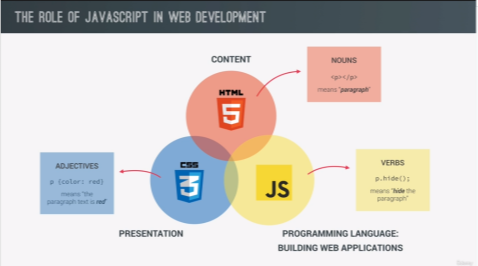

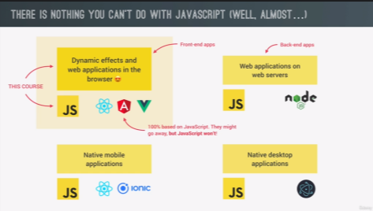

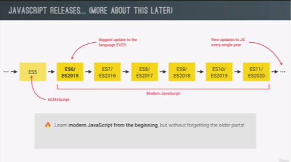

- Value - is basically a piece of data, the most fundamental unit of information that we have in programming.

```js
    console.log("Jonas");

    Value = Jonas
    **Note: either string or integer
```

- Variable - storing value by declaring a variable

```js
    let firstName = "Jonas";

    Value = Jonas
    Variable = firstName

**Note: way in naming variable
camelCase notation- write the first letter in lowercase and next word uppercase

Variable name cannot start with numbers
Can only be start with letters, underscore or dollar sign
CAPSLOCK - is for constant
```

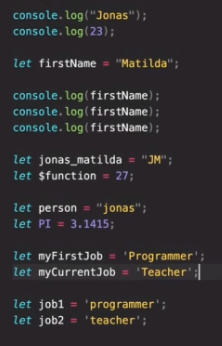

- Data Type - either objects or primitive

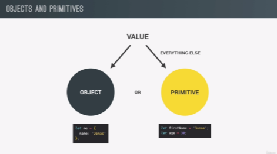

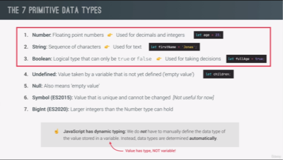

> typeof - is use to determine the data type

```js
let javascriptIsFun = true;
console.log(javascriptIsFun);

console.log(typeof true);
console.log(typeof javascriptIsFun);
console.log(typeof 23);
console.log(typeof "Jonas");
```

> Don't use let in reassigning new value to existing variable

```js
let javascriptIsFun = true;
console.log(javascriptIsFun);

javascriptIsFun = "YES!";
```

- Let, Const & Var (Ways in declaring variables)

  > let and const - introduced in ES6 (modern JS)

  - we use the **let [mutable variable]** keyword to declared variables that can be change later, basically during execution (reasigning a value to a variable)

  - we use the **const [immutable variable]** keyword to declare variables that are not supposed to change. The value is cannot be change.

    ```js
        let age = 30;
        age = 31;

        const birthYear = 1991;

    *when using need an initial value
    *recommend: use const by default and let only when you really sure that the variable need to change
    ```

  > var - is the old way of defining variable

- Basic Operator

  > Operators - allows us to transform values or combine multiple values

  - Arithmetic Operator (+ - \* /)

    ```js
    const now = 2037;
    const ageJonas = now - 1991;
    const ageSarah = now - 2018;
    console.log(ageJonas, ageSarah);

    console.log(ageJonas * 2, ageJonas / 10, 2 ** 3);
    ```

    - we can also use the plus operator to join strings or to concatenate different strings

    ```js
    const firstName = "Jonas";
    const lastName = "Schedtmann";
    console.log(firstName + " " + lastName);
    ```

  - Assignment Operator (=)

    ```js
        // Assignment Operator
        let x = 10 + 5; // 15
        x += 10; // x = x + 10 = 25
        x *= 4; // x = x * 4 = 100
        x++; // x = x +1 = 101
        x--;
        x--;
        console.log(x);

        **NOTE: assignment is right to left execution
    ```

  - Comparison Operator (> , < , >=, <=)

    > use comparison operator to produce boolean values **(true or false)**

    ```js
    // Comparison Operator
    console.log(ageJonas > ageSarah); // > , < , >=, <=
    console.log(ageSarah >= 18);

    const isFullAge = ageSarah >= 18;

    console.log(now - 1991 > now - 2018);
    ```

- Operator Precedence - order of operators to be solve

- Strings and Template Literals

  - Strings

    ```js
    const firstName = "Jonas";
    const job = "teacher";
    const birthYear = 1991;
    const year = 2037;

    const jonas =
      "I'm " +
      firstName +
      ", a " +
      (year - birthYear) +
      " years old" +
      " " +
      job +
      "!";
    console.log(jonas);
    ```

  - Template Literals - can write a string in a more normally, basically inserting the variable directly into the string. Can assemble multiple pieces into one final string.

    ```js
    const jonasNew = `I'm ${firstName}, a ${
      year - birthYear
    } years old ${job}!`;
    console.log(jonasNew);
    ```

  - Backsticks
    ```js
    console.log(`Just a regular string...`);
    ```
  - Multiple Strings (before ES6)

    ```js
      console.log('String with \n\
      multiple \n\
      lines')

      **template strings - simply click enter
      console.log(`String
      multiple
      lines`);

    ```

- Taking Decision: If / Else statement

  - if else control structure - allows us to have more control over the way that our code is executed

    ```js
        // IF ELSE
        const age = 15;
        // const isOldEnough = age >= 18;

        if (age >= 18) {
          console.log("Sarah can start driving license 🚗");
        } else {
          const yearsLeft = 18 - age;
          console.log(`Sarah is too young. Wait for another ${yearsLeft} years`);
        }

        const birthYear = 2021;

        let century;
        if (birthYear <= 2000) {
          century = 20;
        } else {
          century = 21;
        }
        console.log(century);

        **NOTE: condition is essentially any code that returns a true or false value

    ```

- Type Conversion and Coersion

  > Type Conversion is when we manually convert from one type to another

  - We can only convert from **string** to number and number to string or to boolean but not in undefined or null

    ```js
    const inputYear = "1991";
    console.log(Number(inputYear), inputYear);
    console.log(inputYear + 18);

    console.log(Number("Jonas"));
    console.log(typeof NaN);

    console.log(String(23), 23);
    ```

  - We only converted to **numbers** to strings but not to booleans

  > Type Coersion is when JS automatically convert types behind the scenes for us

  - Coersion happens whenever an operator is dealing with two values that have different types

    ```js

      console.log("I am " + 23 + " years old");
      console.log("23" - "10" - 3);
      console.log("23" / "2");

      let n = "1" + 1; // '11'
      n = n - 1; //10
      console.log(n);

      **NOTE:
          - plus will convert into string when that string either first before number(concatenation rule)
          - while minus, multiply and divide will convert into number


    ```

    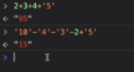

- Truthy and Falsy Values

  > In practice, the conversion of boolean is always implicit not explicit

  > When does JS do type coercion?

  - First - when using logical operators
  - Second - when using in a logical context, e.g in a if else condition

  > Falsy - are values that are not exactly false but will become false when we try to convert them into boolean

  - 5 Falsey Values - 0, '', undefined, null and NaN. They are not exactly false initially but they will become when converted to a boolean. Anything that string has a value is not a falsy

    ```js
    console.log(Boolean(0));
    console.log(Boolean(undefined));
    ```

    ```js
    // Truth or False (Boolean Coersion)
    // 5 Falsey Values: 0, '', undefined, null and NaN

    console.log(Boolean(0));
    console.log(Boolean(undefined));
    console.log(Boolean("Jonas"));
    console.log(Boolean({}));

    const money = 0;
    if (money) {
      console.log("Dont spend it all!");
    } else {
      console.log("You should get a job !");
    }

    let height;
    if (height) {
      console.log("YAY! Height is define");
    } else {
      console.log("Height is UNDEFINED");
    }
    ```

  - Truthy Value - Anything that string has a value is true. Same applies to the empty object

- Equality Operators: == vs ===

  > **triple (===) equal** - (strict equality operator - does not perform type coercion) just like the comparison operators, will also return a true or false value (boolean). True will only be the result in case that both sides are exactly the same

  ```js
  const age = 18;
  if (age === 18) console.log("You just became an adult");

  **note: - when comparing values, always use strict equality
          - better to convert the value manually before comparison than relying on double equal operator
  ```

  ```js
    const favorite = Number(prompt("What's your favorite number?"));
    console.log(favorite);
    console.log(typeof favorite);

    if (favorite === 23) {
      console.log("Cool!");
    }

    **note: we convert manually to convert **Number()**
  ```

  > **double (==) equal** - (loose equality operator - does type coercion)

  ```js
    '18' == 18
    >true

  **note: same with type coercion it converted it to a number

  const age = '18';
  if (age === 18) console.log("You just became an adult (strict)");

  if (age === 18) console.log("You just became an adult (loose)");
  >You just became an adult (loose)

  **note as general rule for clean code: avoid the loose equality operator as much as you can.
  ```

  ```js
  const favorite = prompt("What's your favorite number?");
  console.log(favorite);
  console.log(typeof favorite);

  if (favorite == 23) {
    console.log("Cool!");
  }

  **note: still true, automatically do type coercion
  ```

  \*\*note: we dont need two curly braces if we write one line of code for if statement

- Boolean (LOGICAL) Operator **(AND, OR & NOT)**

  > is a branch of computer science, which uses true and false values to solve complex logical problems. Uses several logical operators to combine true and false values.

  - **AND** - if all the variable is true.

  - **OR** - even if one of the variable is false, the outcome will still be true.

  - **NOT** - doesnt combine multiple value. Acts on only one boolean value and basically just inverts it. If A is true, it will become false. And if its false then NOT A will become true. The NOT actually has proceedings over the AND & OR operators and basically the value inverted first when combine using AND & OR.

  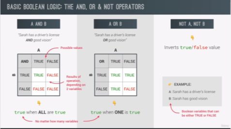
  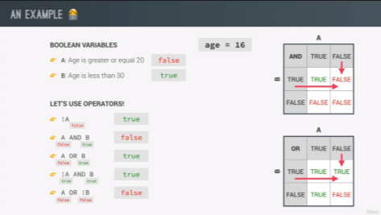

  ```js
  const hasDriversLicense = true; // A
  const hasGoodVision = true; // B

  console.log(hasDriversLicense && hasGoodVision);
  console.log(hasDriversLicense || hasGoodVision);
  console.log(!hasDriversLicense);

  if (hasDriversLicense && hasGoodVision) {
    console.log("Sarah is able to drive");
  } else {
    console.log("Someone else should drive..");
  }

  const isTired = true; // C
  console.log(hasDriversLicense && hasGoodVision && isTired);

  if (hasDriversLicense && hasGoodVision && !isTired) {
    console.log("Sarah is able to drive");
  } else {
    console.log("Someone else should drive..");
  }
  ```

  ```js
  const scoreDolphins = (97 + 112 + 81) / 3;
  console.log(scoreDolphins);

  const scoreKoalas = (109 + 95 + 86) / 3;
  console.log(scoreKoalas);

  if (scoreDolphins > scoreKoalas && scoreDolphins >= 100) {
    console.log("Team Dolphins wins the trophy!");
  } else if (scoreKoalas > scoreDolphins && scoreKoalas >= 100) {
    console.log("Team Koalas wins the trophy");
  } else if (
    scoreDolphins === scoreKoalas &&
    scoreDolphins >= 100 &&
    scoreKoalas >= 100
  ) {
    console.log("Both wins!");
  } else {
    console.log("No one wins");
  }
  ```

- Switch Statement

  > alternative way of writing complicated if/else statement in comapring one value to multiple different options

  ```js

  // Switch Statement
  const day = "thursday";
  //day === "thursday";

  switch (day) {
    case "monday":
      console.log("Plan course structure");
      console.log("Go to coding meetup");
      break;
    case "tuesday":
      console.log("Prepare theory videos");
      break;
    case "wednesday":
    case "thursday":
      console.log("Write code examples");
      break;
    case "friday":
      console.log("Record videos");
      break;
    case "saturday":
    case "sunday":
      console.log("Enjoy the weekends");
      break;
    default:
      console.log("Not a valid day!");
  }

   **note: without a break, the code simply continues executing
  ```

- Statements and Expressions

  > Expression - is a piece of code that produces a value.

  - ```js
      e.g 3 + 4 , 1991, true && false && !false
    ```

  > Statement - is like a bigger piece of code that is executed and which does not produce a value on itself. Its a sequence of actions

  - ```js
        e.g if (23 > 10) {
          const str = '23 is bigger';
        }
    ```
    \*\*note: In template literal, we can only insert expressions but not statements.

- The Conditional (TERNARY) Operator

  > is an expression and allows us to write something similar to an if/else statement but all in one line.

  ```js
  // CONDIIONAL OPERATOR (TERNARY)
  const age = 23;
  age >= 18 ? console.log("Can drink wine") : console.log("Only water");

  const drink = age >= 18 ? "wine" : "water";
  console.log(drink);

  let drink2;
  if (age >= 18) {
    drink2 = "wine";
  } else {
    drink2 = "water";
  }
  console.log(drink2);
  ```

  > using the ternary operator, which produces value, we can actually have conditionals inside of a template literal.

  ```js
  console.log(`I like to drink ${age >= 18 ? "wine" : "water"}`);
  ```

  ```js
   challeng 04:
    const bill = 275;
    const tip = bill >= 50 && bill <= 300 ? bill * 0.15 : bill * 0.2;
    console.log(
      `The bill was ${bill}, the tip is ${tip}, and the total value ${bill + tip}`
    );
  ```

- JavaScript Releases: ES5. ES6+ and EXnext

  > compatible table: http://kangax.github.io/compat-table

  
  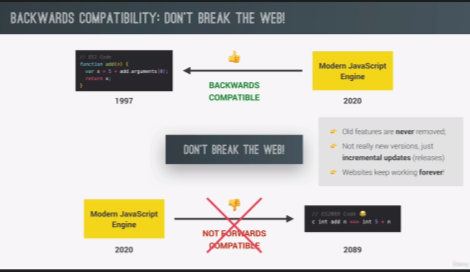
  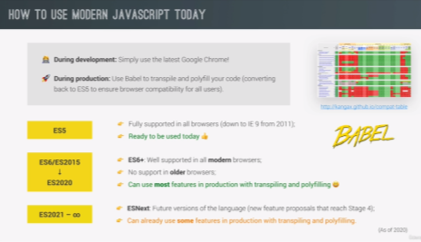
  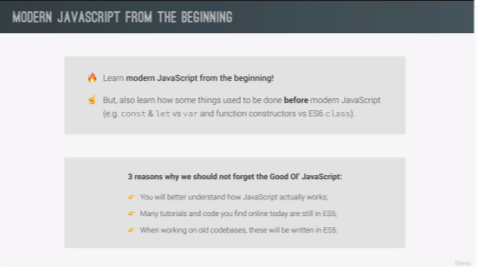

## Section 03: JavaScript Fundamentals - Part 2

- Activating Strict Mode

  > Strict mode - is a special mode that we can activiate in JS, that makes easier to write secure JS code.

  - importance - 1st: forbids us to do certain things | 2nd: creates visible errors in the developers console.

  ```js

    "use strict";

    let hasDriversLicense = false;
    const passTest = true;

    if (passTest) hasDriverslicense = true;
    if (hasDriversLicense) console.log("I can drive!");

    const interface = "Audio"; // reserved word should not used as variable name

    **note: should be the very first statement in the script.
  ```

- Functions

  > functions are actually just values

  > a piece of code that we can reuse over and over again

  > can also receive data and return data back

  > can hold one or more complete lines of codes

  - Parameters - are like variables that are specific only to this function and get defines once call the function | represent the input data of the function
  - Notes : not all functions need to return something and not all functions need to accept parameters

  ```js
    function logger() {
      console.log("May name is Jonas");
    }

    // calling / running / invoking a function
    logger();
    logger();
    logger();

    //generic function
    function fruitProcessor(apples, oranges) {
      console.log(apples, oranges);
      const juice = `Juice with ${apples} apples and ${oranges} orange.`;
      return juice;
    }

   // fruitProcessor(17, 17);  the result(output) of running this function here is the juice that we just returned then we need to save that value by creating a new variable : if we want to use the (juice) value that was returned we need to store it in a variable
    const fruitJuices = fruitProcessor(17, 17);
    console.log(fruitJuices);

    console.log(fruitProcessor(17, 17)); //directly logged it to the console


    **note:
        **(apples, oranges) - is called paramater and represents the input data of the function
        **(17, 17) - specific or the actual values of parameters | input of the fruitProcessor function | get assigned to the parameters (ARGUMENT)
        **return keyword - can return any value from the function and result of executing a function
  ```

  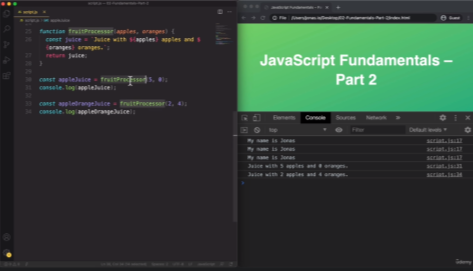

- Function Declarations vs Expressions

  > Function Declarations - can call function declaration before they are defined in the code.

  ```js
  // Function Declarations
  const age1 = calcAge1(1991);

  function calcAge1(birthYear) {
    return 2037 - birthYear;
  }
  ```

  > Function Expression - another type of function. A function without a name (anonymous function).

  ```js
  // Function Declarations

  function calcAge1(birthYear) {
    return 2037 - birthYear;
  }
  const age1 = calcAge1(1991);

  // Function Expressions
  const calcAge2 = function (birthYear) {
    return 2037 - birthYear;
  };
  const age2 = calcAge2(1991);
  console.log(age1, age2);

  **note: function expression: x = 5 (x is the function and 5 is the value)
  ```

- Arrow Functions

  > third type of function that was added to JS in ES6

  > a special form of function expression that is shorter and therfore faster to write.

  ```js
  // Arrow Function
  const calcAge3 = (birthYear) => 2037 - birthYear;
  const age3 = calcAge3(1991);
  console.log(age3);

  // one parameter & multiple return value
  const yearsUntilRetirement = (birthYear) => {
    const age = 2037 - birthYear;
    const retirement = 65 - age;
    return retirement;
  };

  console.log(yearsUntilRetirement(1991));

  // multiple parameter & multiple return value
  const yearsUntilRetirement = (birthYear, firstName) => {
    const age = 2037 - birthYear;
    const retirement = 65 - age;
    return `${firstName} retire in ${retirement} years`;
  };

  console.log(yearsUntilRetirement(1991, "Jonas"));
  console.log(yearsUntilRetirement(1980, "Bob"));
  ```

- Functions calling other functions

  ```js
  // Function calling other function
  function cutFruitPieces(fruit) {
    return fruit * 4;
  }

  function fruitProcessor(apples, oranges) {
    const applesPieces = cutFruitPieces(apples);
    const orangePieces = cutFruitPieces(oranges);

    const juice = `Juice with ${applesPieces} pieces of apples and ${orangePieces} pieces of orange.`;
    return juice;
  }

  console.log(fruitProcessor(2, 3));
  ```

  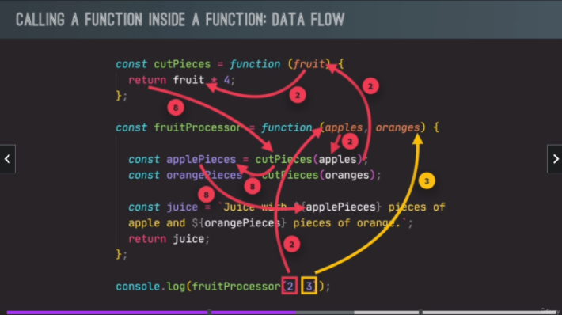

- Recap for function

  ```js
  const age = function (birthYear) {
    return 2037 - birthYear;
  };

  const yearsUntilRetirement = function (birthYear, firstName) {
    const calcAge = age(birthYear);
    const retirement = 65 - calcAge;

    if (retirement > 0) {
      console.log(`${firstName} retire in ${retirement} years`);
      return retirement;
    } else {
      console.log(`${firstName} is already retired!`);
      return -1;
    }
  };

  console.log(yearsUntilRetirement(1991, "Jonas"));
  console.log(yearsUntilRetirement(1970, "Mike"));
  ```

  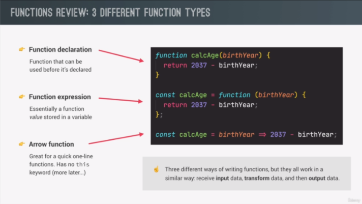
  

- Introduction to Arrays

  > is a data structure. Also can hold as many values as we want and also values of any type. Also a zero-based

  > length - is a property, it gives the exact amount of elements in the array(not a zero-based)

  > only primitive values are immutable but an array is not a primitive value.

  > we cannot do is to actually replace the entire Array.

  > can hold values with different types all at the same time. also input array inside an array

  ```js
  // Arrays
  const friend1 = "Michael";
  const friend2 = "Steven";
  const friend3 = "Peter";

  const years = new Array(1991, 1992, 1993, 1994);

  const friends = ["Michael", "Steven", "Peter"];
  console.log(friends);
  console.log(friends[0]);
  console.log(friends[2]);

  console.log(friends.length);
  console.log(friends[friends.length - 1]);

  friends[2] = "Jay;";
  console.log(friends);

  const firstName = "Jonas";
  const jonas = [firstName, "Schedtmann", 2037 - 1991, "teacher", friends];
  console.log(jonas);
  console.log(jonas.length);

  // Exercise
  const calcAge2 = function (birthYear) {
    return 2037 - birthYear;
  };
  const y = [1991, 1992, 1993, 1994];

  const age1 = calcAge2(y[0]);
  const age2 = calcAge2(y[1]);
  const age4 = calcAge2(y[y.length - 1]);
  console.log(age1, age2, age4);

  //new array technique
  const ages = [calcAge2(y[0]), calcAge2(y[1]), calcAge2(y[y.length - 1])];
  console.log(ages);
  ```

- Basic Array Operations (METHODS)

  > push - is a methods which is technically is a function that adds elements to the end of an array

  > unshift - is a methods which is technically is a function that adds elements to the beginning of an array

  ```js
  // Add elements
  const newLength = friends.push("Jay");
  console.log(friends);
  console.log(newLength);

  friends.unshift("John");
  console.log(friends);
  ```

  > pop - the opposite of the push method. To remove that last array.

  ```js
  /// Remove elements
  friends.pop(); //last
  const popped = friends.pop();
  console.log(popped);
  console.log(friends);

  // **note: Pop method also return the removed element but doesnt return the length of new array

  friends.shift(); //first
  console.log(friends);
  ```

  > includes - one of the ES6 method. Instead of returning the index of element will simply return true if the element is in the array and false otherwise.

  ```js
  console.log(friends.indexOf("Steven"));
  console.log(friends.indexOf("Bob"));

  friends.push(23);
  console.log(friends.includes("Steven"));
  console.log(friends.includes("Bob"));
  // console.log(friends.includes("23"));
  console.log(friends.includes(23));

  if (friends.includes("Steven")) {
    console.log("You have a friend called Steven");
  }
  ```

- Introduction to Object

  > another data structure in JS

  > a standalone entity, with properties and type

  ```js
    const jonas = {
      firstName: "Jonas",
      lastName: "Schedmtmann",
      age: 2037 - 1991,
      job: "teacher",
      friends: ["Michael", "Peter", "Steven"],
    };

    **note: contains a key I(property) value pairs (5 keys here)
  ```

- Dot vs. Bracket Notation

  > ways of getting a property from an object

  - Dot - uses when need actual property
  - Bracket - uses when need to first compute the property name

  ```js
  // Dot vs. Bracket Notation
  const jonas = {
    firstName: "Jonas",
    lastName: "Schedmtmann",
    age: 2037 - 1991,
    job: "teacher",
    friends: ["Michael", "Peter", "Steven"],
  };

  console.log(jonas);

  console.log(jonas.lastName);
  console.log(jonas["firstName"]); //in bracket, can put any expression

  const nameKey = "Name";
  console.log(jonas["first" + nameKey]);
  console.log(jonas["last" + nameKey]);

  const interestedIn = prompt(
    "What do you want to know about Jonas? Choose between firstName, lastName, age, job and friends"
  );

  if (jonas[interestedIn]) {
    console.log(jonas[interestedIn]);
  } else {
    console.log(
      "Wrong request! Choose between firstName, lastName, age, job and friends"
    );
  }

  // add new properties object
  jonas.location = "Portugal";
  jonas["twitter"] = "@jonasschedtman";
  console.log(jonas);

  // Challenge
  console.log(
    `${jonas.firstName} has ${jonas.friends.length} friends, and his bestfriend is called ${jonas.friends[0]}`
  );
  ```

- Object Method

  > any function attached to the object is called method

  > function expression only works in object as a method

  > method is also a property, a property that holds function value

  > "this" variable - basically equal to the object calling the method (ex. jonas as a variable object) | can also use to store new property

  > arrays (methods) are actually also objects, they are just special kind of objects, they hace methods that we can use to manipulate them like pop, push, shift and unshift.

  ```js
  // Object Method
  const jonas = {
    firstName: "Jonas",
    lastName: "Schedmtmann",
    birthYear: 1991,
    job: "teacher",
    friends: ["Michael", "Peter", "Steven"],
    hasDriverLicense: true,

    // calcAge: function (birthYear) {
    //   return 2037 - birthYear;
    // }, function expression that needed an argument

    // calcAge: function () {
    //   return 2037 - this.birthYear;
    // }, uses to avoid repeated argument

    calcAge: function () {
      this.age = 2037 - this.birthYear;
      return this.age;
    },

    // Challenge
    getSummary: function () {
      return `${this.firstName} is a ${this.calcAge()}-year old ${
        this.job
      } and he has ${
        this.hasDriverLicense ? "a" : "no"
      } drivers license. He also has ${this.friends.length} friends namely ${
        this.friends
      }`;
    },
  };
  console.log(jonas.calcAge());
  console.log(jonas.age);
  console.log(jonas.age);
  console.log(jonas.age);
  console.log(jonas.getSummary());

  // console.log(jonas.calcAge()); // jonas.calcAge is computed first and become the function value, then with the parenthesis inputted argument and passed in 1991

  // console.log(jonas["calcAge"](1991)); //we access the property using the brackets (jonas["calcAge"]) and then basically replaces with function, then we call the function (1991).
  ```

- Iteration: The for loop

  > Loop - one of the control structures. Also fundamental aspect of every programming langugae that allows us to automate repetitive tasks.

  > Loop does is to verify before each repetition if all condition still hold true it will keep running the loop

  > for loop - a loop which has a counter

  > Loop statement has 3 parts: 1st **(initialization)** is the initial value of a counter | 2nd **(condition)** is the logical condition | 3rd **(increment)** update counter after each iteration

  ```js
  // For Loop
  // for loop keeps running while condition is TRUE
  //  rep = rep + 1
  for (let rep = 1; rep <= 10; rep++) {
    console.log(`Lifting weights repetition ${rep}!`);
  }
  ```

- Looping Arrays, Breaking and Continuing

  - Looping Arrays

  ```js
  // show all arrays in console: for loop
  const jonas = [
    "Jonas",
    "Schedtmann",
    2037 - 1991,
    "teacher",
    ["Michael", "Peter", "Steven"],
    true,
  ];
  // create new arrays based on above original array
  const types = [];

  for (let i = 0; i < jonas.length; i++) {
    // reading from jonas array
    console.log(jonas[i], typeof jonas[i]);

    // filling types array
    // types[i] = typeof jonas[i];
    types.push(typeof jonas[i]); //its important that we add the new element to the end of array and not in beginning
  }

  console.log(types);

  // computing ages in array: for loop
  const years = [1990, 1991, 1992, 1993];
  const ages = [];

  for (let i = 0; i < years.length; i++) {
    ages.push(2037 - years[i]);
  }
  console.log(ages);
  ```

  - Continue Statement - is to exit the current iteration of the loop and continue to the next one

    ```js
    // Continue Statement

    const jonas = [
      "Jonas",
      "Schedtmann",
      2037 - 1991,
      "teacher",
      ["Michael", "Peter", "Steven"],
      true,
    ];

    console.log("--- ONLY STRING ---");
    for (let i = 0; i < jonas.length; i++) {
      if (typeof jonas[i] !== "string") continue;
      console.log(jonas[i], typeof jonas[i]);
    }
    ```

  - Break Statement - is used to completely terminate the whole loop.

    ```js
    // Break Statement

    const jonas = [
      "Jonas",
      "Schedtmann",
      2037 - 1991,
      "teacher",
      ["Michael", "Peter", "Steven"],
      true,
    ];

    console.log("--- BREAK WITH NUMBERS ---");
    for (let i = 0; i < jonas.length; i++) {
      if (typeof jonas[i] === "number") break;
      console.log(jonas[i], typeof jonas[i]);
    }
    ```

- Looping Backwards and Loops in Loops

  ```js
  // Looping Backwards
  const jonas = [
    "Jonas",
    "Schedtmann",
    2037 - 1991,
    "teacher",
    ["Michael", "Peter", "Steven"],
    true,
  ];

  // Loops in loops
  for (let i = jonas.length - 1; i >= 0; i--) {
    console.log(i, jonas[i]);
  }

  for (let exercise = 1; exercise <= 4; exercise++) {
    console.log(`--------Starting Exercise ${exercise}`);

    for (let rep = 1; rep < 6; rep++) {
      console.log(`Exercise ${exercise}: Lifting weight repetition ${rep}`);
    }
  }
  ```

- While Loop

  > in a while loop, we can only specify a condition

  > more versatile than for loop that can be used in a larger variety of situations

  > called while because it will run while condition is true

  > more explicitly we need to define the other two components of the for loop . Counter - **outside ! ! !** | Inrement \*\*inside code block after the iteration

  ```js
  // while loop
  let rep = 1;
  while (rep <= 10) {
    console.log(`WHILE: Lifting weights repetition ${rep}!`);
    rep++;
  }

  // Math.random() - create number between zero and one
  // Math.trunc() - gives us a number between zero and five
  let dice = Math.trunc(Math.random() * 6) + 1;

  while (dice !== 6) {
    console.log(`You rolled a ${dice}`);
    dice = Math.trunc(Math.random() * 6) + 1;
    if (dice === 6) console.log("Loop is about to end....");
  }
  ```

## Section 04: How to Navigate This Course


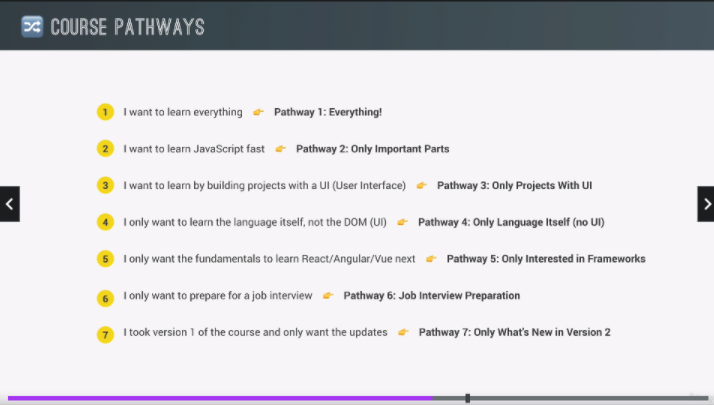

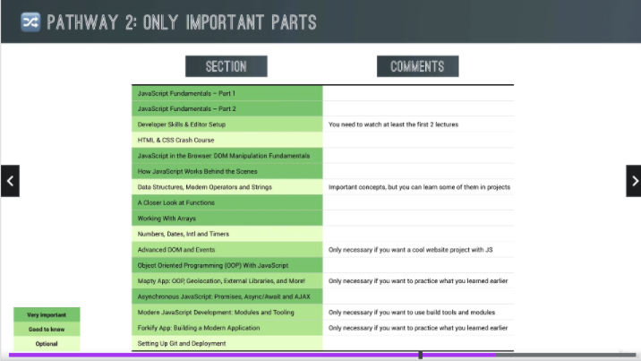

## Section 05: Developer Skills & Editor Setup

- Setting up Prettier in VsCode
  ```js
    {
  "singleQuote": true
    }
  ```
- Installing Node.js and Setting Up a Dev Environment

  > Node.js - is a way of running JS outside of the browser but also a way of running development tools

  - 1st: Download Node.js
  - 2nd: Install
  - 3rd: Run in terminal

    

- Learn how to Code

  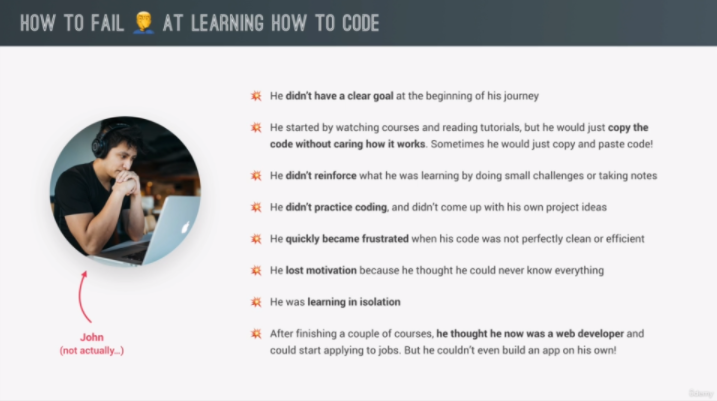

  

  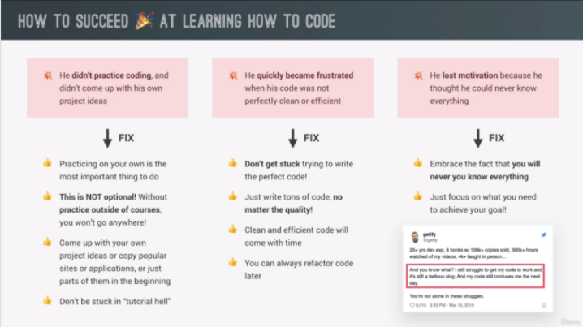

  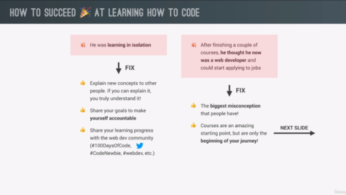

  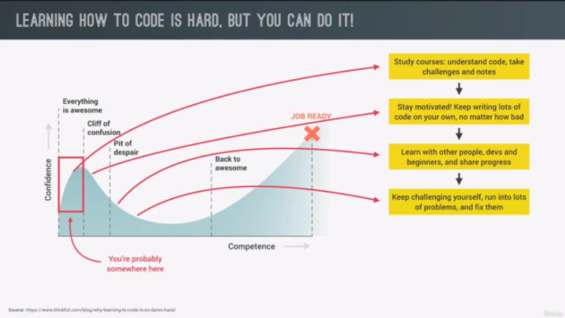

  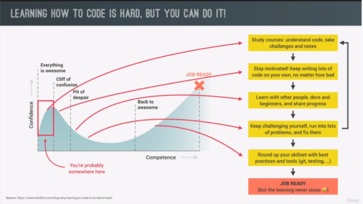

- How to think like a Developer: Become a Problem Solver!

  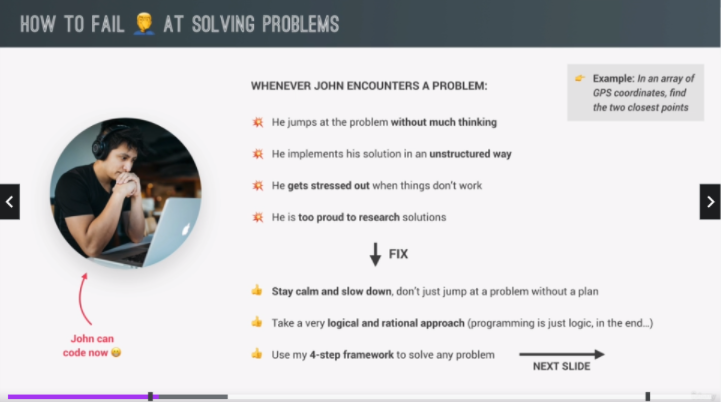
  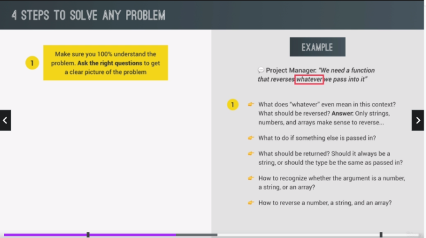
  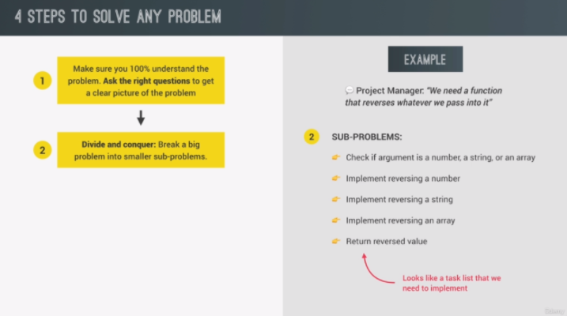
  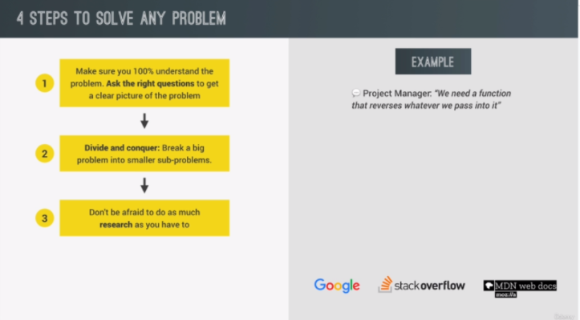
  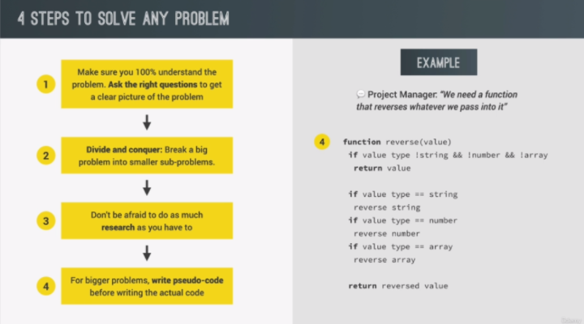

- Using Google, Stack Overflow and MDN

  ```js
  // PROBLEM 01:
  // We work for a company building a smart home thermometer.Our most recent task is this: "Given an array of temperatures of one day, calculate the temperature amplitude. Keep in mind that sometimes there might be a sensor error"

  // Solving Problems
  const temperatures = [3, -2, -6, -1, "error", 9, 13, 17, 15, 14, 9, 5];

  // 1) Understand the Problem
  // - What is temp amplitude? Answer: difference between highest and lowest temp
  // - How to compute max and min temp?
  // - Whats a sensor error? And what to do?

  // 2) Breaking up into sub-problems
  //  - How to ignore errors?
  //  - Find max value in temp array
  //  - Find min value in temp array
  //  - Subtract min from max (amp) and return it

  const calcTempAmp = function (temps) {
    let max = temps[0];
    let min = temps[0];
    for (let i = 0; i < temps.length; i++) {
      const curTemp = temps[i];

      if (typeof curTemp !== "number") continue;
      if (curTemp > max) {
        max = curTemp;
      } else if (curTemp < min) {
        min = curTemp;
      }
    }
    console.log(max, min);
    return max - min;
  };

  const amplitude = calcTempAmp(temperatures);
  console.log(amplitude);
  ```

- Debugging (Fixing Errors)

  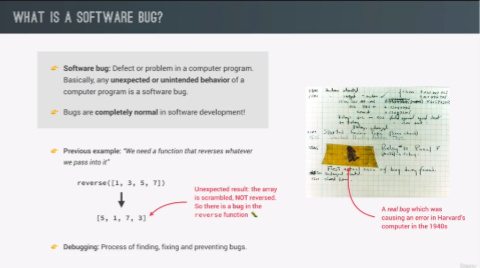

  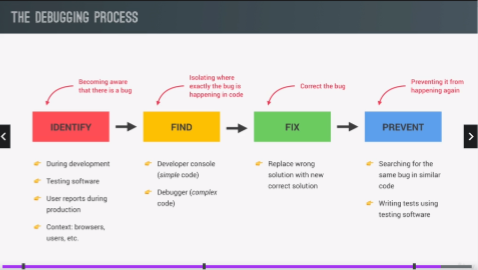

- Debugging with the Console and Breakpoints

  > Breakpoint - an intentional stopping or pausing place in a program, put in place for debugging purposes. It is also sometimes simply referred to as a pause

  > Step button - basically will then go to the next line of code

  ```js
  // Debugging (Fixing Errors) Console and Breakpoints

  const measureKelvin = function () {
    const measurement = {
      type: "temp",
      unit: "celsius",

      // C) FIX
      value: Number(prompt("Degree celsius:")),
    };

    //   B) FIND BUG
    //   console.table(measurement);

    //   console.log(measurement.value);
    //   console.warn(measurement.value);
    //   console.error(measurement.value);

    const kelvin = measurement.value + 273;
    return kelvin;
  };
  // A) IDENTIFY
  // console.log(measureKelvin());

  //  Note: Prompt function always return a string value

  // Using a debugger
  const temperatures1 = [3, -2, -6, -1, "error", 9, 13, 17, 15, 14, 9, 5];

  const temperatures2 = [-1, "error", 9, 9, 5];

  const calcTempAmpBug = function (t1, t2) {
    const temps = t1.concat(t2);
    console.log(temps);

    let max = 0;
    let min = 0;
    for (let i = 0; i < temps.length; i++) {
      const curTemp = temps[i];

      debugger; //same as breakpoint in source debugger
      if (typeof curTemp !== "number") continue;
      if (curTemp > max) {
        max = curTemp;
      } else if (curTemp < min) {
        min = curTemp;
      }
    }
    console.log(max, min);
    return max - min;
  };

  // A) IDENTIFY
  const amplitudeBug = calcTempAmpBug(temperatures1, temperatures2);
  console.log(amplitudeBug);
  ```

## Section 06: [OPTIONAL] HTML & CSS Crash Course

- Basic HTML Structure and Elements
- Attributes, Classes and IDs
- Basic Styling with CSS
- CSS Box Model

  > Reference: https://github.com/Racketship01/BuildResponsiceWebsiteHTML-CSS1/tree/master/Notes

## Section 07: JS in the Browser: DOM and Events

- PROJECT 01: Guess my number!

  ```js
  // document.querySelector(); //method thats available on the document object

  console.log(document.querySelector(".message").textContent);

  // mutiple dot operator are executed from left to right

  //query selector method is available on the document object
  ```

- What is DOM and DOM Manipulation

  - **DOM** (Document Object Model)
    - basically a connection point between HTML document and JavaScript code (The DOM represents the document as nodes and objects; that way, programming languages can interact with the page.)
    - automatically created by the browser as soon as the HTML page loads
    - always starts with the document object (right at the very top). And document is a special object that have access to in JS. Document serves as entry point into the DOM
    - Node - Every object located within a document is a node of some kind. In an HTML document, an object can be an element node but also a text node or attribute node.
      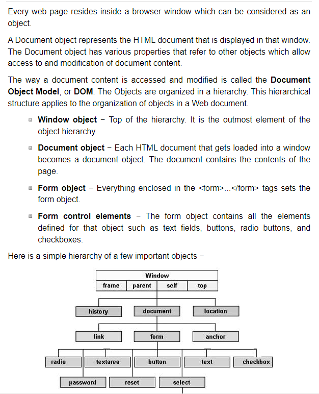
      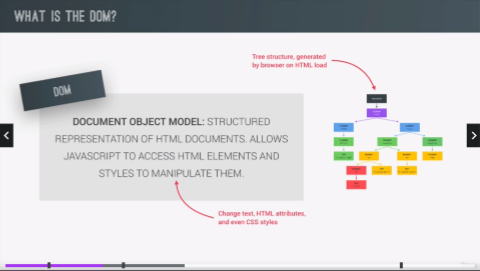
      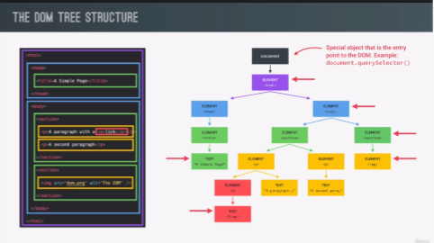
      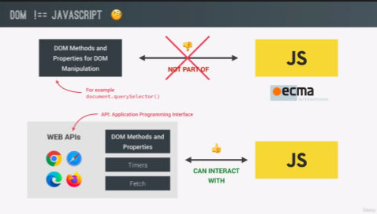

```
  **NOTE:
    - the DOM and DOM methods are actually part of something called web APIs (Application Programming Interface) ---basically libraries that are also written in JS
    - web API APIs are like libraries that browser implement and that can access from JS code
```

- Selecting and Manipulating Elements

  ```js
  console.log(document.querySelector(".message").textContent);

  document.querySelector(".message").textContent = "🎉 Correct Number!";

  document.querySelector(".number").textContent = 13;
  document.querySelector(".score").textContent = 10;

  document.querySelector(".guess").value = 23;
  console.log(document.querySelector(".guess").value);
  ```

- Handling Click Events

  > Events - is something happen on the page. With an event listener, can wait for a certain event to happen and then react to it

  ```js
  //  1st: Need to select the element where the event should happen
  // 2nd: On that element, can call a method e.g addEventListener() so we need to call it once more using parenthesis. Then need to pass in the type of event, just a simple click (1st arg)
  // 3rd: Need to specify the REACTION  (code that executed when click happens called EVENT HANDLER) to the Click event by defining a function

  //   Note:
  //     - addEventListener() is a special kind of function --in second argument is the event handler, need a function value as 2nd argument.
  //     - only define function (2nd arg) then pass it into event handler, then JS engine will call this function as events happens

  document.querySelector(".check").addEventListener("click", function () {
    const guess = Number(document.querySelector(".guess").value);
    console.log(guess, typeof guess);

    if (!guess) {
      document.querySelector(".message").textContent = "⛔ No number!";
    }
  });
  ```

- Implementing Game Logic

  ```js
  let numberSecret = Math.trunc(Math.random() * 20) + 1;
  //console.log(number);

  let score = 20;
  let highScore = 0;

  document.querySelector(".check").addEventListener("click", function () {
    const guess = Number(document.querySelector(".guess").value);
    console.log(guess, typeof guess);

    //  when no input
    if (!guess) {
      document.querySelector(".message").textContent = "⛔ No number!";

      // when player wins
    } else if (guess === numberSecret) {
      document.querySelector(".message").textContent = "🎉 Correct Number!";
      document.querySelector(".number").textContent = numberSecret;

      document.querySelector("body").style.backgroundColor = "#60b347";

      document.querySelector(".number").style.width = "30rem";

      //Implementing Highscore
      if (score > highScore) {
        highScore = score;
        document.querySelector(".highscore").textContent = highScore;
      }

      //  when guess too high
    } else if (guess > numberSecret) {
      if (score > 1) {
        document.querySelector(".message").textContent = "📈 Number too high!";
        score--;
        document.querySelector(".score").textContent = score;
      } else {
        document.querySelector(".message").textContent =
          "🤯 You lost the game!";
        document.querySelector(".score").textContent = 0;
      }

      // when guess too low
    } else if (guess < numberSecret) {
      if (score > 1) {
        document.querySelector(".message").textContent = "📉 Number too low!";
        score--;
        document.querySelector(".score").textContent = score;
      } else {
        document.querySelector(".message").textContent =
          "🤯 You lost the game!";
        document.querySelector(".score").textContent = 0;
      }
    }
  });

  // Coding Challenge 01
  document.querySelector(".again").addEventListener("click", function () {
    score = 20;
    numberSecret = Math.trunc(Math.random() * 20) + 1;

    document.querySelector(".message").textContent = "Start guessing...";

    document.querySelector(".score").textContent = score;

    document.querySelector(".number").textContent = "?";

    document.querySelector(".guess").value = "";

    document.querySelector("body").style.backgroundColor = "#222";

    document.querySelector(".number").style.width = "15rem";
  });

  // Note: All data should always be available in our code not just in the DOM.
  ```

- Manipulating CSS Styles

  - DOM also includes CSS Styles by DOM manipulation

    ```js
    document.querySelector("body").style.backgroundColor = "#60b347";

    document.querySelector(".number").style.width = "30rem";
    ```

- Refractoring Code: DRY Principle

  > Why is it actually so bad to have duplicate code? to minimize bugs and change functionality quickly all at one time.

  > Refractoring - restructure the code without changing how it works to improve the code and eliminate duplicate code

  - Identify duplicate or almost duplicate code
  - Sometimes good technique is also to create functions

  ```js
  // Refractoring : DRY Principle
  let numberSecret = Math.trunc(Math.random() * 20) + 1;
  let score = 20;
  let highScore = 0;

  const displayMsg = function (msg) {
    document.querySelector(".message").textContent = msg;
  };

  document.querySelector(".check").addEventListener("click", function () {
    const guess = Number(document.querySelector(".guess").value);
    console.log(guess, typeof guess);

    //  when no input
    if (!guess) {
      //document.querySelector('.message').textContent = '⛔ No number!';
      displayMsg("⛔ No number!");

      // when player wins
    } else if (guess === numberSecret) {
      //document.querySelector('.message').textContent = '🎉 Correct Number!';
      displayMsg("🎉 Correct Number!");

      document.querySelector(".number").textContent = numberSecret;

      document.querySelector("body").style.backgroundColor = "#60b347";

      document.querySelector(".number").style.width = "30rem";

      //Implementing Highscore
      if (score > highScore) {
        highScore = score;
        document.querySelector(".highscore").textContent = highScore;
      }

      //when guess is wrong
      else if (guess !== numberSecret) {
        if (score > 1) {
          // document.querySelector('.message').textContent =
          //   guess > numberSecret ? '📈 Number too high!' : '📉 Number too low!';
          displayMsg(
            guess > numberSecret ? "📈 Number too high!" : "📉 Number too low!"
          );
          score--;
          document.querySelector(".score").textContent = score;
        } else {
          // document.querySelector('.message').textContent =
          //   '🤯 You lost the game!';
          displayMsg("🤯 You lost the game!");
          document.querySelector(".score").textContent = 0;
        }
      }
    }
  });

  // Coding Challenge 01
  document.querySelector(".again").addEventListener("click", function () {
    score = 20;
    numberSecret = Math.trunc(Math.random() * 20) + 1;

    // document.querySelector('.message').textContent = 'Start guessing...';
    displayMsg("Start guessing...");

    document.querySelector(".score").textContent = score;

    document.querySelector(".number").textContent = "?";

    document.querySelector(".guess").value = "";

    document.querySelector("body").style.backgroundColor = "#222";

    document.querySelector(".number").style.width = "15rem";
  });
  ```

- PROJECT 2: Modal Window

  ```js
  const modal = document.querySelector(".modal");
  const overlay = document.querySelector(".overlay");
  const btnCloseModal = document.querySelector(".close-modal");
  const btnsOpenModal = document.querySelectorAll(".show-modal");

  //Note: when need to manipulate styles on page, always export the styles into a class.

  const openModal = function () {
    console.log("Button clicked");
    modal.classList.remove("hidden");
    //Note: dot is only for the selector when selecting classes
    overlay.classList.remove("hidden");
  };

  const closeModal = function () {
    modal.classList.add("hidden");
    overlay.classList.add("hidden");
  };

  for (let i = 0; i < btnsOpenModal.length; i++)
    btnsOpenModal[i].addEventListener("click", openModal);

  btnCloseModal.addEventListener("click", closeModal);

  overlay.addEventListener("click", closeModal);

  //Note: if want to use same function in multiple event listener, need to specify that function as a separate function(function expression) then can pass as an argument to multiple "add eventlistener"
  ```

- Handling an "Esc" Keypress Event

  > keyboard events are so-called global events because they do not happen on one specific element

  > global events like keyboard events usually listen on the whole document

  > using addEventListener on document, basically listening for events everywhere

  > there 3 types of events for the keyboard: key down, key press and key up

  > key up - only happens when we lift our finger off the keyboard

  > key press - fired continously as we keep our finger on a certain key

  > key down - fired as soon as we press down key, event will happen as soon as we hit any key on the keyboard

  ```js
  document.addEventListener("keydown", function (e) {
    console.log(e.key);

    if (e.key === "Escape" && !modal.classList.contains("hidden")) {
      closeModal();
    }
  });

  //Note: to look at the event object in order to figure out which key was pressed is by giving function a parameter.
  // JS will call this function when a key down events happens and pass in the event object as an argument
  ```

- PROJECT 3: Pick Game

  - Flow of the game
    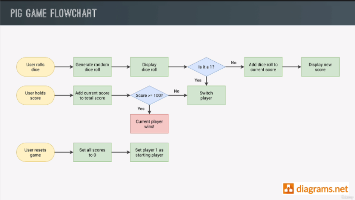

- Rolling the dice

  ```js
  // Selecting elements
  const score0El = document.querySelector("#score--0");
  const score1El = document.getElementById("score--1");
  const current0El = document.getElementById("current--0");
  const current1El = document.getElementById("current--1");

  const diceEl = document.querySelector(".dice");
  const btnNew = document.querySelector(".btn--new");
  const btnRoll = document.querySelector(".btn--roll");
  const btnHold = document.querySelector(".btn--hold");

  //Starting conditions
  score0El.textContent = 0;
  score1El.textContent = 0;

  diceEl.classList.add("hidden");

  let currentScore = 0; //should be outside the event listener/handler not inside
  // Note: should not only display current score on UI, instead need to define a variable in our code.

  // Rolling dice
  btnRoll.addEventListener("click", function () {
    // 1. Generating a random dice roll
    const dice = Math.trunc(Math.random() * 6) + 1;

    // 2. Display dice
    diceEl.classList.remove("hidden");
    diceEl.src = `dice-${dice}.png`;

    // 3. Check for rolled 1: if true, switch to next player
    if (dice !== 1) {
      // Add dice to current score
      currentScore += dice;
      current0El.textContent = currentScore; // change later
    } else {
      // Switch to next player
    }
  });
  ```

- Switching the Active Player

## Section 08: How JS Works Behind the Scenes

## Section 09: Data Structures, Modern Operators and Strings

## Section 10: A Closer Look at Functions

## Section 11: Working with Arrays

## Section 12: Numbers, Dates, Intl and Timers

## Section 13: Advanced DOM and Events

## Section 14: OOP with JS

## Section 15: Mapty App: OOP, Geolocation, External Libraries

## Section 16: Asynchronous JS: Promises, Async/Awaits and AJAX

## Section 17: Modern JS Development: Modules, Tooling and Function

## Section 18: Forkify App: Building a Modern Application

## Section 19: Setting Up Git and Deployment
