# The Complete JavaScript Course 2022: From Zero to Expert!

## Section 02: JavaScript Fundamentals - Part 1

### Brief Introduction

- JavaScript - is a high-level object-oriented, multi-paradigm programming language


- Value - is basically a piece of data, the most fundamental unit of information that we have in programming.

```js
    console.log("Jonas");

    Value = Jonas
    **Note: either string or integer
```

- Variable - storing value by declaring a variable

```js
    let firstName = "Jonas";

    Value = Jonas
    Variable = firstName

**Note: way in naming variable
camelCase notation- write the first letter in lowercase and next word uppercase

Variable name cannot start with numbers
Can only be start with letters, underscore or dollar sign
CAPSLOCK - is for constant
```


- Data Type - either objects or primitive


> typeof - is use to determine the data type

```js
let javascriptIsFun = true;
console.log(javascriptIsFun);

console.log(typeof true);
console.log(typeof javascriptIsFun);
console.log(typeof 23);
console.log(typeof "Jonas");
```

> Don't use let in reassigning new value to existing variable

```js
let javascriptIsFun = true;
console.log(javascriptIsFun);

javascriptIsFun = "YES!";
```

- Let, Const & Var (Ways in declaring variables)

  > let and const - introduced in ES6 (modern JS)

  - we use the **let [mutable variable]** keyword to declared variables that can be change later, basically during execution (reasigning a value to a variable)

  - we use the **const [immutable variable]** keyword to declare variables that are not supposed to change. The value is cannot be change.

    ```js
        let age = 30;
        age = 31;

        const birthYear = 1991;

    *when using need an initial value
    *recommend: use const by default and let only when you really sure that the variable need to change
    ```

  > var - is the old way of defining variable

- Basic Operator

  > Operators - allows us to transform values or combine multiple values

  - Arithmetic Operator (+ - \* /)

    ```js
    const now = 2037;
    const ageJonas = now - 1991;
    const ageSarah = now - 2018;
    console.log(ageJonas, ageSarah);

    console.log(ageJonas * 2, ageJonas / 10, 2 ** 3);
    ```

    - we can also use the plus operator to join strings or to concatenate different strings

    ```js
    const firstName = "Jonas";
    const lastName = "Schedtmann";
    console.log(firstName + " " + lastName);
    ```

  - Assignment Operator (=)

    ```js
        // Assignment Operator
        let x = 10 + 5; // 15
        x += 10; // x = x + 10 = 25
        x *= 4; // x = x * 4 = 100
        x++; // x = x +1 = 101
        x--;
        x--;
        console.log(x);

        **NOTE: assignment is right to left execution
    ```

  - Comparison Operator (> , < , >=, <=)

    > use comparison operator to produce boolean values **(true or false)**

    ```js
    // Comparison Operator
    console.log(ageJonas > ageSarah); // > , < , >=, <=
    console.log(ageSarah >= 18);

    const isFullAge = ageSarah >= 18;

    console.log(now - 1991 > now - 2018);
    ```

- Operator Precedence - order of operators to be solve

- Strings and Template Literals

  - Strings

    ```js
    const firstName = "Jonas";
    const job = "teacher";
    const birthYear = 1991;
    const year = 2037;

    const jonas =
      "I'm " +
      firstName +
      ", a " +
      (year - birthYear) +
      " years old" +
      " " +
      job +
      "!";
    console.log(jonas);
    ```

  - Template Literals - can write a string in a more normally, basically inserting the variable directly into the string. Can assemble multiple pieces into one final string.

    ```js
    const jonasNew = `I'm ${firstName}, a ${
      year - birthYear
    } years old ${job}!`;
    console.log(jonasNew);
    ```

  - Backsticks
    ```js
    console.log(`Just a regular string...`);
    ```
  - Multiple Strings (before ES6)

    ```js
      console.log('String with \n\
      multiple \n\
      lines')

      **template strings - simply click enter
      console.log(`String
      multiple
      lines`);

    ```

- Taking Decision: If / Else statement

  - if else control structure - allows us to have more control over the way that our code is executed

    ```js
        // IF ELSE
        const age = 15;
        // const isOldEnough = age >= 18;

        if (age >= 18) {
          console.log("Sarah can start driving license 🚗");
        } else {
          const yearsLeft = 18 - age;
          console.log(`Sarah is too young. Wait for another ${yearsLeft} years`);
        }

        const birthYear = 2021;

        let century;
        if (birthYear <= 2000) {
          century = 20;
        } else {
          century = 21;
        }
        console.log(century);

        **NOTE: condition is essentially any code that returns a true or false value

    ```

- Type Conversion and Coersion

  > Type Conversion is when we manually convert from one type to another

  - We can only convert from **string** to number and number to string or to boolean but not in undefined or null

    ```js
    const inputYear = "1991";
    console.log(Number(inputYear), inputYear);
    console.log(inputYear + 18);

    console.log(Number("Jonas"));
    console.log(typeof NaN);

    console.log(String(23), 23);
    ```

  - We only converted to **numbers** to strings but not to booleans

  > Type Coersion is when JS automatically convert types behind the scenes for us

  - Coersion happens whenever an operator is dealing with two values that have different types

    ```js

      console.log("I am " + 23 + " years old");
      console.log("23" - "10" - 3);
      console.log("23" / "2");

      let n = "1" + 1; // '11'
      n = n - 1; //10
      console.log(n);

      **NOTE:
          - plus will convert into string when that string either first before number(concatenation rule)
          - while minus, multiply and divide will convert into number


    ```

    

- Truthy and Falsy Values

  > In practice, the conversion of boolean is always implicit not explicit

  > When does JS do type coercion?

  - First - when using logical operators
  - Second - when using in a logical context, e.g in a if else condition

  > Falsy - are values that are not exactly false but will become false when we try to convert them into boolean

  - 5 Falsey Values - 0, '', undefined, null and NaN. They are not exactly false initially but they will become when converted to a boolean. Anything that string has a value is not a falsy

    ```js
    console.log(Boolean(0));
    console.log(Boolean(undefined));
    ```

    ```js
    // Truth or False (Boolean Coersion)
    // 5 Falsey Values: 0, '', undefined, null and NaN

    console.log(Boolean(0));
    console.log(Boolean(undefined));
    console.log(Boolean("Jonas"));
    console.log(Boolean({}));

    const money = 0;
    if (money) {
      console.log("Dont spend it all!");
    } else {
      console.log("You should get a job !");
    }

    let height;
    if (height) {
      console.log("YAY! Height is define");
    } else {
      console.log("Height is UNDEFINED");
    }
    ```

  - Truthy Value - Anything that string has a value is true. Same applies to the empty object

- Equality Operators: == vs ===

  > **triple (===) equal** - (strict equality operator - does not perform type coercion) just like the comparison operators, will also return a true or false value (boolean). True will only be the result in case that both sides are exactly the same

  ```js
  const age = 18;
  if (age === 18) console.log("You just became an adult");

  **note: - when comparing values, always use strict equality
          - better to convert the value manually before comparison than relying on double equal operator
  ```

  ```js
    const favorite = Number(prompt("What's your favorite number?"));
    console.log(favorite);
    console.log(typeof favorite);

    if (favorite === 23) {
      console.log("Cool!");
    }

    **note: we convert manually to convert **Number()**
  ```

  > **double (==) equal** - (loose equality operator - does type coercion)

  ```js
    '18' == 18
    >true

  **note: same with type coercion it converted it to a number

  const age = '18';
  if (age === 18) console.log("You just became an adult (strict)");

  if (age === 18) console.log("You just became an adult (loose)");
  >You just became an adult (loose)

  **note as general rule for clean code: avoid the loose equality operator as much as you can.
  ```

  ```js
  const favorite = prompt("What's your favorite number?");
  console.log(favorite);
  console.log(typeof favorite);

  if (favorite == 23) {
    console.log("Cool!");
  }

  **note: still true, automatically do type coercion
  ```

  \*\*note: we dont need two curly braces if we write one line of code for if statement

- Boolean (LOGICAL) Operator **(AND, OR & NOT)**

  > is a branch of computer science, which uses true and false values to solve complex logical problems. Uses several logical operators to combine true and false values.

  - **AND** - if all the variable is true.

  - **OR** - even if one of the variable is false, the outcome will still be true.

  - **NOT** - doesnt combine multiple value. Acts on only one boolean value and basically just inverts it. If A is true, it will become false. And if its false then NOT A will become true. The NOT actually has proceedings over the AND & OR operators and basically the value inverted first when combine using AND & OR.

  
  

  ```js
  const hasDriversLicense = true; // A
  const hasGoodVision = true; // B

  console.log(hasDriversLicense && hasGoodVision);
  console.log(hasDriversLicense || hasGoodVision);
  console.log(!hasDriversLicense);

  if (hasDriversLicense && hasGoodVision) {
    console.log("Sarah is able to drive");
  } else {
    console.log("Someone else should drive..");
  }

  const isTired = true; // C
  console.log(hasDriversLicense && hasGoodVision && isTired);

  if (hasDriversLicense && hasGoodVision && !isTired) {
    console.log("Sarah is able to drive");
  } else {
    console.log("Someone else should drive..");
  }
  ```

  ```js
  const scoreDolphins = (97 + 112 + 81) / 3;
  console.log(scoreDolphins);

  const scoreKoalas = (109 + 95 + 86) / 3;
  console.log(scoreKoalas);

  if (scoreDolphins > scoreKoalas && scoreDolphins >= 100) {
    console.log("Team Dolphins wins the trophy!");
  } else if (scoreKoalas > scoreDolphins && scoreKoalas >= 100) {
    console.log("Team Koalas wins the trophy");
  } else if (
    scoreDolphins === scoreKoalas &&
    scoreDolphins >= 100 &&
    scoreKoalas >= 100
  ) {
    console.log("Both wins!");
  } else {
    console.log("No one wins");
  }
  ```

- Switch Statement

  > alternative way of writing complicated if/else statement in comapring one value to multiple different options

  ```js

  // Switch Statement
  const day = "thursday";
  //day === "thursday";

  switch (day) {
    case "monday":
      console.log("Plan course structure");
      console.log("Go to coding meetup");
      break;
    case "tuesday":
      console.log("Prepare theory videos");
      break;
    case "wednesday":
    case "thursday":
      console.log("Write code examples");
      break;
    case "friday":
      console.log("Record videos");
      break;
    case "saturday":
    case "sunday":
      console.log("Enjoy the weekends");
      break;
    default:
      console.log("Not a valid day!");
  }

   **note: without a break, the code simply continues executing
  ```

- Statements and Expressions

  > Expression - is a piece of code that produces a value.

  - ```js
      e.g 3 + 4 , 1991, true && false && !false
    ```

  > Statement - is like a bigger piece of code that is executed and which does not produce a value on itself. Its a sequence of actions

  - ```js
        e.g if (23 > 10) {
          const str = '23 is bigger';
        }
    ```
    \*\*note: In template literal, we can only insert expressions but not statements.

- The Conditional (TERNARY) Operator

  > is an expression and allows us to write something similar to an if/else statement but all in one line.

  ```js
  // CONDIIONAL OPERATOR (TERNARY)
  const age = 23;
  age >= 18 ? console.log("Can drink wine") : console.log("Only water");

  const drink = age >= 18 ? "wine" : "water";
  console.log(drink);

  let drink2;
  if (age >= 18) {
    drink2 = "wine";
  } else {
    drink2 = "water";
  }
  console.log(drink2);
  ```

  > using the ternary operator, which produces value, we can actually have conditionals inside of a template literal.

  ```js
  console.log(`I like to drink ${age >= 18 ? "wine" : "water"}`);
  ```

  ```js
   challeng 04:
    const bill = 275;
    const tip = bill >= 50 && bill <= 300 ? bill * 0.15 : bill * 0.2;
    console.log(
      `The bill was ${bill}, the tip is ${tip}, and the total value ${bill + tip}`
    );
  ```

- JavaScript Releases: ES5. ES6+ and EXnext

  > compatible table: http://kangax.github.io/compat-table

  
  
  
  

## Section 03: JavaScript Fundamentals - Part 2

- Activating Strict Mode

  > Strict mode - is a special mode that we can activiate in JS, that makes easier to write secure JS code.

  - importance - 1st: forbids us to do certain things | 2nd: creates visible errors in the developers console.

  ```js

    "use strict";

    let hasDriversLicense = false;
    const passTest = true;

    if (passTest) hasDriverslicense = true;
    if (hasDriversLicense) console.log("I can drive!");

    const interface = "Audio"; // reserved word should not used as variable name

    **note: should be the very first statement in the script.
  ```

- Functions

  > functions are actually just values

  > a piece of code that we can reuse over and over again

  > can also receive data and return data back

  > can hold one or more complete lines of codes

  - Parameters - are like variables that are specific only to this function and get defines once call the function | represent the input data of the function
  - Notes : not all functions need to return something and not all functions need to accept parameters

  ```js
    function logger() {
      console.log("May name is Jonas");
    }

    // calling / running / invoking a function
    logger();
    logger();
    logger();

    //generic function
    function fruitProcessor(apples, oranges) {
      console.log(apples, oranges);
      const juice = `Juice with ${apples} apples and ${oranges} orange.`;
      return juice;
    }

   // fruitProcessor(17, 17);  the result(output) of running this function here is the juice that we just returned then we need to save that value by creating a new variable : if we want to use the (juice) value that was returned we need to store it in a variable
    const fruitJuices = fruitProcessor(17, 17);
    console.log(fruitJuices);

    console.log(fruitProcessor(17, 17)); //directly logged it to the console


    **note:
        **(apples, oranges) - is called paramater and represents the input data of the function
        **(17, 17) - specific or the actual values of parameters | input of the fruitProcessor function | get assigned to the parameters (ARGUMENT)
        **return keyword - can return any value from the function and result of executing a function
  ```

  

- Function Declarations vs Expressions

  > Function Declarations - can call function declaration before they are defined in the code.

  ```js
  // Function Declarations
  const age1 = calcAge1(1991);

  function calcAge1(birthYear) {
    return 2037 - birthYear;
  }
  ```

  > Function Expression - another type of function. A function without a name (anonymous function).

  ```js
  // Function Declarations

  function calcAge1(birthYear) {
    return 2037 - birthYear;
  }
  const age1 = calcAge1(1991);

  // Function Expressions
  const calcAge2 = function (birthYear) {
    return 2037 - birthYear;
  };
  const age2 = calcAge2(1991);
  console.log(age1, age2);

  **note: function expression: x = 5 (x is the function and 5 is the value)
  ```

- Arrow Functions

  > third type of function that was added to JS in ES6

  > a special form of function expression that is shorter and therfore faster to write.

  ```js
  // Arrow Function
  const calcAge3 = (birthYear) => 2037 - birthYear;
  const age3 = calcAge3(1991);
  console.log(age3);

  // one parameter & multiple return value
  const yearsUntilRetirement = (birthYear) => {
    const age = 2037 - birthYear;
    const retirement = 65 - age;
    return retirement;
  };

  console.log(yearsUntilRetirement(1991));

  // multiple parameter & multiple return value
  const yearsUntilRetirement = (birthYear, firstName) => {
    const age = 2037 - birthYear;
    const retirement = 65 - age;
    return `${firstName} retire in ${retirement} years`;
  };

  console.log(yearsUntilRetirement(1991, "Jonas"));
  console.log(yearsUntilRetirement(1980, "Bob"));
  ```

- Functions calling other functions

  ```js
  // Function calling other function
  function cutFruitPieces(fruit) {
    return fruit * 4;
  }

  function fruitProcessor(apples, oranges) {
    const applesPieces = cutFruitPieces(apples);
    const orangePieces = cutFruitPieces(oranges);

    const juice = `Juice with ${applesPieces} pieces of apples and ${orangePieces} pieces of orange.`;
    return juice;
  }

  console.log(fruitProcessor(2, 3));
  ```

  

- Recap for function

  ```js
  const age = function (birthYear) {
    return 2037 - birthYear;
  };

  const yearsUntilRetirement = function (birthYear, firstName) {
    const calcAge = age(birthYear);
    const retirement = 65 - calcAge;

    if (retirement > 0) {
      console.log(`${firstName} retire in ${retirement} years`);
      return retirement;
    } else {
      console.log(`${firstName} is already retired!`);
      return -1;
    }
  };

  console.log(yearsUntilRetirement(1991, "Jonas"));
  console.log(yearsUntilRetirement(1970, "Mike"));
  ```

  
  

- Introduction to Arrays

  > is a data structure. Also can hold as many values as we want and also values of any type. Also a zero-based

  > length - is a property, it gives the exact amount of elements in the array(not a zero-based)

  > only primitive values are immutable but an array is not a primitive value.

  > we cannot do is to actually replace the entire Array.

  > can hold values with different types all at the same time. also input array inside an array

  ```js
  // Arrays
  const friend1 = "Michael";
  const friend2 = "Steven";
  const friend3 = "Peter";

  const years = new Array(1991, 1992, 1993, 1994);

  const friends = ["Michael", "Steven", "Peter"];
  console.log(friends);
  console.log(friends[0]);
  console.log(friends[2]);

  console.log(friends.length);
  console.log(friends[friends.length - 1]);

  friends[2] = "Jay;";
  console.log(friends);

  const firstName = "Jonas";
  const jonas = [firstName, "Schedtmann", 2037 - 1991, "teacher", friends];
  console.log(jonas);
  console.log(jonas.length);

  // Exercise
  const calcAge2 = function (birthYear) {
    return 2037 - birthYear;
  };
  const y = [1991, 1992, 1993, 1994];

  const age1 = calcAge2(y[0]);
  const age2 = calcAge2(y[1]);
  const age4 = calcAge2(y[y.length - 1]);
  console.log(age1, age2, age4);

  //new array technique
  const ages = [calcAge2(y[0]), calcAge2(y[1]), calcAge2(y[y.length - 1])];
  console.log(ages);
  ```

- Basic Array Operations (METHODS)

  > push - is a methods which is technically is a function that adds elements to the end of an array

  > unshift - is a methods which is technically is a function that adds elements to the beginning of an array

  ```js
  // Add elements
  const newLength = friends.push("Jay");
  console.log(friends);
  console.log(newLength);

  friends.unshift("John");
  console.log(friends);
  ```

  > pop - the opposite of the push method. To remove that last array.

  ```js
  /// Remove elements
  friends.pop(); //last
  const popped = friends.pop();
  console.log(popped);
  console.log(friends);

  // **note: Pop method also return the removed element but doesnt return the length of new array

  friends.shift(); //first
  console.log(friends);
  ```

  > includes - one of the ES6 method. Instead of returning the index of element will simply return true if the element is in the array and false otherwise.

  ```js
  console.log(friends.indexOf("Steven"));
  console.log(friends.indexOf("Bob"));

  friends.push(23);
  console.log(friends.includes("Steven"));
  console.log(friends.includes("Bob"));
  // console.log(friends.includes("23"));
  console.log(friends.includes(23));

  if (friends.includes("Steven")) {
    console.log("You have a friend called Steven");
  }
  ```

- Introduction to Object

  > another data structure in JS

  > a standalone entity, with properties and type

  ```js
    const jonas = {
      firstName: "Jonas",
      lastName: "Schedmtmann",
      age: 2037 - 1991,
      job: "teacher",
      friends: ["Michael", "Peter", "Steven"],
    };

    **note: contains a key I(property) value pairs (5 keys here)
  ```

- Dot vs. Bracket Notation

  > ways of getting a property from an object

  - Dot - uses when need actual property
  - Bracket - uses when need to first compute the property name

  ```js
  // Dot vs. Bracket Notation
  const jonas = {
    firstName: "Jonas",
    lastName: "Schedmtmann",
    age: 2037 - 1991,
    job: "teacher",
    friends: ["Michael", "Peter", "Steven"],
  };

  console.log(jonas);

  console.log(jonas.lastName);
  console.log(jonas["firstName"]); //in bracket, can put any expression

  const nameKey = "Name";
  console.log(jonas["first" + nameKey]);
  console.log(jonas["last" + nameKey]);

  const interestedIn = prompt(
    "What do you want to know about Jonas? Choose between firstName, lastName, age, job and friends"
  );

  if (jonas[interestedIn]) {
    console.log(jonas[interestedIn]);
  } else {
    console.log(
      "Wrong request! Choose between firstName, lastName, age, job and friends"
    );
  }

  // add new properties object
  jonas.location = "Portugal";
  jonas["twitter"] = "@jonasschedtman";
  console.log(jonas);

  // Challenge
  console.log(
    `${jonas.firstName} has ${jonas.friends.length} friends, and his bestfriend is called ${jonas.friends[0]}`
  );
  ```

- Object Method

  > any function attached to the object is called method

  > function expression only works in object as a method

  > method is also a property, a property that holds function value

  > "this" variable - basically equal to the object calling the method (ex. jonas as a variable object) | can also use to store new property

  > arrays (methods) are actually also objects, they are just special kind of objects, they have methods that we can use to manipulate them like pop, push, shift and unshift.

  ```js
  // Object Method
  const jonas = {
    firstName: "Jonas",
    lastName: "Schedmtmann",
    birthYear: 1991,
    job: "teacher",
    friends: ["Michael", "Peter", "Steven"],
    hasDriverLicense: true,

    // calcAge: function (birthYear) {
    //   return 2037 - birthYear;
    // }, function expression that needed an argument

    // calcAge: function () {
    //   return 2037 - this.birthYear;
    // }, uses to avoid repeated argument

    calcAge: function () {
      this.age = 2037 - this.birthYear;
      return this.age;
    },

    // Challenge
    getSummary: function () {
      return `${this.firstName} is a ${this.calcAge()}-year old ${
        this.job
      } and he has ${
        this.hasDriverLicense ? "a" : "no"
      } drivers license. He also has ${this.friends.length} friends namely ${
        this.friends
      }`;
    },
  };
  console.log(jonas.calcAge());
  console.log(jonas.age);
  console.log(jonas.age);
  console.log(jonas.age);
  console.log(jonas.getSummary());

  // console.log(jonas.calcAge()); // jonas.calcAge is computed first and become the function value, then with the parenthesis inputted argument and passed in 1991

  // console.log(jonas["calcAge"](1991)); //we access the property using the brackets (jonas["calcAge"]) and then basically replaces with function, then we call the function (1991).
  ```

- Iteration: The for loop

  > Loop - one of the control structures. Also fundamental aspect of every programming langugae that allows us to automate repetitive tasks.

  > Loop does is to verify before each repetition if all condition still hold true it will keep running the loop

  > for loop - a loop which has a counter

  > Loop statement has 3 parts: 1st **(initialization)** is the initial value of a counter | 2nd **(condition)** is the logical condition | 3rd **(increment)** update counter after each iteration

  ```js
  // For Loop
  // for loop keeps running while condition is TRUE
  //  rep = rep + 1
  for (let rep = 1; rep <= 10; rep++) {
    console.log(`Lifting weights repetition ${rep}!`);
  }
  ```

- Looping Arrays, Breaking and Continuing

  - Looping Arrays

  ```js
  // show all arrays in console: for loop
  const jonas = [
    "Jonas",
    "Schedtmann",
    2037 - 1991,
    "teacher",
    ["Michael", "Peter", "Steven"],
    true,
  ];
  // create new arrays based on above original array
  const types = [];

  for (let i = 0; i < jonas.length; i++) {
    // reading from jonas array
    console.log(jonas[i], typeof jonas[i]);

    // filling types array
    // types[i] = typeof jonas[i];
    types.push(typeof jonas[i]); //its important that we add the new element to the end of array and not in beginning
  }

  console.log(types);

  // computing ages in array: for loop
  const years = [1990, 1991, 1992, 1993];
  const ages = [];

  for (let i = 0; i < years.length; i++) {
    ages.push(2037 - years[i]);
  }
  console.log(ages);
  ```

  - Continue Statement - is to exit the current iteration of the loop and continue to the next one

    ```js
    // Continue Statement

    const jonas = [
      "Jonas",
      "Schedtmann",
      2037 - 1991,
      "teacher",
      ["Michael", "Peter", "Steven"],
      true,
    ];

    console.log("--- ONLY STRING ---");
    for (let i = 0; i < jonas.length; i++) {
      if (typeof jonas[i] !== "string") continue;
      console.log(jonas[i], typeof jonas[i]);
    }
    ```

  - Break Statement - is used to completely terminate the whole loop.

    ```js
    // Break Statement

    const jonas = [
      "Jonas",
      "Schedtmann",
      2037 - 1991,
      "teacher",
      ["Michael", "Peter", "Steven"],
      true,
    ];

    console.log("--- BREAK WITH NUMBERS ---");
    for (let i = 0; i < jonas.length; i++) {
      if (typeof jonas[i] === "number") break;
      console.log(jonas[i], typeof jonas[i]);
    }
    ```

- Looping Backwards and Loops in Loops

  ```js
  // Looping Backwards
  const jonas = [
    "Jonas",
    "Schedtmann",
    2037 - 1991,
    "teacher",
    ["Michael", "Peter", "Steven"],
    true,
  ];

  // Loops in loops
  for (let i = jonas.length - 1; i >= 0; i--) {
    console.log(i, jonas[i]);
  }

  for (let exercise = 1; exercise <= 4; exercise++) {
    console.log(`--------Starting Exercise ${exercise}`);

    for (let rep = 1; rep < 6; rep++) {
      console.log(`Exercise ${exercise}: Lifting weight repetition ${rep}`);
    }
  }
  ```

- While Loop

  > in a while loop, we can only specify a condition

  > more versatile than for loop that can be used in a larger variety of situations

  > called while because it will run while condition is true

  > more explicitly we need to define the other two components of the for loop . Counter - **outside ! ! !** | Inrement \*\*inside code block after the iteration

  ```js
  // while loop
  let rep = 1;
  while (rep <= 10) {
    console.log(`WHILE: Lifting weights repetition ${rep}!`);
    rep++;
  }

  // Math.random() - create number between zero and one
  // Math.trunc() - gives us a number between zero and five
  let dice = Math.trunc(Math.random() * 6) + 1;

  while (dice !== 6) {
    console.log(`You rolled a ${dice}`);
    dice = Math.trunc(Math.random() * 6) + 1;
    if (dice === 6) console.log("Loop is about to end....");
  }
  ```

## Section 04: How to Navigate This Course


## Section 05: Developer Skills & Editor Setup

- Setting up Prettier in VsCode
  ```js
    {
  "singleQuote": true
    }
  ```
- Installing Node.js and Setting Up a Dev Environment

  > Node.js - is a way of running JS outside of the browser but also a way of running development tools

  - 1st: Download Node.js
  - 2nd: Install
  - 3rd: Run in terminal

    

- Learn how to Code

  

  

  

  

  

  

- How to think like a Developer: Become a Problem Solver!

  
  
  
  
  

- Using Google, Stack Overflow and MDN

  ```js
  // PROBLEM 01:
  // We work for a company building a smart home thermometer.Our most recent task is this: "Given an array of temperatures of one day, calculate the temperature amplitude. Keep in mind that sometimes there might be a sensor error"

  // Solving Problems
  const temperatures = [3, -2, -6, -1, "error", 9, 13, 17, 15, 14, 9, 5];

  // 1) Understand the Problem
  // - What is temp amplitude? Answer: difference between highest and lowest temp
  // - How to compute max and min temp?
  // - Whats a sensor error? And what to do?

  // 2) Breaking up into sub-problems
  //  - How to ignore errors?
  //  - Find max value in temp array
  //  - Find min value in temp array
  //  - Subtract min from max (amp) and return it

  const calcTempAmp = function (temps) {
    let max = temps[0];
    let min = temps[0];
    for (let i = 0; i < temps.length; i++) {
      const curTemp = temps[i];

      if (typeof curTemp !== "number") continue;
      if (curTemp > max) {
        max = curTemp;
      } else if (curTemp < min) {
        min = curTemp;
      }
    }
    console.log(max, min);
    return max - min;
  };

  const amplitude = calcTempAmp(temperatures);
  console.log(amplitude);
  ```

- Debugging (Fixing Errors)

  

  

- Debugging with the Console and Breakpoints

  > Breakpoint - an intentional stopping or pausing place in a program, put in place for debugging purposes. It is also sometimes simply referred to as a pause

  > Step button - basically will then go to the next line of code

  ```js
  // Debugging (Fixing Errors) Console and Breakpoints

  const measureKelvin = function () {
    const measurement = {
      type: "temp",
      unit: "celsius",

      // C) FIX
      value: Number(prompt("Degree celsius:")),
    };

    //   B) FIND BUG
    //   console.table(measurement);

    //   console.log(measurement.value);
    //   console.warn(measurement.value);
    //   console.error(measurement.value);

    const kelvin = measurement.value + 273;
    return kelvin;
  };
  // A) IDENTIFY
  // console.log(measureKelvin());

  //  Note: Prompt function always return a string value

  // Using a debugger
  const temperatures1 = [3, -2, -6, -1, "error", 9, 13, 17, 15, 14, 9, 5];

  const temperatures2 = [-1, "error", 9, 9, 5];

  const calcTempAmpBug = function (t1, t2) {
    const temps = t1.concat(t2);
    console.log(temps);

    let max = 0;
    let min = 0;
    for (let i = 0; i < temps.length; i++) {
      const curTemp = temps[i];

      debugger; //same as breakpoint in source debugger
      if (typeof curTemp !== "number") continue;
      if (curTemp > max) {
        max = curTemp;
      } else if (curTemp < min) {
        min = curTemp;
      }
    }
    console.log(max, min);
    return max - min;
  };

  // A) IDENTIFY
  const amplitudeBug = calcTempAmpBug(temperatures1, temperatures2);
  console.log(amplitudeBug);
  ```

## Section 06: [OPTIONAL] HTML & CSS Crash Course

- Basic HTML Structure and Elements
- Attributes, Classes and IDs
- Basic Styling with CSS
- CSS Box Model

  > Reference: https://github.com/Racketship01/BuildResponsiceWebsiteHTML-CSS1/tree/master/Notes

## Section 07: JS in the Browser: DOM and Events

- PROJECT 01: Guess my number!

  ```js
  // document.querySelector(); //method thats available on the document object

  console.log(document.querySelector(".message").textContent);

  // mutiple dot operator are executed from left to right

  //query selector method is available on the document object
  ```

- What is DOM and DOM Manipulation

  - **DOM** (Document Object Model)
    - basically a connection point between HTML document and JavaScript code (The DOM represents the document as nodes and objects; that way, programming languages can interact with the page.)
    - automatically created by the browser as soon as the HTML page loads
    - always starts with the document object (right at the very top). And **DOCUMENT** is a special object that have access to in JS. **DOCUMENT** serves as entry point into the DOM
    - Node - Every object located within a document is a node of some kind. In an HTML document, an object can be an element node but also a text node or attribute node.
      
      
      
      

```
  **NOTE:
    - the DOM and DOM methods are actually part of something called web APIs (Application Programming Interface) ---basically libraries that are also written in JS
    - web API APIs are like libraries that browser implement and that can access from JS code
```

- Selecting and Manipulating Elements

  ```js
  console.log(document.querySelector(".message").textContent);

  document.querySelector(".message").textContent = "🎉 Correct Number!";

  document.querySelector(".number").textContent = 13;
  document.querySelector(".score").textContent = 10;

  document.querySelector(".guess").value = 23;
  console.log(document.querySelector(".guess").value);
  ```

- Handling Click Events

  > Events - is something happen on the page. With an event listener, can wait for a certain event to happen and then react to it

  > Event handler function are also called callback function

  ```js
  //  1st: Need to select the element where the event should happen
  // 2nd: On that element, can call a method e.g addEventListener() so we need to call it once more using parenthesis. Then need to pass in the type of event, just a simple click (1st arg)
  // 3rd: Need to specify the REACTION  (code that executed when click happens called EVENT HANDLER) to the Click event by defining a function

  //   Note:
  //     - addEventListener() is a special kind of function --in second argument is the event handler, need a function value as 2nd argument.
  //     - only define function (2nd arg) then pass it into event handler, then JS engine will call this function as events happens

  document.querySelector(".check").addEventListener("click", function () {
    const guess = Number(document.querySelector(".guess").value);
    console.log(guess, typeof guess);

    if (!guess) {
      document.querySelector(".message").textContent = "⛔ No number!";
    }
  });
  ```

- Implementing Game Logic

  ```js
  let numberSecret = Math.trunc(Math.random() * 20) + 1;
  //console.log(number);

  let score = 20;
  let highScore = 0;

  document.querySelector(".check").addEventListener("click", function () {
    const guess = Number(document.querySelector(".guess").value);
    console.log(guess, typeof guess);

    //  when no input
    if (!guess) {
      document.querySelector(".message").textContent = "⛔ No number!";

      // when player wins
    } else if (guess === numberSecret) {
      document.querySelector(".message").textContent = "🎉 Correct Number!";
      document.querySelector(".number").textContent = numberSecret;

      document.querySelector("body").style.backgroundColor = "#60b347";

      document.querySelector(".number").style.width = "30rem";

      //Implementing Highscore
      if (score > highScore) {
        highScore = score;
        document.querySelector(".highscore").textContent = highScore;
      }

      //  when guess too high
    } else if (guess > numberSecret) {
      if (score > 1) {
        document.querySelector(".message").textContent = "📈 Number too high!";
        score--;
        document.querySelector(".score").textContent = score;
      } else {
        document.querySelector(".message").textContent =
          "🤯 You lost the game!";
        document.querySelector(".score").textContent = 0;
      }

      // when guess too low
    } else if (guess < numberSecret) {
      if (score > 1) {
        document.querySelector(".message").textContent = "📉 Number too low!";
        score--;
        document.querySelector(".score").textContent = score;
      } else {
        document.querySelector(".message").textContent =
          "🤯 You lost the game!";
        document.querySelector(".score").textContent = 0;
      }
    }
  });

  // Coding Challenge 01
  document.querySelector(".again").addEventListener("click", function () {
    score = 20;
    numberSecret = Math.trunc(Math.random() * 20) + 1;

    document.querySelector(".message").textContent = "Start guessing...";

    document.querySelector(".score").textContent = score;

    document.querySelector(".number").textContent = "?";

    document.querySelector(".guess").value = "";

    document.querySelector("body").style.backgroundColor = "#222";

    document.querySelector(".number").style.width = "15rem";
  });

  // Note: All data should always be available in our code not just in the DOM.
  ```

- Manipulating CSS Styles

  - DOM also includes CSS Styles by DOM manipulation

    ```js
    document.querySelector("body").style.backgroundColor = "#60b347";

    document.querySelector(".number").style.width = "30rem";
    ```

- Refractoring Code: DRY Principle

  > Why is it actually so bad to have duplicate code? to minimize bugs and change functionality quickly all at one time.

  > Refractoring - restructure the code without changing how it works to improve the code and eliminate duplicate code

  - Identify duplicate or almost duplicate code
  - Sometimes good technique is also to create functions

  ```js
  // Refractoring : DRY Principle
  let numberSecret = Math.trunc(Math.random() * 20) + 1;
  let score = 20;
  let highScore = 0;

  const displayMsg = function (msg) {
    document.querySelector(".message").textContent = msg;
  };

  document.querySelector(".check").addEventListener("click", function () {
    const guess = Number(document.querySelector(".guess").value);
    console.log(guess, typeof guess);

    //  when no input
    if (!guess) {
      //document.querySelector('.message').textContent = '⛔ No number!';
      displayMsg("⛔ No number!");

      // when player wins
    } else if (guess === numberSecret) {
      //document.querySelector('.message').textContent = '🎉 Correct Number!';
      displayMsg("🎉 Correct Number!");

      document.querySelector(".number").textContent = numberSecret;

      document.querySelector("body").style.backgroundColor = "#60b347";

      document.querySelector(".number").style.width = "30rem";

      //Implementing Highscore
      if (score > highScore) {
        highScore = score;
        document.querySelector(".highscore").textContent = highScore;
      }

      //when guess is wrong
      else if (guess !== numberSecret) {
        if (score > 1) {
          // document.querySelector('.message').textContent =
          //   guess > numberSecret ? '📈 Number too high!' : '📉 Number too low!';
          displayMsg(
            guess > numberSecret ? "📈 Number too high!" : "📉 Number too low!"
          );
          score--;
          document.querySelector(".score").textContent = score;
        } else {
          // document.querySelector('.message').textContent =
          //   '🤯 You lost the game!';
          displayMsg("🤯 You lost the game!");
          document.querySelector(".score").textContent = 0;
        }
      }
    }
  });

  // Coding Challenge 01
  document.querySelector(".again").addEventListener("click", function () {
    score = 20;
    numberSecret = Math.trunc(Math.random() * 20) + 1;

    // document.querySelector('.message').textContent = 'Start guessing...';
    displayMsg("Start guessing...");

    document.querySelector(".score").textContent = score;

    document.querySelector(".number").textContent = "?";

    document.querySelector(".guess").value = "";

    document.querySelector("body").style.backgroundColor = "#222";

    document.querySelector(".number").style.width = "15rem";
  });
  ```

- PROJECT 2: Modal Window

  ```js
  const modal = document.querySelector(".modal");
  const overlay = document.querySelector(".overlay");
  const btnCloseModal = document.querySelector(".close-modal");
  const btnsOpenModal = document.querySelectorAll(".show-modal");

  //Note: when need to manipulate styles on page, always export the styles into a class.

  const openModal = function () {
    console.log("Button clicked");
    modal.classList.remove("hidden");
    //Note: dot is only for the selector when selecting classes
    overlay.classList.remove("hidden");
  };

  const closeModal = function () {
    modal.classList.add("hidden");
    overlay.classList.add("hidden");
  };

  for (let i = 0; i < btnsOpenModal.length; i++)
    btnsOpenModal[i].addEventListener("click", openModal);

  btnCloseModal.addEventListener("click", closeModal);

  overlay.addEventListener("click", closeModal);

  //Note: if want to use same function in multiple event listener, need to specify that function as a separate function(function expression) then can pass as an argument to multiple "add eventlistener"
  ```

- Handling an "Esc" Keypress Event

  > keyboard events are so-called global events because they do not happen on one specific element

  > global events like keyboard events usually listen on the whole document

  > using addEventListener on document, basically listening for events everywhere

  > there 3 types of events for the keyboard: key down, key press and key up

  > key up - only happens when we lift our finger off the keyboard

  > key press - fired continously as we keep our finger on a certain key

  > key down - fired as soon as we press down key, event will happen as soon as we hit any key on the keyboard

  ```js
  document.addEventListener("keydown", function (e) {
    console.log(e.key);

    if (e.key === "Escape" && !modal.classList.contains("hidden")) {
      closeModal();
    }
  });

  //Note: to look at the event object in order to figure out which key was pressed is by giving function a parameter.
  // JS will call this function when a key down events happens and pass in the event object as an argument
  ```

- PROJECT 3: Pig Game

  - Flow of the game
    

- Game's Logic

  ```js
  // Rolling the dice
  // Selecting elements
  "use strict";

  // Selecting elements

  const player0El = document.querySelector(".player--0");
  const player1El = document.querySelector(".player--1");
  const score0El = document.querySelector("#score--0");
  const score1El = document.getElementById("score--1");
  const current0El = document.getElementById("current--0");
  const current1El = document.getElementById("current--1");

  const diceEl = document.querySelector(".dice");
  const btnNew = document.querySelector(".btn--new");
  const btnRoll = document.querySelector(".btn--roll");
  const btnHold = document.querySelector(".btn--hold");

  //Starting conditions
  let scores, currentScore, activePlayer, playing;
  //declaring a value is not the same as assigning them a value

  const init = function () {
    scores = [0, 0];
    currentScore = 0; //should be outside the event listener/handler not inside
    // Note: should not only display current score on UI, instead need to define a variable in our code.
    activePlayer = 0;
    playing = true;

    diceEl.classList.add("hidden");
    player0El.classList.remove("player--winner");
    player1El.classList.remove("player--winner");
    player0El.classList.add("player--active");
    player1El.classList.remove("player--active");

    score0El.textContent = 0;
    score1El.textContent = 0;
    current0El.textContent = 0;
    current1El.textContent = 0;
  };
  init(); //calling init function

  const switchPlayer = function () {
    document.getElementById(`current--${activePlayer}`).textContent = 0;
    currentScore = 0;
    activePlayer = activePlayer === 0 ? 1 : 0;
    // if (activePlayer === 0) {1} else {0}
    player0El.classList.toggle("player--active");
    player1El.classList.toggle("player--active");
  };

  // Rolling dice
  btnRoll.addEventListener("click", function () {
    if (playing) {
      // 1. Generating a random dice roll
      const dice = Math.trunc(Math.random() * 6) + 1;

      // 2. Display dice
      diceEl.classList.remove("hidden");
      diceEl.src = `dice-${dice}.png`;

      // 3. Check for rolled 1: if true, switch to next player
      if (dice !== 1) {
        // Add dice to current score
        currentScore += dice;
        document.getElementById(`current--${activePlayer}`).textContent =
          currentScore; // select the element dynamically for the current player and display currentScore

        //current0El.textContent = currentScore; // selecting only for player 1 - change later
      } else {
        // Switch to next player
        switchPlayer();
      }
    }
  });

  // HOLD Feature
  btnHold.addEventListener("click", function () {
    if (playing) {
      // 1. Add current score to active player's score
      scores[activePlayer] += currentScore;
      // scores[1] = scores[1] + currentScore;
      document.getElementById(`score--${activePlayer}`).textContent =
        scores[activePlayer];

      // 2. Check if player's score is >= 100
      if (scores[activePlayer] >= 100) {
        // If yes, finish the game
        playing = false;
        diceEl.classList.add("hidden");
        document
          .querySelector(`.player--${activePlayer}`)
          .classList.add("player--winner", "name");
        document
          .querySelector(`.player--${activePlayer}`)
          .classList.remove("player--active");
      } else {
        // if not, switch to the next player
        switchPlayer();
      }
    }
  });

  // RESET Game
  btnNew.addEventListener("click", init);
  // we dont declare anonymous function for event handler instead we pass n the init function --okay to pass as other function
  ```

## Section 08: How JS Works Behind the Scenes

- A high-level overview of JS

  
  
  

  > one of powerful toolls that takes memory management - garbage collection --is basically an algorithm inside JS engine

  
  
  
  
  
  

- JS Engine and Runtime

  > V8 engine - powers Google Chrome and also Node.js -- so we can build server side applications with JS outside any browser

  > Call Stack - where code is actually executed using something called execution contexts

  > Heap - is an unstructured memory pool which stores all the objects our application needed

  

  > Compilation - machine code is built and then it is executed in the CPU in the processor --execution happen after compilation ex. application that we using on our computer, it has been compiled before and executing way after compilation

  > Interpretation - runs through source code and executes line by line (executed all at the same time) --still needs to be converted into MC but simply happens right before its executed and not ahead of time

  

  - Modern Just-In-Time Compilation of JS

    - First step is to parse the code - means read the code, during parsing process, the code is parsed into a data structure called AST(abstract syntax tree) -- this tree has nothing to do with DOM
    - 2nd step is the compilation - takes the generated AST and compiles it into machine code
    - 3rd step - executed right away --(modern JS engine)
    - \*\*Note: modern JS engines actually have some pretty clever optimazation strategies -- create a very unoptimized versin on MC in the beginning just so that it can start executing as fast as possible -- then in the background, this code is optimized and recompiled during the already running program execution.

      

    - without engine, there is no runtime therefore no JS at all
    - Runtime - container including all the things that we need to use JS (in this case in the browser)
    - the heart of any JS runtime is always JS engine
    - engine alone is not enough, in order to work properly, we also need access to the web API's --related to the DOM or timers or even console.log
    - Web API's - are functionalities provided to the engine, accessible on global window object

  - Typical JS runtime also includes **callback queue** --is a data structured that contains all the callback functions that are ready to be executed ex. we attach event handler function to DOM elements like button to reacts to certain events **--event handler function are also called callback function**

    - for ex. a click, the callback function will be called --first thing that actually happpens after the event is that the callback function is put into callback queue --then when the stack is empty the callback function is passed to the stack so that it can be executed. --basically happens in **event loop - essential for non-blocking concurrency model** that takes callback functions from callback queue and puts them in the call stack to be executed.

    
    

- Execution contexts and the Call Stack

  - What is an execution context?

    - code is now ready to be executed
    - global execution context is created for the top-level code --basically code that is not inside any functions will be executed (function should only be executed when called)
    - JS code always runs inside an execution context
      

    - Note: Scope chain - basically consists of references to variables that are located outside of the current function. And to keep track of the scope chain, it is stored in each execution context

      
      

    - Note: execution context belonging to arrow functions, do not get their own arguments keyword nor do they get the this keyword --arrow dont have the arguments object and this keyword, instead they can use the arguments object and this keyword from their closest regular function parent
    - Technically speaking --code runs inside of execution context that are in the call stack.

- Scope and Scope Chain

  - Lexical scoping e.g -- a function that is written inside another function has access to the variables of the parent function
  - Variable scoping is influenced by where exactly we write our functions and code blocks
  - Scope -- in case of functions, essentially the variable environment which is stored in the functions execution context (difference between scope and variable environment are basically the same)
  - Scope of a variable --entire region
    
    
    

  - Note: variable lookup -- if one scope needs to use a certain variable but cant find in current scope, it will look up in the scope chain and find in one of the parent scopes.

    > on scope can only look up in scope chain but it cant look down.

  - Note: var -- function scoped, let & const -- block scoped

    

  - Note: the order in which functions are called does not affect the scope chain e.g the third function dont have access in 2nd function even though called the third

    

- Scoping in Practice

  ```js
  function calcAge(birthYear) {
    const age = 2037 - birthYear;

    function printAge() {
      let output = `${firstName} you are ${age}, born in ${birthYear}`;
      console.log(output);

      if (birthYear >= 1981 && birthYear <= 1996) {
        var millenial = true;
        // Creating NEW variable with same name as outer's scope
        const firstName = "Steven";

        const str = `Your'e a millenial, ${firstName} `;
        console.log(str);

        //reassigning variable from outer's scope
        output = "NEEEEW!";

        function add(a, b) {
          return a + b;
        }
        console.log(add(2, 3));
      }
      console.log(millenial); //var is a function scope
      // add(2, 3); //reference error -- functions are block scope -- only true for strict mode
      console.log(output);
    }
    printAge();

    return age;
  }

  const firstName = "Jonas";
  calcAge(1991);
  ```

- Variable Environment: Hoisting and the TDZ

  

  

  - Note: each and every let and const variable get their own TDZ (temporal dead zone) that starts at the beginning of the scope until the line where it is defined. And variable is safe to use after the TDZ.

  ```js
  // HOISTING

  // VAR HOISTING
  var num;
  num = 6;
  console.log(num);

  // FUNCTION DECLARATION HOISTING
  defineHoisted();
  function defineHoisted() {
    console.log("hoisted");
  }

  // LET & CONST HOISTING
  let num; //declaration
  num = 6; //initialization
  console.log(num);

  const num = 6;
  console.log(num);

  // TDZ
  const myName = "Jane";

  if (myName === "Jane") {
    const age = 2037 - 1991;
    console.log(`${myName} is a ${job}`); //TDZ
    console.log(age);
    const job = "teacher";
    console.log(x);
  }

  console.log(myName);
  ```

- Hoisting and TDZ in Practice

  - Note: Window is the global object of JS in the browser -- variables declared in let & const do not create properties on the window object

  ```js
  // Practice Hoisting

  // Variables
  console.log(me);
  //console.log(job);
  //console.log(yr);

  var me = "Jonas";
  let job = "teacher";
  const yr = 1991;

  // Functions

  console.log(addDec(2, 3));
  //console.log(addExp(2, 3));
  console.log(addArrow);
  //console.log(addArrow(2, 3));

  function addDec(a, b) {
    return a + b;
  }

  const addExp = function (a, b) {
    return a + b;
  };

  var addArrow = (a, b) => a + b;

  // Example
  console.log(deleteShoppingCart());
  if (!numProducts) deleteShoppingCart();

  var numProducts = 10;

  function deleteShoppingCart() {
    console.log("All products deleted!");
  }

  var x = 1;
  let y = 2;
  const z = 3;

  console.log(x === window.x);
  console.log(y === window.y);
  console.log(z === window.z);
  ```

- The 'this' keyword

  

  - Note: not as a method attached to any object will simply be undefined -- only valid for strict mode
  - \*\*if use 'this' variable in arrow function, it will bw simply be the this keyword of the parent function (lexical this keyword)
  - \*\* 'this' kewyword in the global scope is simply window object e.g console.log(this);

  - 'this' Practice

    - Method borrowing - borrowing method from one object to the other (dry code)
    - 'this' keyword always points to the object that is calling the method.

    ```js
    // 'this' keyword practice

    console.log(this); //parent/globe scope

    const calcAge = function (birthYear) {
      console.log(2037 - birthYear);
      console.log(this); // undefined w/o attached to any object --in strict mode
    };
    calcAge(1991);

    const calcAgeArrow = (birthYear) => {
      console.log(2037 - birthYear);
      console.log(this); // window -- because of this in the lexical scoping (parent/globe scope)
    };
    calcAgeArrow(1991);

    const jonas = {
      year: 1991,
      calcAge: function () {
        console.log(this); // attached to object jonas
        console.log(2037 - this.year);
      },
    };
    jonas.calcAge();

    // Method borrowing
    const matilda = {
      year: 2017,
    };

    matilda.calcAge = jonas.calcAge; //method borrow
    matilda.calcAge(); // calling the method on matilda --this keyword will point to matilda, object which called the method

    const f = jonas.calcAge;
    f(); // this keyword attached to jonas is now undefine because function f calling jonas is just a regular function
    ```

- Regular Functions vs Arrow Functions

  ```js
  // Regular vs Arrow

  // var firstName = 'Matilda';

  const jonas = {
    firstName: "Jonas",
    year: 1991,
    calcAge: function () {
      // console.log(this);
      console.log(2037 - this.year);

      // Solution 1
      // const self = this; // self or that
      // const isMillenial = function () {
      //   console.log(self);
      //   console.log(self.year >= 1981 && self.year <= 1996);
      // };

      // Solution 2
      // arrow function inside parent scope --jonas object
      const isMillenial = () => {
        console.log(this);
        console.log(this.year >= 1981 && this.year <= 1996);
      };
      isMillenial();
      // inside regular function call, this keyword is undefined
    },

    // arrow functon in a method
    greet: () => {
      console.log(this);
      console.log(`Hey ${this.firstName}`);
    },
    // Note: for best practice, never use arrow funtion as method in object

    // greet: function () {
    //   console.log(this);
    //   console.log(`Hey ${this.firstName}`);
    // },
  };
  jonas.greet();
  jonas.calcAge();

  // arguments keywords is only available in regular function not in arrow function
  const addExp = function (a, b) {
    console.log(arguments);
    return a + b;
  };
  addExp(2, 3);
  addExp(2, 5, 3, 8);

  var addArrow = (a, b) => {
    console.log(arguments);
    return a + b;
  };
  addArrow(2, 5, 3, 8); // Reference Error
  ```

- Primitive vs Objects(Primitive vs Reference Types)

  > In memory and memory management - usual to call primitives and reference type(objects)

  > reference type(objects) stored in the memory heap (JS engine)

  > primitive types are store in call stack

  

  

  

  **Note**: the piece of memory in the call stack has a reference to the piece of memory in the heap

  **Note**: const are only immutable in primitive types not on reference

  ```js
  // Primitive vs Objects(Primitive vs Reference Types)

  let age = 30;
  let oldAge = age;
  age = 31;
  console.log(age);
  console.log(oldAge);

  const me = {
    name: "Jonas",
    age: 30,
  };
  const friend = me;
  friend.age = 27;
  console.log("Friend: ", friend);
  console.log("Me: ", me);
  ```

- Primitives vs Object Practice

  ```js
  // Primitives vs Object Practice

  // Primitive types
  let lastName = "Williams";
  let oldLastName = lastName;
  lastName = "Davis";

  // reference type
  const jessica = {
    firstName: "Jessica",
    lastName: "Williams",
    age: 27,
  };
  const marriedJessica = jessica;
  marriedJessica.lastName = "Davis";
  console.log("Before marriage:", jessica);
  console.log("After marriage:", marriedJessica);

  // copying object --
  const jessica2 = {
    firstName: "Jessica",
    lastName: "Williams",
    age: 27,
    family: ["Alice", "Bob"], // array is an object -- deeply nested object
  };

  const jessicaCopy = Object.assign({}, jessica2); // only property copy not array object -- only creates shallow copy not deep clone
  jessicaCopy.lastName = "Davis";

  // Note: shallow copy only copy the properties while deep clone copy everything

  jessicaCopy.family.push("Mary");
  jessicaCopy.family.push("John");

  console.log("Before marriage:", jessica2);
  console.log("After marriage:", jessicaCopy);
  ```

## Section 09: Data Structures, Modern Operators and Strings

- What is and why might you Destructure an object or array?

  > Destructuring is a JavaScript expression that makes it possible to unpack values from arrays, or properties from objects, into distinct variables. That is, we can extract data from arrays and objects and assign them to variables. ... The ES6 destucturing assignment makes it easier to extract this data.

- Destructing Array

  > destructing is an ES6 feature and a way of **unpacking values** from an array or an object **into separate/new variables**

  > destructing is to break a complex data structure down into smaller data structure like a variable

  > for arrays, we use destructuring to **retrieve elements from the array and store them into variables** in very easy way. Not destroying the array just destructuring

  ```js
  // destructing array

  const arr = [2, 3, 4];
  const a = [0];
  const b = [1];
  const c = [2];

  const [x, y, z] = arr; // destructuring assignment
  console.log(x, y, z);

  let [main, , secondary] = restaurant.categories; // use , to skip element in arr
  console.log(main, secondary);

  // switch variable using destructuring
  // const temp = main;
  // main = secondary;
  // secondary = temp;
  // console.log(main, secondary);

  [main, secondary] = [secondary, main];
  console.log(main, secondary);

  // receive 2 return values from a function
  const restaurant = {
    name: "Classico Italiano",
    location: "Via Angelo Tavanti 23, Firenze, Italy",
    categories: ["Italian", "Pizzeria", "Vegetarian", "Organic"],
    starterMenu: ["Focaccia", "Bruschetta", "Garlic Bread", "Caprese Salad"],
    mainMenu: ["Pizza", "Pasta", "Risotto"],

    order: function (starterIndex, mainIndex) {
      return [this.starterMenu[starterIndex], this.mainMenu[mainIndex]];
    },
  };

  const [starter, mainCourse] = restaurant.order(2, 0);
  console.log(starter, mainCourse);

  // nested array -- one array inside another
  const nested = [2, 4, [5, 6]];
  // const [i, , j] = nested;
  // console.log(i, j);

  // destructuring insice destructuring
  const [i, , [j, k]] = nested;
  console.log(i, j, k);

  // default values
  const [p = 1, q = 1, r = 1] = [8, 9];
  console.log(p, q, r);
  ```

- Destructuring Object

  > destructuring object -- uses curly braces

  > provide variable names that exactly match the property name

  > extremely useful technique when dealing with the result of an API call --basically means to get data from another web application

  ```js
  const restaurant = {
    name: "Classico Italiano",
    location: "Via Angelo Tavanti 23, Firenze, Italy",
    categories: ["Italian", "Pizzeria", "Vegetarian", "Organic"],
    starterMenu: ["Focaccia", "Bruschetta", "Garlic Bread", "Caprese Salad"],
    mainMenu: ["Pizza", "Pasta", "Risotto"],

    openingHours: {
      thu: {
        open: 12,
        close: 22,
      },
      fri: {
        open: 11,
        close: 23,
      },
      sat: {
        open: 0, // Open 24 hours
        close: 24,
      },
    },

    // calling a method with an object --function destructure the object arguments --can also set default values as arguments
    orderDelivery: function ({
      time = "20:00",
      address,
      mainIndex = 0,
      starterIndex = 1,
    }) {
      console.log(
        `Order received! ${this.starterMenu[starterIndex]} and ${this.mainMenu[mainIndex]} at ${time} in ${address}`
      );
    },
  };
  // practical application --we can pass an object into the function as argument then function destructure that object
  restaurant.orderDelivery({
    time: "22:30",
    address: "Manila,Ph",
    mainIndex: 2,
    starterIndex: 2,
  });

  restaurant.orderDelivery({
    address: "Manila,Ph",
    starterIndex: 1,
  });

  // Destructuring Object
  const { name, openingHours, categories } = restaurant;
  console.log(name, openingHours, categories);

  // variable names differ from property name(still need to reference property names)
  const {
    name: restaurantName,
    openingHours: hours,
    categories: tags,
  } = restaurant;
  console.log(restaurantName, hours, tags); // helpful when dealing with third part data

  // default values feature --helpful when we do not have hard-coded data in application --third party app
  const { menu = [], starterMenu: starters = [] } = restaurant;
  console.log(menu, starters);

  // mutating variables while destructuring objects
  let a = 111;
  let b = 999;
  const obj = { a: 23, b: 7, c: 14 };
  ({ a, b } = obj); //uses parenthesis()
  console.log(a, b);

  // nested object
  const { fri } = openingHours;
  console.log(fri);

  const {
    fri: { open, close },
  } = openingHours;
  console.log(open, close);

  const {
    fri: { open: o, close: c },
  } = openingHours;
  console.log(o, c);
  ```

- The Spread Operator (...)

  > uses to expand an array into all its elements

  > basically unpacking all the array elements at one

  > whenever we need the elements of an array individually we use spread operator

  > the difference of spread operator to destructuring array, takes all the elements from the array and it doesnt create new variables

  > we can only use it in places where we would otherwise write values separated by commas

  > iterables - things like all arrays, strings, maps or sets but not object

  ```js
  // Spread Operator

  // array
  const arr = [7, 8, 9];
  const badNewArr = [1, 2, arr[0], arr[1], arr[2]];
  console.log(badNewArr);

  const newArr = [1, 2, ...arr]; // using spread operator write them individually as wrote as manually
  console.log(newArr);
  console.log(...newArr); // write individually array element

  const restaurant = {
    name: "Classico Italiano",
    location: "Via Angelo Tavanti 23, Firenze, Italy",
    categories: ["Italian", "Pizzeria", "Vegetarian", "Organic"],
    starterMenu: ["Focaccia", "Bruschetta", "Garlic Bread", "Caprese Salad"],
    mainMenu: ["Pizza", "Pasta", "Risotto"],

    openingHours: {
      thu: {
        open: 12,
        close: 22,
      },
      fri: {
        open: 11,
        close: 23,
      },
      sat: {
        open: 0, // Open 24 hours
        close: 24,
      },
    },

    orderPasta: function (ing1, ing2, ing3) {
      console.log(`You order pasta with ${ing1}, ${ing2} and ${ing3}`);
    },
  };

  const newMenu = [...restaurant.mainMenu, "Gnocci"]; // creating complete new array
  console.log(newMenu);

  // copy array
  const mainMenuCopy = [...restaurant.mainMenu];

  // join 2 array
  const joinArray = [...restaurant.mainMenu, ...restaurant.starterMenu];
  console.log(joinArray);

  // iterables: arrays, strings, maps, sets. NOT object
  const str = "Jonas";
  const letters = [...str, "", "S"];
  console.log(letters);
  console.log(...str);
  //console.log(`${...str} Schedtmann`); //cannot use spread using template literal

  // Note: multiple values separated by a comma are usually only expected when we pass arguments into function or building new array

  // multiple arguments in function -- real work example
  const ingredients = [
    prompt("Lets make pasta! Ingredient 1?"),
    prompt("Ingredient 2?"),
    prompt("Ingredient 3?"),
  ];
  console.log(ingredients);
  restaurant.orderPasta(...ingredients);

  // objects - ES 2018, spread operator actually works on objects even obj are not iterables
  const newRestaurant = { foundedIn: 1998, ...restaurant, founder: "Guiseppe" };
  console.log(newRestaurant);

  // copy object --aside from using object.assign
  const restaurantCopy = { ...restaurant };
  restaurantCopy.name = "Ristorante Roma";
  console.log(restaurantCopy.name);
  console.log(restaurant.name);
  ```

- Rest Pattern and Parameters

  > has the same syntax with spread operator but actually does the opposite.

  > rest pattern --uses the exact same syntax to collect multiple elements and **condense them into an array.** Basically collects the elements that are unused in the destructuring assignment.

  > spread operator is to unpack an array, while rest is to pack

  > spread operator we expand, while in rest we compress

  ```js
  // Rest Pattern and Parameters

  // SPREAD -- because on the RIGHT side of the assignment operator
  const arr = [1, 2, ...[3, 4]];

  // 1) Destructuring

  // REST -- on the LEFT side of assign operator
  const [a, b, c, ...others] = [1, 2, 3, 4, 5];
  console.log(a, b, c, others); //called rest because it will take the rest of the elements

  // BOTH spread and rest
  const [pizza, , risotto, ...otherFoods] = [
    ...restaurant.mainMenu,
    ...restaurant.starterMenu,
  ];
  console.log(pizza, risotto, otherFoods);
  // rest pattern always must be the last in destructuring assignment
  // only one rest in any destructuring assignment

  // Object
  const { sat, ...weekdays } = restaurant.openingHours;
  console.log(weekdays);

  // 2)  Functions
  const add = function (...numbers) {
    let sum = 0;
    for (let i = 0; i < numbers.length; i++) sum += numbers[i];
    console.log(sum);
  };
  add(2, 3);
  add(5, 3, 7, 2);
  add(5, 3, 7, 2, 5, 8, 9);

  const x = [23, 4, 7];
  add(...x); // x values being spread will enter add function then be pass into number array by the rest parameters

  const restaurant = {
    name: "Classico Italiano",
    location: "Via Angelo Tavanti 23, Firenze, Italy",
    categories: ["Italian", "Pizzeria", "Vegetarian", "Organic"],
    starterMenu: ["Focaccia", "Bruschetta", "Garlic Bread", "Caprese Salad"],
    mainMenu: ["Pizza", "Pasta", "Risotto"],

    openingHours: {
      thu: {
        open: 12,
        close: 22,
      },
      fri: {
        open: 11,
        close: 23,
      },
      sat: {
        open: 0, // Open 24 hours
        close: 24,
      },
    },

    orderPizza: function (mainIngredients, ...otherIngredients) {
      console.log(mainIngredients);
      console.log(otherIngredients);
    },
  };

  // rest parameters --real application at restaurant object

  restaurant.orderPizza("mushrooms", "onion", "olives", "spinash");
  restaurant.orderPizza("mushrooms");
  ```

- Short Circuit (&& and ||)

  - Logical Operators

    - 1 -- can use any data type then can return any data type and do something called --**SHORT CIRCUITING** aka short circuit evaluation
      - OR Operator - short circuiting means that if the first value is a truthy value, it will immediately return the 1st value --can USE to set default values
      - AND Operator - only true if all operands are true. opposite of OR operator, if the 1st value is falsy then immediately return falsy value w/o evaluating 2nd value --if both truthy, the last value return -- can USE to execute code in the second operand if 1st is true

    ```js
    // Short Circuit (&& and ||)

    console.log("------- OR --------");
    // OR operator -- return truthy values even if first operand is truthy other operand will not even be evaluated
    console.log(3 || "Joe"); // 3
    console.log("" || "Joe"); // Joe
    console.log(true || 0); // true
    console.log(undefined || null); //null --no short circuit last operand will return even falsy

    console.log(undefined || 0 || "" || "Hello" || 23 || null); // Hello

    // checking if has property in restaurant obj
    restaurant.numGuests = 23;
    const guests1 = restaurant.numGuests ? restaurant.numGuests : 10;
    console.log(guests1);

    const guest2 = restaurant.numGuests || 10;
    console.log(guest2); // 10 --restaurant.numGuest was undefined --falsy

    console.log("------- AND --------");

    // AND operator--opposite of OR operator, if the 1st value is falsy then immediately return falsy value w/o evaluating 2nd value --if both truthy, the last value return
    console.log(0 && "Jonas");
    console.log(7 && "Jonas");
    console.log("Hello" && 23 && null && "jonas"); // result will always be the falsy value even in multiple values

    // practical practice
    if (restaurant.orderPizza) {
      console.log("mushrooms", "spinach");
    }

    restaurant.orderPizza && restaurant.orderPizza("mushrooms", "spinach");
    ```

- The Nullish Coalesing Operator (??)

  > operator that as introduced in ES2020

  > Nullish: zero and empty string ('') is not a nullish value --it is as if the zero and the empty string were not falsy values and were instead truthy values as well.

  > Nullish value: null or undefined --If values are not defined and null, second operand will be returned

  ```js
  // Nullish Coalesing Operator (??)
  restaurant.numGuests = 0;
  const guest = restaurant.numGuests || 10;
  console.log(guest);

  // Nullish: null and undefined (NOT 0 or '')
  const guestCorrect = restaurant.numGuests ?? 10;
  console.log(guestCorrect);
  ```

- Logical Assignment Operators

  > Introduced in ES2021

  ```js
  // Logical Assignment Operator
  const rest1 = {
    name: "Mama Sita",
    //numGuest: 20,
    numGuest: 0,
  };

  const rest2 = {
    name: "Mang Kanor",
    owner: "Nicanor Knorr",
  };

  // OR assignment operator --will assign a value to variable if that exact variable is currently falsy
  // rest1.numGuest = rest1.numGuest || 10;
  // rest2.numGuest = rest2.numGuest || 10;

  // rest1.numGuest ||= 10;
  // rest2.numGuest ||= 10; //--assigns a value to a variable if that variable is currently falsy

  // Nullish assignment operator --assign a value to a variable if that exact variable is currently nullish(null or undefined)
  rest1.numGuest ??= 10; // 0
  rest2.numGuest ??= 10; // 10

  // AND assignment operator
  //rest1.owner = rest1.owner && 'Anonymous'; // undefined
  rest1.owner &&= "Anonymous";
  rest2.owner &&= "Anonymous";

  console.log(rest1);
  console.log(rest2);
  ```

- Looping Arrays: The FOR-OF LOOP

  ```js
  // Looping Arrays: The FOR-OF LOOP
  const menu = [...restaurant.starterMenu, ...restaurant.mainMenu];

  // regular for loop
  for (let i = 0; i < menu.length; i++) {
    console.log(menu[i]);
  }

  console.log(menu);

  // for of --will automatically loop over the entire array and in each iteration gives acces to current array
  for (const item of menu) console.log(item);
  // variable item is always the current element

  // current index
  for (const [i, el] of menu.entries()) {
    console.log(`${i + 1}: ${el}`);
  }

  //console.log([...menu.entries()]);
  // menu.entries() --basically an array which in each position contain a new array that has both element and index number of that element in the original array
  ```

- Enhanced Object Literals

  > Introduced in ES6

  ```js
  // Enhanced Object Literals

  const weekdays = ["mon", "tue", "wed", "thu", "fri", "sat", "sun"];

  const openingHours = {
    [weekdays[3]]: {
      open: 12,
      close: 22,
    },
    [weekdays[4]]: {
      open: 11,
      close: 23,
    },
    [weekdays[5]]: {
      open: 0, // Open 24 hours
      close: 12 + 12,
    },
  };

  const restaurant2 = {
    name: "Classico Italiano",
    location: "Via Angelo Tavanti 23, Firenze, Italy",
    categories: ["Italian", "Pizzeria", "Vegetarian", "Organic"],
    starterMenu: ["Focaccia", "Bruschetta", "Garlic Bread", "Caprese Salad"],
    mainMenu: ["Pizza", "Pasta", "Risotto"],

    // ES6 enhance object literal
    openingHours,
    order(starterIndex, mainIndex) {
      return [this.starterMenu[starterIndex], this.mainMenu[mainIndex]];
    },
  };
  ```

- Optional Chaining (?.)

  ```js
  // Optional Chaining (?.)

  if (restaurant.openingHours && restaurant.openingHours.mon) {
    console.log(restaurant.openingHours.mon.open);
  }

  // with OC
  console.log(restaurant.openingHours.mon?.open); // undefined --property before ? (mon) the one being read if exist, if not undefined is the result
  console.log(restaurant.openingHours?.mon?.open); //  if restaurant.openingHours does not even exist,well, then the Monday property will not even be read

  // example
  const days = ["mon", "tue", "wed", "thu", "fri", "sat", "sun"];

  for (const day of days) {
    //console.log(day);
    const open = restaurant.openingHours[day]?.open ?? "closed";
    console.log(`On ${day} , we are open at ${open}`);
  }
  // remember if we want to use a variable name as the property name, basically, we need to use the brackets notation.

  // Methods
  console.log(restaurant.order?.(0, 1) ?? "Method not exist");
  console.log(restaurant.orderSalad?.(0, 1) ?? "Method not exist");

  // Array
  const user = [{ name: "jonas", email: "helloa@jonas,io" }];

  // const user = [];
  console.log(user[0]?.name ?? "User array empty");

  // if else
  if (user.length > 0) console.log(user[0].name);
  else {
    console.log("User array empty");
  }
  ```

- Looping Objects: Object Keys, Values and Entries

  - Unlike for of loop array, loop over object are not iterable in indirect way

  ```js
  // Looping Objects: Object Keys, Values and Entries

  // Propperty NAMES
  const properties = Object.keys(openingHours);
  console.log(properties);

  let openStr = `We are open in ${properties.length} days: `;

  for (const day of properties) {
    openStr += `${day}, `;
  }
  console.log(openStr);

  // Property VALUES

  const values = Object.values(openingHours);
  console.log(values);

  // Entries --names plus the values together --Entire object --distinction between array and object is important as we loop over the entire object

  const entries = Object.entries(openingHours);
  console.log(entries);

  // [key, value]
  for (const [key, { open, close }] of entries) {
    console.log(`On ${key} we open at ${open} to ${close}`);
  }
  ```

- Sets

  > Set is a collection of unique values --means that a set can never have any duplicates --all duplicates will be gone

  > Set is always iterables --elements are unique and the order of elements are relevant

  > there is no indexes in sets

  > using set cant retirieve data, if needed getting values out of a set use an array

  > sets is not intended to replace arrays at all

  ```js
  // Sets
  const ordersSet = new Set([
    "Pasta",
    "Pizza",
    "Pizza",
    "Pasta",
    "Pasta",
    "Risotto",
  ]);
  console.log(ordersSet);

  console.log(new Set("Jonnaas")); // J o n a s

  console.log(ordersSet.size); //3
  console.log(ordersSet.has("Pizza")); // true
  console.log(ordersSet.has("Bread")); // false

  ordersSet.add("Garlic Bread");
  ordersSet.add("Garlic Bread");
  ordersSet.delete("Risotto");
  // ordersSet.clear();
  console.log(ordersSet);

  for (const order of ordersSet) console.log(order);

  // example
  const staff = ["Waiter", "Chef", "Waiter", "Manager", "Chef", "Waiter"];
  const staffUnique = [...new Set(staff)];
  console.log(staffUnique);

  console.log(
    new Set(["Waiter", "Chef", "Waiter", "Manager", "Chef", "Waiter"]).size
  );

  console.log(new Set("jonasschedtmann").size);
  ```

- Maps: Fundamentals

  > Map is a data structure that can use to map values to keys --like an object data is stored in key value pairs in maps

  > difference between map, keys can have any type(object, arrays or other maps) and can be huge, while object, keys are basically always strings

  ```js
  // MAPS
  const rest = new Map();
  rest.set("name", "Classico Italiano"); //set method is similar to add -- allows to add new element

  rest.set(1, "Firenze, Italy");
  console.log(rest.set(2, "Lisbon, Portugal"));

  rest
    .set("categories", ["Italian", "Pizzeria", "Vegetarian", "Organic"])
    .set("open", 11)
    .set("close", 23)
    .set(true, "We are open")
    .set(false, "We are closed");
  // calling set method returns the updated map

  console.log(rest.get("name"));
  console.log(rest.get(true));
  // to read data from the map, use get method

  const time = 12;
  console.log(rest.get(time > rest.get("open") && time < rest.get("close")));

  console.log(rest.has("categories")); // check method
  rest.delete(2);
  //rest.clear();

  // Solution --define a variable to return an identifier from call stack
  // array
  const arr = [1, 2]; // refer to the same place in memory

  rest.set(arr, "Test");
  rest.set(document.querySelector("h1"), "Heading");
  console.log(rest);
  console.log(rest.size);

  console.log(rest.get(arr)); // Refernce error --array are store in heap, therefore the key[1,2] will be a value in call stack. Address will be undefined as key will be a value at call stack

  // object
  const me = { name: "Jonas", age: 30 };
  rest.set(me, "Name");

  console.log(rest.get(me)); //use the same object/array to read the value out of the map
  ```

- Maps: Iteration

  ```js
  // Maps: Iteration
  const question = new Map([
    ["question", "What is the best programming language in the world?"],
    [1, "C"],
    [2, "Java"],
    [3, "JavaScript"],
    ["correct", 3],
    [true, "Correct!"],
    [false, "Try again!"],
  ]);
  // question.set(['best teacher', 'Jonas']); // Refernce error
  console.log(question);

  // convert object to maps
  console.log(Object.entries(openingHours));

  const hoursMap = new Map(Object.entries(openingHours));
  console.log(hoursMap);

  // iteration - quiz app
  console.log(question.get("question"));
  for (const [key, value] of question) {
    if (typeof key === "number") console.log(`Answer ${key}: ${value}`);
  }

  //const answer = Number(prompt('Your answer'));
  //console.log(question.get(question.get('correct') === answer));

  // console.log(
  //   question.get(
  //     answer === question.get('correct') ?? answer !== question.get('correct')
  //   )
  // );

  // convert map back to array
  console.log([...question]); // unpack value by using spread operator

  // methods in arrays
  console.log([...question.entries()]);
  console.log([...question.keys()]);
  console.log([...question.values()]);
  ```

- Summary: Which Data Structure to Use

  > 1st: Do we need a simple list values ? Use ARRAYS or a SET --values w/o any description

  > 2nd: If need key values pairs ? Use Object or Maps --with a key value pair we have a way of describing the values using a keys

  > In modern JS - common source of data come from Web APIs --comes in a special data format called JSON

  > sets are not meant to replace arrays but rather to compliment them

  
  

- Working with Strings - Part 1

  > impossible to mutate strings as they are primitives --slice method and other method always return a new string

  > Whenever we call a method on a string, JS will automatically behind the scene convert that string primitive to a string object with same content. Then its on that object where method are called --basically takes string and put in into a box which is the object (boxing)

  ```js
  // Working with Strings - Part 1

  const airline = "TAP Air Portugal";
  const plane = "A320";

  console.log(plane[0]);
  console.log(plane[1]);
  console.log(plane[2]);
  console.log("B737"[0]);

  // lenght
  console.log(airline.length);
  console.log("B737".length);

  // methods
  console.log(airline.indexOf("r"));
  console.log(airline.lastIndexOf("r"));
  console.log(airline.indexOf("portugal")); // case-sensitive

  // SLICE METHOD

  // Note: one good use case is to extract part of a string using slice method
  console.log(airline.slice(4)); // Air Portugal (sub-string) --zero-based and spacing is counted

  console.log(airline.slice(4, 7));
  // KIM: basically stops extracting before reaching index bumber 7 (declared in parameter) --also the length of extracted string is always going to be last parameter minus first

  // extract string w/o knowing its index --using slice method
  console.log(airline.slice(0, airline.indexOf(" ")));
  console.log(airline.slice(airline.lastIndexOf(" ") + 1));

  console.log(airline.slice(-2)); // al --negative index ill start extracting from the end

  console.log(airline.slice(1, -1)); // cutoff the first letter at positon one and last letter at position -1

  const checkMiddleSeat = function (seat) {
    // const s = seat.slice(seat.lastIndexOf(' '));
    const s =
      seat.slice(-1) === "B" || seat.slice(-1) === "E"
        ? `You're in middle seat`
        : `You're not on middle seat`;
    console.log(s);
  };
  checkMiddleSeat("11B");
  checkMiddleSeat("23C");
  checkMiddleSeat("3E");

  console.log(new String("jonas")); // conversion string to object
  console.log(typeof new String("jonas")); //object

  console.log(typeof new String("jonas").slice(1));
  // Note: When the operation is done --the object is converted back to primitive string --all string methods return primitives even if called on a string object
  ```

- Working with Strings - Part 2

  ```js
  // Working with Strings - Part 2
  const airline = "TAP Air Portugal";

  console.log(airline.toLowerCase());
  console.log(airline.toUpperCase());

  // Fix capitalization Name
  const pax = "jOnAs";
  const paxLower = pax.toLowerCase();
  const paxUpper = paxLower[0].toUpperCase() + paxLower.slice(1);

  console.log(paxUpper);

  // Comparing emails
  const email = "hello@jonas.io";
  const loginEmail = "  Hello@Jonas.Io \n";

  // const lowerEmail = loginEmail.toLowerCase();
  // const trimmedEmail = lowerEmail.trim();
  const normalizedEmail = loginEmail.toLowerCase().trim(); //start in ES2019 --can trim white space from start and at end
  console.log(normalizedEmail);
  console.log(email === normalizedEmail);

  // replace method  --relace method also return a brand new string(doesnt mutate original) --case sensitive
  const price = "₱100,000";
  const priceUS = price.replace("₱", "$").replace(",", ".");
  console.log(priceUS);

  const announcement =
    "All passengers come to boarding door 23. Boarding door 23!";

  console.log(announcement.replace("door", "gate"));
  console.log(announcement.replaceAll("door", "gate"));

  // using regular expression
  console.log(announcement.replace(/door/g, "gate")); // g stands for global

  // Booleans
  const plane = "Airbus A320neo";
  console.log(plane.includes("A320"));
  console.log(plane.includes("Boeing"));
  console.log(plane.startsWith("Airb"));

  if (plane.startsWith("Airbus") && plane.endsWith("neo")) {
    console.log("Part of NEW Airbus family");
  }

  // Practice exercise
  const checkBaggage = function (items) {
    const baggage = items.toLowerCase();
    if (baggage.includes("knife") || baggage.includes("gun")) {
      console.log("You are NOT allowed on board");
    } else {
      console.log("WELCOME aboard!");
    }
  };
  checkBaggage("I have a laptop, some Food and a pocket Knife");
  checkBaggage("Socks and camera");
  checkBaggage("Got some snacks and a gun for protection");
  ```

- Working with Strings - Part 3

  > Split method - allows us to split a string into multiple parts based on a divider string --it will then store the results into elements of a **new array**

  > Join method - is the opposite of split. method creates and returns a new string by concatenating all of the elements in an array

  ```js
  // Working with Strings - Part 3

  // Split and join
  console.log("a+very+nice+string".split("+"));
  console.log("Jonas Schmedtmann".split(" "));

  const [firstName, lastName] = "Jonas Schmedtmann".split(" ");

  const newName = ["Mr.", firstName, lastName.toUpperCase()].join(" ");
  console.log(newName);

  const capitalizeName = function (name) {
    const names = name.split(" ");
    console.log(names);

    const namesUpper = [];

    for (const n of names) {
      //namesUpper.push(n[0].toUpperCase() + n.slice(1));

      namesUpper.push(n.replace(n[0], n[0].toUpperCase()));
    }
    console.log(namesUpper.join(" "));
  };
  capitalizeName("jessica ann smith davis");
  capitalizeName("jonas schmedtmann");

  // Padding
  const message = "Go to gate 23";
  console.log(message.padStart(25, "+").padEnd(35, "+"));
  console.log("Jonas".padStart(25, "+").padEnd(35, "+"));

  const maskCreditCard = function (number) {
    const str = String(number);
    const last = str.slice(-4);

    return last.padStart(str.length, "*");
    //console.log(last.padStart(str.length, '*'));
  };
  console.log(maskCreditCard(12345678));
  console.log(maskCreditCard(12345678912345));
  console.log(maskCreditCard("12345678912345678912345"));

  // Repeat
  const message2 = "Bad weather... All Departures delayed";

  console.log(message2.repeat(5));

  const planesInLine = function (n) {
    console.log(`There are ${n} planes in line ${"🛩".repeat(n)}`);
  };
  planesInLine(5);
  planesInLine(3);
  planesInLine(12);
  ```

- String Method in Practice

  ```js
  // String Method Practice

  // Data needed for a later exercise
  const flights =
    "_Delayed_Departure;fao93766109;txl2133758440;11:25+_Arrival;bru0943384722;fao93766109;11:45+_Delayed_Arrival;hel7439299980;fao93766109;12:05+_Departure;fao93766109;lis2323639855;12:30";

  const getCode = (str) => str.slice(0, 3).toUpperCase();

  for (const flight of flights.split("+")) {
    const [type, from, to, time] = flight.split(";");
    const output = `${
      type.startsWith("_Delayed") ? "🔴" : ""
    } ${type.replaceAll("_", " ")} from ${getCode(from)} to ${getCode(
      to
    )} (${time.replace(":", "h")})`;
    console.log(output.padStart(50));
  }
  ```

## Section 10: A Closer Look at Functions

- Default Parameters

  > sometimes its useful to have functions where some parameters are set by default

  ```js
  // Default Parameters

  const bookings = [];

  const createBooking = function (
    flightNum,
    numPassenger = 1,
    price = 199 * numPassenger
  ) {
    // ES5
    //   numPassenger = numPassenger || 1;
    //   price = price || 199;

    const booking = {
      flightNum,
      numPassenger,
      price,
    };
    console.log(booking);
    bookings.push(booking);
  };

  createBooking("LG123");
  createBooking("LG123", 2, 800);
  createBooking("LG123", 2);
  createBooking("LG123", 5);
  createBooking("LG123", undefined, 1000);
  // Note : skipping in argument is not allowed --tricks set to undefined (same as not even setting it)
  ```

- How Passing Arguments Works: Value vs Reference

  > there are two terms that are used all the time when dealing with functions --which is passing by value and passing by reference

  > JS does not have passing by reference, only passing by value even though it looks like its passing by reference

  ```js
  // How Passing Arguments Works: Value vs Reference

  const flight = "LH234";
  const jonas = {
    name: "Jonas Schedtmann",
    passport: 234567890,
  };

  const checkedIn = function (flightNum, pax) {
    flightNum = "KH999";
    pax.name = "Mr. " + pax.name;

    if (pax.passport === 234567890) {
      alert("Check in");
    } else {
      alert("Wrong passport");
    }
  };
  checkedIn(flight, jonas);
  console.log(flight);
  console.log(jonas); // when pass a ref type to a function, what is copied is really just a reference to the object in the memory heap -->

  // flightNum here is a completely different variable. And therefore, as we changed it here,it did not get reflected in the outside flight variable.

  // Is the same as doing...
  const flightnum = flight;
  const pax = jonas;

  // KIM: Passing a primitive type to a function is really just the same as creating a copy outside of a function. On the other hand, when we pass object to a function, it is really just like copying an object -- whatever we change in a copy will also happen in the original

  // two function manipulating one object -- it will create a bug
  const newPassport = function (person) {
    person.passport = Math.trunc(Math.random() * 10000000);
  };

  // newPassport(jonas);
  console.log(newPassport(jonas));
  // checkedIn(flight, jonas);

  console.log(jonas); // output: new passport number defined in newPassport function
  ```

- First-Class and High-Order Functions

  > a fundamental property of the JS language --it has a first class function -- that enable to write higher order

  > **higher order function** --is either a function that **receives another function as an argument** or a function that returns a new function

  - callback function will be called later by the higher order function

  > **first class function** -- is just a feature that a programming language has or does not have. All it means is that all functions are values

  

- Functions Accepting Callback Function

  > A callback function is a function passed into another function as an argument, which is then invoked inside the outer function to complete some kind of routine or action.

  - Why callback functions so much used in JS? and why helpful?
    - 1st: it makes it easily split up code into more reusable and interconnected parts
    - 2nd: allows to create abstraction --hide the detail of some code implementation --allows us to think about problems at a higher more abstract level

  ```js
  // Functions Acceptipting Callback Function

  const oneWord = function (string) {
    return string.replace(/ /g, "").toLowerCase();
  };

  const upperFirstWord = function (string) {
    const [first, ...others] = string.split(" ");
    return [first.toUpperCase(), ...others].join(" ");
  };

  // console.log(oneWord('Say the name'));
  // console.log(upperFirstWord('Say the name'));

  // higher order function
  const transformer = function (str, fn) {
    console.log(`Original str: ${str}`);
    console.log(`transformed str: ${fn(str)}}`);

    console.log(`transformed by: ${fn.name}`);
  };
  transformer("JavaScript is the best!", upperFirstWord);
  transformer("JavaScript is the best!", oneWord);

  // We abstracted this code away into other functions --we created a new level of abstraction by doinf the transformer function (delegating the string transformation to other lower level of function(oneWord and upperFirstWord))

  // JS uses callbacks all the time
  const high5 = function () {
    console.log("Hi!");
  };

  document.body.addEventListener("click", high5);
  ["Jonas", "Jose", "Adam"].forEach(high5);
  ```

- Functions Returning Functions

  > Closures -- are a very complex and difficult to understand mechanism thats part of JS

  ```js
  // Functions Returning Functions

  const greet = function (greeting) {
    return function (name) {
      // <--- return function of greet
      console.log(`${greeting} ${name}`);
    };
  };
  const greeterHey = greet("Hey!"); // greteerHey is a function (variable) that will produce a value of the greet function
  greeterHey("Jonas"); // <---return function of name
  greeterHey("Steven");

  // easy way
  greet("Hello")("Jonas");
  // argument hello is for greet function parameter while Jonas is for return name function

  // Challenge
  const greetArr = (greeting) => (name) => console.log(`${greeting} ${name}`);
  greetArr("Helloooo")("Jonass");
  ```

- The Call and Apply Methods

  ```js
  // The Call and Apply Method

  const lufthansa = {
    airline: "Lufthansa",
    iataCode: "LH",
    bookings: [],
    book(flightNum, name) {
      console.log(
        `${name} book a seat on ${this.airline} flight ${this.iataCode}${flightNum}`
      );
      this.bookings.push({ flight: `${this.iataCode}${flightNum}`, name });
    },
  };
  lufthansa.book(239, "Jonas Schedtmann");
  lufthansa.book(896, "Mike Smith");
  console.log(lufthansa);

  const euroWings = {
    airline: "Eurowings",
    iataCode: "EW",
    bookings: [],
  };

  const swiss = {
    airline: "Swiss Airlines",
    iataCode: "LX",
    bookings: [],
  };

  const book = lufthansa.book;

  // Does NOT work
  // book(23, 'Sarah Williams')

  // Call method -- the first argument is exactly what we want the this keyword point to (in this case the eurowings object) And allows us to manually and explicitly set the this keyword of any function that we want to call

  book.call(euroWings, 23, "Sarah William"); // call the book function with the this keyword set to eurowings
  console.log(euroWings);

  book.call(lufthansa, 239, "Mary Cooper");
  console.log(lufthansa);

  // Apply method -- same as call methods, the only difference is that apply does NOT receive a list of arguments after the this keyword --instead gonna take an array of the arguments

  const flightData = [234, "George Cooper"];
  book.apply(swiss, flightData);
  console.log(swiss);
  // first argument is the this keyword (object that needs to pass in)and the second argument is list of arrays --the data need to pass in

  // modern JS not use apply --instead can still use a call method
  book.call(swiss, ...flightData);
  console.log(swiss);
  ```

- The Bind Method

  > The difference between call() and bind() is that the call() sets the this keyword and executes the function immediately and it does not create a new copy of the function, while the bind() creates a copy of that function and sets the this keyword.

  > bind method also allows us to manually set this keyword for any function call

  > the difference is that bind does not immediately call the function, instead it returns a new function where the this keyword is bound

  > partial application --a common pattern specifying parts of the argument beforehand --means that a part of the arguments of the original function are already applied

  ```js
  // Bind Method
  const bookEW = book.bind(euroWings);
  const bookLH = book.bind(lufthansa);
  const bookLX = book.bind(swiss);
  bookEW(23, "Steven Williams");

  const bookEW23 = book.bind(euroWings, 23);
  bookEW23("Jonas Schedtmann");
  bookEW23("Martha Cooper");

  // with Event Listeners
  lufthansa.planes = 300;
  lufthansa.buyPlane = function () {
    console.log(this);
    this.planes++;
    console.log(this.planes);
  };

  document
    .querySelector(".buy")
    .addEventListener("click", lufthansa.buyPlane.bind(lufthansa)); // the this keyword is not pointing at the object lufthansa.buyPlane but in the element selected (buy) --but using bind will creates a copy of buyPlane() and sets the this keyword.

  // Partial Application
  const addTax = (rate, value) => value + value * rate;
  console.log(addTax(0.1, 200));

  const addVAT = addTax.bind(null, 0.23); // preset arguments
  // addVAT = value => value + value * 0.23;
  console.log(addVAT(100));
  // the first argument of the bind method is the this keyword --use null instead if this keyword not in the function
  // if want want to preset the argument, it should always be the first argument

  // Challenge
  const taxAdd = function (rate) {
    return function (value) {
      console.log(value + value * rate);
    };
  };

  const taxAddReg = taxAdd(0.1);
  taxAddReg(200);
  const taxVAT = taxAdd.bind(null)(0.23);
  taxVAT(100);

  // Other Solution --w/o using bind
  const addTaxRate = function (rate) {
    return function (value) {
      return value + value * rate;
    };
  };

  const taxAddReg2 = addTaxRate(0.23);
  console.log(taxAddReg2(100));
  console.log(taxAddReg2(23));
  ```

- Immediate Invoked Function Expressions (IIFE)

  > An IIFE (Immediately Invoked Function Expression) is a JavaScript function that runs as soon as it is defined.

  - 1: An IIFE (Immediately Invoked Function Expression) is a JavaScript function that runs as soon as it is defined.
  - 2: The second part creates the immediately invoked function expression () through which the JavaScript engine will directly interpret the function.

  ```js
  const runOnce = function () {
    console.log("This");
  };
  runOnce();

  // IIFE
  (function () {
    console.log("This will never run again");
    console.log(runOnce());
  })();

  (() => console.log("This will ALSO never run again"))();

  // Variable declared with let or const create their own scope inside a block
  ```

- Closures

  > Closure is not a feature that we explicitly use. We dont create closure manually, it simply happen automatically

  

  > Closure makes a function remember all the variables that existed at the function's birthplace essentially

  
  

  ```js
  // Closure
  const secureBooking = function () {
    let passengerCount = 0;

    return function () {
      passengerCount++;
      console.log(`${passengerCount} passenger`);
    };
  };
  const booker = secureBooking();
  booker();
  booker();
  booker();

  // secureBooking as being the birthplace of booker function

  // NOTE: Any function always has access to the variable environment of the execution context in which the function was created

  // the Booker function has access to the passengerCount variable(secureBooking function) because it's basically defined in the scope in which the Booker function was actually created. So in a sense, the scope chain is actually preserved through the closure, even when a scope has already been destroyed because its execution context is gone. This means that even though the execution context has actually been destroyed, the variable environment somehow keeps living somewhere in the engine.

  console.dir(booker);
  ```

  ```js
  // More examples

  // Example 1
  let f;

  const g = function () {
    const a = 23;
    f = function () {
      console.log(a * 2);
    };
  };

  const h = function () {
    const b = 777;
    f = function () {
      console.log(b * 2);
    };
  };

  g(); // Execution context
  f(); // Closure
  console.dir(f);

  // re-assigning f function
  h();
  f();
  console.dir(f);
  //Note: whenever re-assinged functions even without returning them this will create a CLOSURE

  // Example 2
  const boardPassengers = function (n, wait) {
    const perGroup = n / 3;

    setTimeout(function () {
      console.log(`We are now boarding all ${n} passengers`);
      console.log(`There are 3 groups, each with ${perGroup} passengers`);
    }, wait * 1000);

    console.log(`Will start boarding in ${wait} seconds`);
  };

  const perGroup = 1000;
  boardPassengers(180, 3);
  // Closure --also includes the arguments because they are really just a local variables in the function

  // Closure will execute variable element inside a function first , when no local variable declared in function, closure will execute variable in the global scope
  ```

## Section 11: Working with Arrays

- Simple Array Method

  > methods are simply functions that we can call on objects. So basically, they are functions attached to objects.

  > So if we have array methods, that means that arrays themselves are also objects. And so these array methods are simply functions that are attached to all arrays that we create in JavaScript.

  > **Slice method** --extract part of any array but without changing the original array, instead it returns a new array. Also use to simplt create a shallow copy of any array

  ```js
  // SLICE
  let arr = ["a", "b", "c", "d", "e"];
  console.log(arr.slice(2));
  console.log(arr.slice(2, 4)); // end parameter is not included in the output just like strings --length of the array will be end minus begin paramter (2)

  console.log(arr.slice(-2)); // --we can define a negative begin parameter then will start to copy from the end of array

  console.log(arr.slice(1, 2)); // starts extracting at position 1 and extracts everything except the last two (-2)

  console.log(arr.slice()); // shallow copy of exact array

  console.log([...arr]); // shallow copy using spread operator
  ```

  > The only time you really need to use the slice method here is when we want to chain multipme methods together, calling one after the other

  > **Splice method** -- works almost same as slice but the core differnce is that it actually change the original array (mutates array) --splice deleted element from the original array --delete one or more elements from an array using splice

  ```js
  // SPLICE
  // console.log(arr.splice(2)); //--output: c, d, e
  // console.log(arr); // original array will be the first two element as we extracted from the postion 2 --output: a, b

  arr.splice(-1); // minus one here is the last element
  console.log(arr);

  arr.splice(1, 2); // delete count (position) as declared in arguments --1st parameter here is the start but the 2nd is really the number of elements that we want to delete
  console.log(arr);
  ```

  

  > **Reverse method** --simply reverse the order from end to begin --also does mutate the original array

  ```js
  // REVERSE
  arr = ["a", "b", "c", "d", "e"];
  const arr2 = ["j", "i", "h", "g", "f"];

  arr2.reverse(); // simply reverse the order from end to begin --also does mutate the original array
  console.log(arr2);
  ```

  > **Concat Method** --use to concatenate two arrays. --also does not mutate original array

  ```js
  // CONCAT
  const letters = arr.concat(arr2);
  console.log(letters);
  console.log([...arr, ...arr2]); // using spread operator
  ```

  > **Join Method**

  ```js
  // JOIN
  console.log(letters.join(" - ")); // result is a string with a separtor specified
  ```

- The NEW at Method

  > **At Method** --use as a modern way to get element on the array --also works at strings

  ```js
  // The NEW at Method
  const arr = [23, 11, 64];
  console.log(arr[0]); // old way
  console.log(arr.at(0)); // ES2020

  // old way getting the last element
  console.log(arr[arr.length - 1]); // old way --know the array length
  console.log(arr.slice(-1)[0]); // using slice --take out values using bracket

  // modern ES2020
  console.log(arr.at(-1)); // negative makes the counting from the right side (end)

  // Note: if want to get the last element of the array, use AT method and to do something called method chaining (combining multiple methods)

  //if you just want to quickly get a value from an array, so just like the first element, then of course you can keep using the brackets notation.

  // String
  console.log("jonas".at(0));
  console.log("jonas".at(-1));
  ```

- Looping Arrays: forEach

  > is a higher order function

  > a lot easier to access at the current index than for of loop

  > forEach passes in the current element, the index and the entire array that we are looping. And so therefore we can specify them here in our parameter list.

  > Fundamental difference : for of vs forEach

  - forEach --will always loop over the entire array --cannot break out of a forEach loop (continue and break statements do not work in a forEach loop at all)

  ```js
  // Looping Arrays: forEach

  const movements = [200, 450, -400, 3000, -650, -130, 70, 1300];

  // for (const movement of movements) {
  for (const [i, movement] of movements.entries()) {
    if (movement > 0) {
      console.log(`Movement ${i + 1}: You deposite ${movement}`);
    } else {
      console.log(`Movement ${i + 1}: You withdrew ${Math.abs(movement)}`);
    }
  }

  console.log("-----------FOREACH-----------");
  movements.forEach(function (mov, i, arr) {
    if (mov > 0) {
      console.log(`Movement ${i + 1}: You deposite ${mov}`);
    } else {
      console.log(`Movement ${i + 1}: You withdrew ${Math.abs(mov)}`);
    }
  });
  // 0: function(200)
  // 1: function(450)
  // ...

  // forEach does is to loop over the array and in each iteration it will pass in the current element as an argument and execute the callback function

  // 1st parameter: current element
  // 2nd parameter: current index
  // 3rd parameter: entire array that we loop
  ```

- forEach with Maps and Sets

  ```js
  // forEach with Maps and Sets

  // Map
  const currencies = new Map([
    ["USD", "United States dollar"],
    ["EUR", "Euro"],
    ["GBP", "Pound sterling"],
  ]);

  currencies.forEach(function (value, key, map) {
    console.log(`${key}: ${value}`);
  });
  // 1st parameter: current value
  // 2nd parameter: key
  // 3rd parameter: entire map that we loop over

  // Sets
  const currenciesUnique = new Set(["USD", "GBP", "USD", "EUR", "EUR"]);
  console.log(currenciesUnique);

  currenciesUnique.forEach(function (value, _, map) {
    console.log(`${value}: ${value}`);
  });

  // key is exactly same as value because SET don't have key and indexes
  // (_) --means a throwaway variable --variable taht completely unnecessary
  ```

- Project: BANKIST APP

  

  - Creating DOM elements

    - The **insertAdjacentHTML() method** of the Element interface parses the specified text as HTML or XML and inserts the resulting nodes into the DOM tree at a specified position.

    ```
    position
    A string representing the position relative to the element. Must be one of the following strings:
    "beforebegin"
    Before the element. Only valid if the element is in the DOM tree and has a parent element.

    **"afterbegin"**
    Just inside the element, before its first child.

    **"beforeend":**
    Just inside the element, after its last child.

    **"afterend"**
    After the element. Only valid if the element is in the DOM tree and has a parent element.

    **text**
    The string to be parsed as HTML or XML and inserted into the tree.

    ```

    

    ```js
    // Creating DOM elements
    const displayMovements = function (movements) {
      containerMovements.innerHTML = ""; // use to clear/empty entire container then start adding new elements

      movements.forEach(function (mov, i) {
        const type = mov > 0 ? "deposit" : "withdrawal";

        const html = `<div class="movements__row">
        <div class="movements__type movements__type--${type}">${
          i + 1
        } ${type}</div>
        
        <div class="movements__value">${Math.abs(mov)}</div>
      </div>`;

        containerMovements.insertAdjacentHTML("afterbegin", html); // method used to display/attach in webpage(DOM tree) --accepts two string 1st: position of new element we want to attach HTML (function) 2nd: text (string containing the HTML that we want to insert)

        // afterbegin position --order of the element in the array would be inverted (*end to begin) --new child element will appear before all the other child elements

        // beforeend position -- (*begin to end) simply be added after the previous one
      });
    };
    displayMovements(account1.movements);
    // Good practice: a lot better to pass data directly into the function than global variables --each function should actually receive the data that it should work with, instead of using a global variable.

    // console.log(containerMovements.innerHTML); // text content: simply returns text itself while HTML: returns everything, including the html (all HTML tags will be included)
    ```

  - Computing Usernames

    ```js
    // Computing Username

    const createUsernames = function (accs) {
      accs.forEach(function (acc) {
        acc.username = acc.owner
          .toLowerCase()
          .split(" ")
          .map((name) => name[0])
          .join("");
      }); // forEach is a great case to produce some so called side effects --simply do dome work without returning anything
    };
    createUsernames(accounts);
    console.log(accounts);

    // const createUsernames = function (user) {
    //   const username = user
    //     .toLowerCase()
    //     .split(' ')
    //     .map(name => name[0])
    //     .join('');
    //   return username;
    // };
    // createUsernames('Steven Thomas Williams');
    ```

  - Computing Balance

    ```js
    // Computing balance --reduce method

    const calcPrintBalance = function (acc) {
      acc.balance = acc.movements.reduce((acc, mov) => acc + mov, 0);

      // function (acc, mov){
      //
      //   const money = (acc += mov);
      //   return money;
      // }, 0);

      // const html = `
      //   <p class="balance__value">${balance}€</p>
      // </div>`;

      // labelBalance.insertAdjacentHTML('afterend', html);

      labelBalance.textContent = `${acc.balance}€`;
    };
    //calcPrintBalance(account1.movements);
    ```

  - Statistics --using Chain Method

    ```js
    // Statistics -- using chain method

    const calcDisplaySummary = function (movements) {
      const income = movements
        .filter((mov) => mov > 0)
        .reduce((acc, mov) => acc + mov, 0);
      //console.log(income);
      labelSumIn.textContent = `${income}€`;

      const outcome = movements
        .filter((mov) => mov < 0)
        .reduce((acc, mov) => acc + mov, 0);
      labelSumOut.textContent = `${Math.abs(outcome)}€`;

      const interestDeposit = 1.2 / 100;
      const summary = movements
        .filter((mov) => mov > 0)
        .map((deposit) => deposit * interestDeposit)
        .filter((int, i, arr) => {
          console.log(arr);
          return int >= 1;
        })
        .reduce((acc, int) => acc + int, 0);
      labelSumInterest.textContent = `${Math.abs(summary)}€`;
    };
    calcDisplaySummary(account1.movements);
    ```

  - Implementing Login

    ```js
    // Implementing Log-in

    // refractoring Updated UI
    const updateUI = function (acc) {
      // display movements
      displayMovements(acc.movements);
      // display balance
      calcPrintBalance(acc);
      // display summary
      calcDisplaySummary(acc);

      // not only displays but stored data --should now only be called with the entire account object
    };

    // event handlers
    let currentAccount;

    btnLogin.addEventListener("click", function (e) {
      // Prevent form from submitting
      e.preventDefault();
      currentAccount = accounts.find(
        (acc) => acc.username === inputLoginUsername.value
      );
      console.log(currentAccount);

      if (currentAccount?.pin === Number(inputLoginPin.value)) {
        // display UI and message
        labelWelcome.textContent = `Welcome back! ${
          currentAccount.owner.split(" ")[0]
        }`;
        // currentAccount --this is simply another variable which points to the same so to the original object in the memory heap (all of these different references to actually point to the exact same objects in the memory heap)

        // Clear input fields
        inputLoginUsername.value = inputLoginPin.value = "";
        inputLoginPin.blur();

        containerApp.style.opacity = 100;

        // Update UI
        updateUI(currentAccount);
      }
    });

    // in HTML the default behavior when we click the submit button is for the page to reload
    ```

  - Implementing Transfers

    ```js
    // Implementing transfers
    btnTransfer.addEventListener("click", function (e) {
      e.preventDefault();
      const amount = Number(inputTransferAmount.value);
      const receiverAcc = accounts.find(
        (acc) => acc.username === inputTransferTo.value
      );
      console.log(amount, receiverAcc);

      if (
        amount > 0 &&
        receiverAcc &&
        currentAccount.balance >= amount &&
        receiverAcc?.username !== currentAccount.username
      ) {
        //console.log('Transfer Valid!');

        // Transfer
        currentAccount.movements.push(-amount);
        receiverAcc.movements.push(amount);

        // Update UI
        updateUI(currentAccount);
      }

      // clear fiels
      inputTransferAmount.value = inputTransferTo.value = "";
      inputTransferAmount.blur();
    });
    ```

  - Implementing Loan Request

    ```js
    // Implementing Loan Request --using Some method

    // our bank has a rule, which says that it only grants a loan if there at least one deposit with at least 10% of the requested loan amount.
    btnLoan.addEventListener("click", function (e) {
      e.defaultPrevented();

      const amount = Number(inputLoanAmount.value);

      if (
        amount > 0 &&
        currentAccount.movements.some((mov) => mov >= amount * 0.1)
      ) {
        // add movement
        currentAccount.movements.push(amount);

        // update UI
        updateUI(currentAccount);
      }
      inputLoanAmount.value = "";
      inputLoanAmount.blur();
    });
    // whenever we see or hear the word any, we can already know that it's probably a good use case for the some method.
    ```

  - Sorting Feature --using sort method

    ```js
    // display Movement feature
    const displayMovements = function (movements, sort = false) {
      containerMovements.innerHTML = "";

      // sorting method -- will then order the actual underlying array --actual movements array as it is in the account object (mutated orig array and return mutated array)
      // false - descending
      // true - ascending
      const movs = sort ? movements.slice().sort((a, b) => a - b) : movements;

      movs.forEach(function (mov, i) {
        const type = mov > 0 ? "deposit" : "withdrawal";

        const html = `<div class="movements__row">
        <div class="movements__type movements__type--${type}">${
          i + 1
        } ${type}</div>
        
        <div class="movements__value">${mov}€</div>
      </div>`;

        containerMovements.insertAdjacentHTML("afterbegin", html);
      });
    };

    // event handler for sort

    let sorted = false;
    btnSort.addEventListener("click", function (e) {
      e.preventDefault();

      displayMovements(currentAccount.movements, !sorted);

      // uses NOT operator (!) to reverse current sorted if false or true

      // in every click sorted changes from true to false
      sorted = !sorted;
    });
    ```

  - Closing account

    ```js
    // Closing Account -- using The findindex Method
    btnClose.addEventListener("click", function (e) {
      e.preventDefault();

      if (
        inputCloseUsername.value === currentAccount.username &&
        Number(inputClosePin.value) === currentAccount.pin
      ) {
        const index = accounts.findIndex(
          (acc) => acc.username === currentAccount.username
        );
        console.log(index);

        // .indexOf(23) only search for a value that is in the array, if contains 23 then its true, if not false

        // delete account
        accounts.splice(index, 1);

        // Hide UI
        containerApp.style.opacity = 0;
      }

      // clear fields
      inputCloseUsername.value = inputClosePin.value = "";
      inputClosePin.blur();
    });
    ```

- Data Transformations: Map, Filter, Reduce

  > these methods use to create new arrays based on transforming data from other arrays

  > **MAP** -- creates a brand new array based on the original array. So essentially the map method takes an array, loops over that array and in each alteration, it applies a callback function that we specify on our code to the current array element.

  > **FILTER** -- used to filter for elements in the original array which satisfy a certain condition.

  > **REDUCE** -- use to boil down all the elements of the original array into one single value

  

- The Map Method

  > this method will give a brand new array and will contain in each position the results of applying a callback function to the original array elements

  > also has access to the 3 parameters --1st: current array element 2nd: current index 3rd: whole array

  ```js
  const movements = [200, 450, -400, 3000, -650, -130, 70, 1300];

  const euroToUsd = 1.1;

  const moveToUsd = movements.map(function (mov) {
    return mov * euroToUsd;
  });

  console.log(movements);
  console.log(moveToUsd);

  // for of
  const movementsUSDfor = [];
  for (const mov of movements) movementsUSDfor.push(mov * euroToUsd);
  console.log(movementsUSDfor);

  // arrow
  const movementToUsd = movements.map((mov) => mov * euroToUsd);
  console.log(movements);
  console.log(movementToUsd);

  // map with 3 parameters
  const movementDescription = movements.map(
    (mov, i) =>
      `Movement ${i + 1}: You ${mov > 0 ? "deposited" : "withdrew"} ${Math.abs(
        mov
      )}`

    // if (mov > 0) {
    //   return `Movement ${i + 1}: You deposite ${mov}`;
    // } else {
    //   return `Movement ${i + 1}: You withdrew ${Math.abs(mov)}`;
    // }
  );
  console.log(movementDescription);

  // KIM: completely acceptable to have even more return statement as long as only one of them is executed
  ```

- The Filter Method

  ```js
  // Filter Method

  const movements = [200, 450, -400, 3000, -650, -130, 70, 1300];

  const deposit = movements.filter(function (mov, i, arr) {
    return mov > 0;
  });
  console.log(movements);
  console.log(deposit);

  // for of
  const depositFor = [];
  for (const mov of movements) if (mov > 0) depositFor.push(mov);
  console.log(depositFor);

  const withdrawals = movements.filter((mov) => mov < 0);
  console.log(withdrawals);
  ```

- The Reduce Method

  ```js
  // The Reduce Method
  const movements = [200, 450, -400, 3000, -650, -130, 70, 1300];
  console.log(movements);
  const balance = movements.reduce(function (acc, cur, i, arr) {
    console.log(`Iteration ${i}: ${acc}`);
    return acc + cur;
  }, 0);

  const balance3 = movements.reduce((acc, cur) => acc + cur, 0);
  console.log(balance3);
  // 1st parameter: function (accumulator --(current sum of all the previous values) is the value that keep adding to the current value --acc + curr)
  // 2nd: initial value of the accumulator --(0)

  // for of
  let balance2 = 0;
  for (const mov of movements) balance2 += mov;
  console.log(balance2);

  // in for of loop --we always need an external variable

  // Maximum value --  it doesn't have to be a sum. It could be a multiplication or even something completely different, like a string or an object,
  const max = movements.reduce((acc, mov) => {
    if (acc > mov) return acc;
    else return mov;
  }, movements[0]);
  console.log(max);
  ```

  

  

  

  

- The Magic of Chaining Methods

  ```js
  // The Chaining Method

  const euroToUsd = 1.1;
  const movements = [200, 450, -400, 3000, -650, -130, 70, 1300];
  console.log(movements);
  // PIPELINE
  const totalDeposits = movements
    .filter((mov) => mov > 0)
    .map((mov, i, arr) => {
      // console.log(arr);
      return mov * euroToUsd;
    })
    //.map(mov => mov * euroToUsd)
    .reduce((acc, mov) => acc + mov, 0);
  console.log(totalDeposits);

  // we can only chain a method after another if the first one returns an array

  // reminders: 1st --not overuse chaining 2nd --try to optimize it 3rd --it is bad practice to chain methods that mutate the underlying original array
  // if we have a huge chain of methods, chained one after the other, we should try to compress all the functionality that they do into as little methods as possible.
  ```

- The Find Method

  > use to retrieve one element of an array based on a condition

  > Find method accepts a condition also accepts a callback function which will then be called as the method loops over the array

  > just like the Filter method, the Find method also needs a callback function that returns a Boolean.

  > unlike the Filter method, the Find method will actually not return a new array but it will only return the first element in the array that satisfies this condition.

  > the Find method is a bit similar to the Filter method, but there are two fundamental differences .First Filter returns all the elements that match the condition while the Find method only returns the first one and second and even more important, the Filter method returns a new array while Find only returns the element itself and not an array,

  > using Find, we can basically find an object in the array based on some property of that object,

  ```js
  // The Find Method
  const movements = [200, 450, -400, 3000, -650, -130, 70, 1300];

  const firstWithdrawal = movements.find((mov) => mov < 0);
  console.log(movements);
  console.log(firstWithdrawal);

  const account = accounts.find((acc) => acc.owner === "Jessica Davis");
  console.log(account);

  // using the Find method, we can then search this array basically to find an object that matches a certain property that we already know.

  // for of
  const unique = [];
  for (const acc of accounts) {
    if (acc.owner === "Jessica Davis") {
      unique.push(acc);
    }
  }
  console.log(unique);
  ```

- The FindIndex Method

  > almost same way as find but as the name says. findIndex returns the index of the found element and not the element itself

  > the findIndex method will then return the index of the first element in the array that matches this condition.

  > both the find and findIndex methods get access to also the current index, and the current entire array.

- Some and Every Method

  > The some() method tests whether at least one element in the array passes the condition. It returns true if, in the array, it finds an element for which the provided function returns true; otherwise it returns false. It doesn't modify the array.

  > The every() method only returns true if all of the elements in the array satisfy the condition that we pass in. So in other words, if every element passes the test in our callback function, only then the every method returns true

  ```js
  // Some and Every
  const movements = [200, 450, -400, 3000, -650, -130, 70, 1300];

  // test for EQUALITY - includes method
  console.log(movements);
  console.log(movements.includes(-130));

  // can use the includes method to test if an array includes a certain value.

  // test for CONDITION - SOME method
  console.log(movements.some((mov) => mov === -130));

  const anyDeposits = movements.some((mov) => mov > 0);
  console.log(anyDeposits);

  // EVERY method
  console.log(movements.every((mov) => mov > 0));
  console.log(account4.movements.every((mov) => mov > 0));

  // Separate callback
  const deposit = (mov) => mov > 0;

  console.log(movements.some(deposit));
  console.log(movements.every(deposit));
  console.log(movements.filter(deposit));
  ```

- Flat an d FlatMap Method

  > remove the nested array and flattenend the array

  > only goes one level deep(nested), when flattening the array. and delared level of deep at argument section

  > **FLATMAP** essentially combines, a map and a flat method, into just one method

  - flat map also does mapping, it needs to receive exactly the same callback as a map method.
  - Only goes with a one level deep of array

  ```js
  // Flat an d FlatMap Method

  // FLAT
  const arr = [[1, 2, 3], [4, 5, 6], 7, 8];
  console.log(arr.flat()); // no callback function

  const arrDeep = [[[1, 2], 3], [4, [5, 6]], 7, 8];
  console.log(arrDeep.flat(2)); // flat method did'nt work but if declared deep in argument it will

  const accountMovements = accounts.map((acc) => acc.movements);
  console.log(accountMovements);

  const allMovements = accountMovements.flat();
  console.log(allMovements);

  const sumAllMovements = allMovements.reduce((acc, mov) => acc + mov, 0);
  console.log(sumAllMovements);

  const chainMovement = accounts
    .map((acc) => acc.movements)
    .flat()
    .reduce((acc, mov) => acc + mov, 0);
  console.log(chainMovement);

  // FLATMAP
  const chainMovement2 = accounts
    .flatMap((acc) => acc.movements)
    .reduce((acc, mov) => acc + mov, 0);
  console.log(chainMovement2);
  ```

- Sorting Array

  > actually mutates its original array

  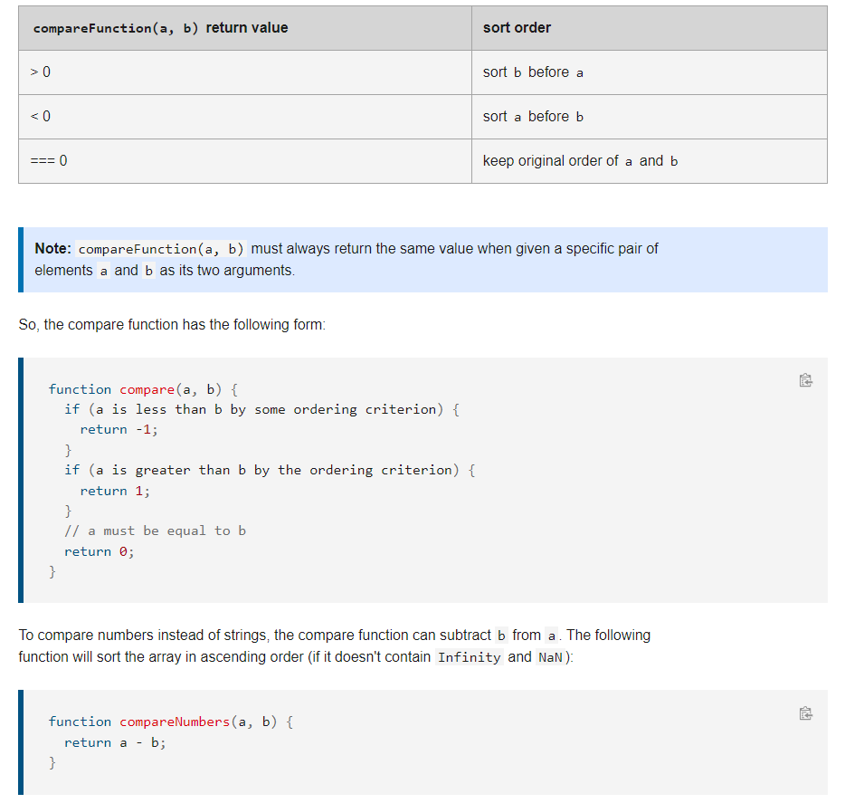

  > if you have a mixed array, like with strings and numbers together, then this is not gonna work and simply not to use the sort method

  ```js
  // Sorting Array

  // strings
  const owners = ["Jonas", "Adam", "Zach", "Martha"];
  console.log(owners.sort()); // arranged alphabetically

  // numbers
  const movements = [200, 450, -400, 3000, -650, -130, 70, 1300];
  console.log(movements);
  // console.log(movements.sort()); // not ordered  --sort method does the sorting based on strings

  // RULE
  // return < 0 = A before B (keep order)
  // return > 0 = B before A (switch order)

  // ASCENDING
  // movements.sort((a, b) => {
  //   // ascending order -- small to large
  //   if (a > b) return 1;
  //   if (b < a) return -1;

  //   // // mdn
  //   // if (a < b) return -1;
  //   // if (a > b) return 1;
  // }); //need to use a callback function for number to be sort

  movements.sort((a, b) => a - b);
  console.log(movements);
  // a: current value
  // b: next value

  // DESCENDING
  // movements.sort((a, b) => {
  //   // ascending order -- small to large
  //   if (a > b) return -1;
  //   if (a < b) return 1;
  // });
  movements.sort((a, b) => b - a);
  console.log(movements);

  // mixed arrays --strings and number
  ```

- More Ways of Creating and Filling Arrays

  > generate arrays programmatically w/o having to define all the items manually

  - 1st: use the Array() constructor function
  - 2nd: use fill method to fill empty array created by the new Array() constructor function

  > Array.from() --function was initially introduced into JavaScript in order to create arrays from array like structures.

  - Strings, Maps or Sets, they are all Iterables in JavaScript. And so they can be converted to real arrays using Array.from().

  ```js
  // More Ways of Creating and Filling Arrays

  const arr = [1, 2, 3, 4, 5, 6, 7];
  console.log(new Array([1, 2, 3, 4, 5, 6, 7]));

  // empty array + fill method
  const x = new Array(7);
  console.log(x);
  // console.log(x.map(() => 5));

  x.fill(1);
  x.fill(1, 3, 5); // same with slice method --1st parameter (1) will be the fill element --can specify a begin parameter (3) --and can specify end parameter (5) the final index here is not gonna be included in the array.
  console.log(x);

  // not empty
  arr.fill(23, 2, 6);
  console.log(arr);

  // Create new array programmatically --using Array.from()
  const y = Array.from({ length: 7 }, () => 1); // not using the from as a method on array instead we are using it on the Array() constructor (new Array())

  // array here is exactly the same as new Array(), so again, array here is a function and then on this function object, we call the from() method.

  // 1st: pass in an object with the length property
  // 2nd: mapping function (what will return to new array )
  console.log(y); // [11111111]

  const z = Array.from({ length: 7 }, (_, i) => i + 1);
  console.log(z); // [1234567]

  // NODELIST
  // querySelectorAll() --returns something called a Nodelist --something like an array which contains all selected elements but its not a real array

  // Note:  if we actually wanted to use a real array method like that on a NodeList, we would first need to convert the NodeList to an array. And for that Array.from() is perfect.

  // movement array not stored in our code --first need get them first in UI and do the calculation

  // const movementsUI = Array.from(document.querySelectorAll('.movements__value'));
  // console.log(movementsUI);

  labelBalance.addEventListener("click", function () {
    const movementsUI = Array.from(
      document.querySelectorAll(".movements__value"),
      (el) => Number(el.textContent.replace("€", ""))
    );
    console.log(movementsUI);

    const movementsUI2 = [...document.querySelectorAll(".movements__value")];
    console.log(movementsUI2);
  });

  // We used a Array.from() to create an array from the result of the querySelectorAll() which is a NodeList, which is not really an array, but an array like structure and that array like structure can easily be converted to an array using Array.from().

  // And then as a second step, we even included a mapping function, which then transforms that initial array to an array exactly as we want it.
  ```

- Summary: Which Array Method to Use?

  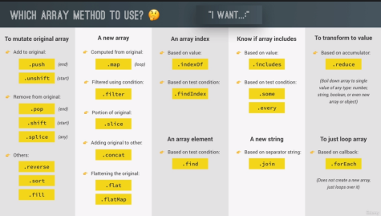

- Array Method: Practice

  ```js
  // Array Method Practice

  // 1.
  const bankDepositSum = accounts
    .flatMap((acc) => acc.movements)
    .filter((mov) => mov > 0)
    .reduce((sum, cur) => sum + cur, 0);

  console.log(bankDepositSum);

  // 2.
  // const numDeposit1000 = accounts
  //   .flatMap(acc => acc.movements)
  //   .filter(mov => mov >= 1000).length;

  const numDeposit1000 = accounts
    .flatMap((acc) => acc.movements)
    .filter((mov) => mov >= 1000)
    // .reduce((count, cur) => (cur >= 100 ? count + 1 : count), 0);
    .reduce((count, cur) => (cur >= 100 ? ++count : count), 0); // use prefic plus plus as solution ++count
  console.log(numDeposit1000);
  // we can even use reduce to basically simply count something in an array. So what's important to keep in mind is that we have this value (0) outside. So this accumulator, which we can use to reduce the array down to anything that we want.

  // prefix ++operator
  let a = 10;
  console.log(a++);
  // the plus plus operator does actually increment the value but it still returns the previous value.
  console.log(a);
  // So if we now log the a again here, you will see that now it is indeed 11.

  // 3.
  // reduce method returns new object
  const { deposits, withdrawals } = accounts
    .flatMap((acc) => acc.movements)
    .reduce(
      (sums, cur) => {
        // cur > 0 ? (sums.deposits += cur) : (sums.withrawals += cur);
        sums[cur > 0 ? "deposits" : "withdrawals"] += cur;
        return sums;
      },
      { deposits: 0, withdrawals: 0 }
    );
  console.log(deposits, withdrawals);

  // 4.
  // this is a nice title -> This Is a Nice Title
  const convertTitleCase = function (title) {
    const capitalize = (str) => str[0].toUpperCase() + str.slice(1);

    const exceptions = [
      "a",
      "an",
      "and",
      "the",
      "but",
      "or",
      "on",
      "in",
      "with",
    ];

    const titleCase = title
      .toLowerCase()
      .split(" ")
      .map((word) => (exceptions.includes(word) ? word : capitalize(word)))
      .join(" ");

    return capitalize(titleCase);
  };
  console.log(convertTitleCase("this is a nice title"));
  console.log(convertTitleCase("this is a LONG title but not too long"));
  console.log(convertTitleCase("and here is another title with an EXAMPLE"));
  ```

## Section 12: Numbers, Dates, Intl and Timers

- Converting and Checking Numbers

  > in JavaScript, all numbers are presented internally as floating point numbers. --always as decimals

  > numbers are represented internally in a 64 base 2 format. So that means that numbers are always stored in a binary format. So basically, they're only composed of zeros and ones.

  > in this binary form, it is very hard to represent some fractions that are very easy to represent in the base 10 system that we are used to. So base 10 is basically the numbers from zero to nine, while binary is base 2 and so that's the numbers zero and one.

  ```js
  console.log(23 === 23.0);

  // Base 10: 0 - 9 (1/10 = 0.1) (3/10 = 3.33333333 infinite fraction)

  // Binary base 2: 0 - 1
  console.log(0.1 + 0.2); //infinite fraction
  console.log(0.1 + 0.2 === 0.3);

  // Conversion
  console.log(Number("23"));
  console.log(+"23");

  // Parsing
  //  every function is also an object. And this number object here has some methods to do parsing.
  console.log(Number.parseInt("30px", 10)); // 30
  console.log(Number.parseInt("e23", 10)); // NaN

  // the parseInt function actually accepts a second argument, which is the so-called radix. And the radix is the base of the numeral system that we are using.

  // Floating
  console.log(Number.parseInt(" 2.5rem ")); // 2
  console.log(Number.parseFloat(" 2.5rem ")); // 2.5 -- uses whenever need to read value out of string

  // Global function
  console.log(parseFloat(" 2.5rem ")); // 2.5

  // NaN -- use to check if value is NOT a number
  console.log(Number.isNaN(23)); // F
  console.log(Number.isNaN("23")); // F
  console.log(Number.isNaN(+"23x")); // T
  console.log(Number.isNaN(23 / 0)); // F

  // isFinite -- ultimate method to check if any value is a real number not a string
  console.log(Number.isFinite(23)); // T
  console.log(Number.isFinite("23")); // F
  console.log(Number.isFinite(+"23X")); // F
  console.log(Number.isFinite(23 / 0)); // F

  // isInteger --use to check if the value is integer
  console.log(Number.isInteger(23)); // T
  console.log(Number.isInteger(23.0)); // T
  console.log(Number.isInteger(23 / 0)); // F
  ```

- Math and Rounding

  ```js
  // Math and Rounding

  // Square root
  console.log(Math.sqrt(25)); // 5
  console.log(25 ** (1 / 2)); // 5
  console.log(8 ** (1 / 3)); // 2

  // max
  console.log(Math.max(5, 18, 23, 11, 2));
  console.log(Math.max(5, 18, "23", 11, 2));
  console.log(Math.max(5, 18, "23px", 11, 2));

  // min
  console.log(Math.min(5, 18, 23, 11, 2));

  // pie - calculate the area of a circle with (10px in css) radius
  console.log(Math.PI * Number.parseFloat("10px") ** 2);

  // Math.random() 0...1 -- starts with 0 * number need to randomize plus 1
  console.log(Math.trunc(Math.random() * 6) + 1);

  // generate random integers between two values
  const randomInt = (min, max) =>
    Math.floor(Math.random() * (max - min) + 1) + min;
  // 0...1 -> 0...(max - min) -> min...(max - min + min) -> min...max
  console.log(randomInt(10, 20));
  // how we end up with a nice function which will give us always a number that's going to stay between min and max.

  // Rounding Integers -- all method does type coersion
  console.log(Math.round(23.3));
  console.log(Math.round(23.9));

  console.log(Math.ceil(23.3)); // 23 -- rounded up
  console.log(Math.ceil(23.9)); // 24

  console.log(Math.floor(23.3)); //23 -- rounded down -- works with both positive and negative numbers
  console.log(Math.floor(23.9)); // 23

  console.log(Math.trunc(23.3)); // 23

  console.log(Math.trunc(-23.3)); // -23 --same with floor in dealing positive number but never work negative numbers
  console.log(Math.floor(-23.9)); // 23

  // Rounding Decimals -- decimals it works differently than with integers
  console.log((2.7).toFixed(0)); // '3' --toFixed always return a string and not a number
  console.log((2.7).toFixed(3)); // '2.700' --adds two zeros for decimal place of 3
  console.log((2.345).toFixed(2)); // '2.35'
  console.log(+(2.345).toFixed(2)); // 2.35 --convert string into number

  // Does this here works in a similar way than the string methods?
  // primitives actually don't have methods. And so behind the scenes, JavaScript will do boxing.

  // And boxing is to basically transform this to a number object, then call the method on that object. And then once the operation is finished it will convert it back to a primitive,
  ```

- The Remainder (%)

  > simply returns the remainder of a division

  ```js
  // Remainder Operator
  console.log(5 % 2); // 1
  console.log(5 / 2); // 5 =  2 * 2 + 1

  console.log(8 % 3); // 2
  console.log(8 / 3); // 8 = 2 * 3 + 2

  // When number is even ? if its divisible by two --divisible by two means that if we divide it by two,remainder is zero

  console.log(6 % 2); // 0
  console.log(6 / 2); // 3

  console.log(7 % 2); // 1
  console.log(7 / 2); // 3 * 2 + 1

  const isEven = (n) => n % 2;
  console.log(8);
  console.log(23);
  console.log(514);

  labelBalance.addEventListener("click", function () {
    [...document.querySelectorAll(".movements__row")].forEach(function (
      row,
      i
    ) {
      // 0, 2, 4, 6
      if (i % 2 === 0) row.style.backgroundColor = "orangered";
      // 0, 3, 6, 9
      if (i % 3 === 0) row.style.backgroundColor = "blue";
    });
  });

  // every Nth time, then it is a good idea to use the remainder operator for that.
  ```

- Numeric Separator

  > Starting from year's 2021. We can use a feature called "Numeric Separators" to format numbers in a way that is easier for us, or for other developers to read and to understand.

  > Numeric separator only works in between numbers not in start nor end. Also one underscore (\_) are valid.

  ```js
  // Numeric Separator

  // 287, 460, 000, 000
  const diameter = 287_460_000_000;
  console.log(diameter);

  const priceCents = 345_99;
  console.log(priceCents);

  const transferFee1 = 15_00; // 15
  const transferFee2 = 1_500; // 1500

  const PI = 3.14_15;
  console.log(PI); // 3.

  console.log(Number("230_000")); // NaN
  // should really only use, these numeric separators, when you are writing down numbers

  // If you need to store a number in a string, for example, in an API, or if you get a number as a string from an API, you should not use underscores in there, because then JavaScript will not be able to parse the number correctly out of that string.

  console.log(parseInt("230_000")); // 230 --Only the parts that is here in front of the underscore. Everything else will then be ignored.
  ```

- Working with BigInt

  > a special type of integers that was introduced in yr 2020

  > numbers are represented internally as 64 bits. And that means that there are exactly 64 ones or zeros to represent any given number

  > these 64 bits only 53 are used to actually store the digits themselves. The rest are for storing the position of the decimal point and the sign.

  > BigInt stands for big integer. And it can be used to store numbers as large as we want. So no matter how big

  ```js
  // Working with BigInt

  console.log(2 ** 53 - 1); // biggest number --2 base two
  console.log(Number.MAX_SAFE_INTEGER); // stored into the number namspace -- any integer that is larger than this is not safe

  // sometimes works some not
  console.log(2 ** 53 + 1);
  console.log(2 ** 53 + 2);
  console.log(2 ** 53 + 3);
  console.log(2 ** 53 + 4);

  // BigInt
  console.log(123345454575484515484548448n); // --n transforms regular number into BigInt number
  console.log(BigInt(123345454575484515484548448)); // this constructor function should only be used with small numbers

  // Operations
  console.log(10000n + 10000n);
  console.log(123545699878744815454n * 10000000n);

  const huge = 54156746534657545455n;
  const num = 17;
  // console.log(huge * num); // cannot mix BigInt and other types of data (regular number)
  console.log(huge * BigInt(num)); // Solution

  // console.log(Math.sqrt(16n)); // Error --math operation does not work in bigInt

  // 2 exception -- comparison operators and plus operator when working with strings

  // logical operator
  console.log(20n > 15); // T
  console.log(20n === 20); // F --different primitive type --triple operator does not do type coersion
  console.log(typeof 20n); // bigInt
  console.log(20n == "20"); // T --double operator does type coersion --coerce to a regular numnber

  // string concatenation
  console.log(huge + " is REALLY HUGE!!!!");

  // Division --bigInt indeed is an integer
  console.log(10n / 3n); // 3n --simply retiurn the closest BigInt
  console.log(10 / 3); // 3.333333333335

  console.log(11n / 3n); // 3n -- simply cuts the decimal part offs
  ```

- Creating Dates

  ```js
  // Creating Dates

  const now = new Date();
  console.log(now);

  // parse date from date string
  console.log(new Date("Mar 08 2022 17:36:46"));
  console.log(new Date("December 24, 2015"));

  //  Z here means the UTC. So that's the Coordinated Universal Time, which is basically the time without any time zone in London and also without daylight savings.
  console.log(new Date(2037, 10, 19, 15, 23, 5));
  console.log(new Date(2037, 10, 31)); // Dec 01, 2037

  // ms
  console.log(new Date(0)); // Jan 01, 1970 milliseconds after that initial Unix time

  // convert days to milliseconds
  console.log(new Date(3 * 24 * 60 * 60 * 1000)); // 3days after in Unix time (3 days, 24hrs, 60 mins ===  hr, 60secs and 1000 ms)

  // these date are special type of object --have own methods
  // Working with dates
  const future = new Date(2037, 10, 19, 15, 23);
  console.log(future);
  console.log(future.getFullYear()); // dont use getYear()
  console.log(future.getMonth());
  console.log(future.getDate()); // Day
  console.log(future.getDay()); // day in present date
  console.log(future.getHours());
  console.log(future.getMinutes());
  console.log(future.getSeconds());

  // convert particular date object into string that can store somewghere
  console.log(future.toISOString()); //  follows some kinds of international standard

  console.log(future.getTime()); // 2142228180000 (huge amount passed since 01-01-1970)--timestamp is the milliseconds which passed since 01-01-170

  console.log(new Date(2142228180000)); // reverse of timestamp

  // timestamp is a special method that we can use to get the timestamp for right now
  console.log(Date.now());
  console.log(new Date(1646734561871));

  // set methods
  future.setFullYear(2040);
  console.log(future);
  // also exist setMonth, setDate and so forth method
  ```

- Operation with Dates

  ```js
  // Operations with Dates

  // convert date to a number will result a timestamp in milliseconds

  const future = new Date(2037, 3, 14);
  console.log(+future);

  const calcDaysPassed = (date1, date2) =>
    (date2 - date1) / (1000 * 60 * 60 * 24);

  const day1 = calcDaysPassed(new Date(2037, 3, 14), new Date(2037, 3, 24));
  console.log(day1);

  // Note: if need precise calculation e.g time changes due to daylight saving changes --use a date library like moment.js
  ```

- Internationalizing Dates (INTL)

  ```js
  // Internationalizing Dates(Intl) --Experimenting with API
  const now = new Date();
  const options = {
    hour: "numeric",
    minute: "numeric",
    day: "numeric",
    month: "long",
    year: "numeric",
    weekday: "long",
  };

  // location from users browser
  const locale = navigator.language;
  console.log(locale);

  labelDate.textContent = new Intl.DateTimeFormat(locale, options).format(now); // we need to pass into this function here is a so-called locale string.And this locale is usually the language and then dash the country.
  ```

- Internationalizing Numbers (Intl)

  ```js
  // Internationalizing Number (intl) -- Experimenting
  const num = 23564586.23;

  const options = {
    style: "currency",
    unit: "celsius",
    currency: "EUR",
    // useGrouping: false,
  };

  console.log("US: ", new Intl.NumberFormat("en-US", options).format(num));
  console.log("GERMANY: ", new Intl.NumberFormat("de-DE", options).format(num));
  console.log("PH: ", new Intl.NumberFormat("en-US", options).format(num));
  console.log(
    navigator.language,
    new Intl.NumberFormat(navigator.language, options).format(num)
  );
  ```

  - Timers: setTimeOut and setInterval

  > Set timeout timer runs just once, after a defined time

  > Set interval timer keeps running basically forever, until we stop it.

  ```js
  // Timers: setTimeOut and setInterval

  // set time out -- this function receives a callback function. So just like some array methods, or DOM event handlers as the 1st paramter and specify a second argument when does the function to be called (e.g milliseconds)

  // when the execution of our code reaches this point, it will simply call the set timeout function, it will then essentially register this callback function here to be called later. And then the code execution simply continues. And we can prove that by doing something after the set timeout.

  // setTimeout(
  //   (ing1, ing2) => console.log(`Here is your pizza with ${ing1} and ${ing2}`),
  //   3000,
  //   'olives',
  //   'spinach'
  // ); // all the arguments here that we pass after the delay will be arguments to the function.

  const ingredients = ["olives", "spinach"];
  const pizzaTimer = setTimeout(
    (ing1, ing2) => console.log(`Here is your pizza with ${ing1} and ${ing2}`),
    3000,
    ...ingredients
  );
  console.log("Waiting...");

  // if (ingredients.includes('spinach')) clearTimeout(pizzaTimer);

  // Asynchronous JS -- as soon as JavaScript hits this line of code here, it will simply basically keep counting the time in the background, and register this callback function to be called after that time has elapsed, and then immediately, JavaScript will move on to the next line,

  // setInterval
  setInterval(function () {
    const now = new Date();
    console.log(now);
  }, 1000);

  // Challenge
  setInterval(function () {
    const now = new Date();
    const hour = now.getHours();
    const minute = now.getMinutes();
    const sec = now.getSeconds();
    const ms = now.getMilliseconds();

    const clock = `${hour}:${minute}:${sec}:${ms}`;

    console.log(clock);
  }, 1000);
  ```

## Section 13: Advanced DOM and Events

- Document (e.g HTML Document `<!DOCTYPE html>`)

- Document Object

  - -- each HTML document that gets loaded into a window becomes a document object. The document contains the contents of the page.
  - -- is a special object that have access to in JS
  - -- serves as entry point into the DOM
  - -- represents any web page loaded in the browser

- DOM -- structured representation of HTML documents(DOM TREE) allows JS to access html elements and styles to manipulate them (DOM MANIPULATION)

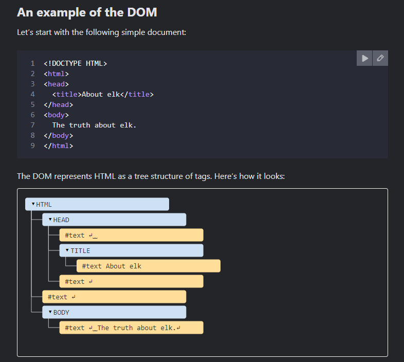
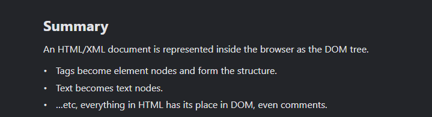
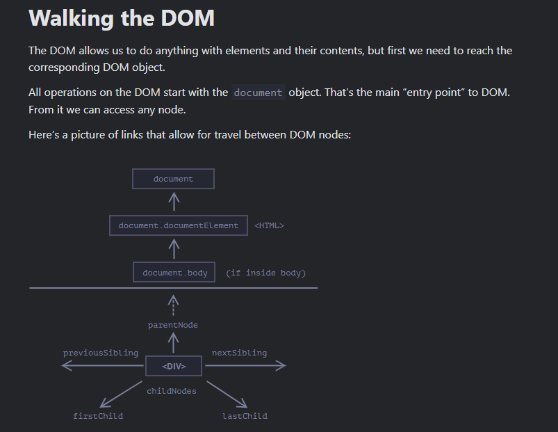

- How DOM really works (how DOM is organized internally)

  - DOM is basically the interface between all JS code and browser or more specificially HTML Documents

  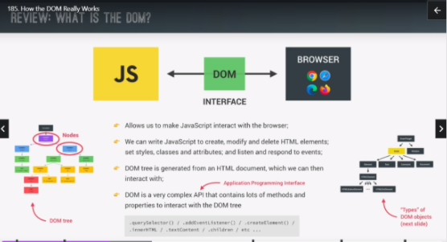

  - some nodes are HTML elements but others are just text --this is really important to understand because all these DOM methods and properties are organized into these different types of objects.

  

  - Rule: Everything that's in the HTML has to go into DOM as well **Everything in HTML, even comments, becomes a part of the DOM.**
  - Element Type --Gives each HTML access to a ton of useful properties such as innerHTML, classList, children or parent element --each element will be represented internally as an object
  - Now just to make this complete, the element type has internally an HTML element, child type. And that element type itself has exactly one child type for each HTML element that exists in HTML. So we have a special type for buttons, a special type for images,for links, and so on and so forth.

  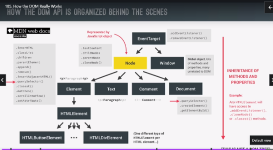

  - Inheritance --makes all DOM works --inheritance means that all the child types will also get acces to the methods and properties of all their parent node types e.g HTML element will get access to everything from element type like innerHTML or classList or other methods and properties

  - DOM Manipulation --just another type of node so it contains important method such as querySelector()--available both document and element types, createElement() and getElementById()

  - EventTarget --parent of both node type and also window node type --can call addEventListener on every node type in DOM API

  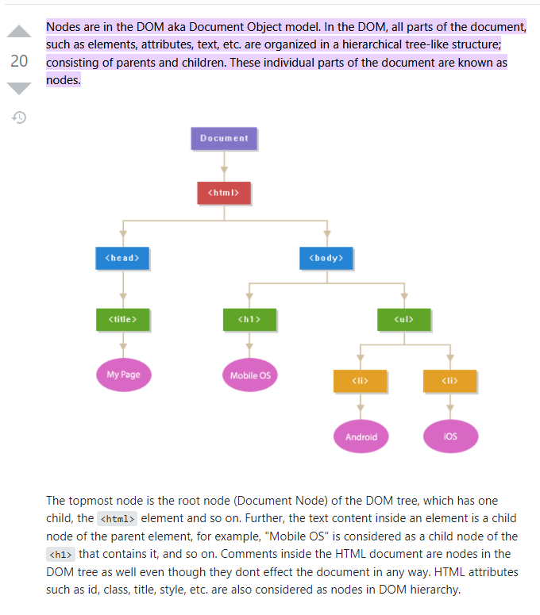

- Selecting, Creating and Deleting Document

  ```js
  // Selecting, Creating and Deleting Document

  // Selecting Elements (HTML document)
  console.log(document.documentElement); // root
  console.log(document.head); // if inside the head
  console.log(document.body); // if inside the body

  const header = document.querySelector(".header");
  const allSection = document.querySelectorAll(".section");
  console.log(allSection); // return a nodelist of all section element

  document.getElementById("section--1"); // no need to use # or . (only applicable to querySelector metthod)
  const allButton = document.getElementsByTagName("button");
  console.log(allButton); // return HTMLCollection() --different from node list(not update automatically) --so called life collection that means if the DOM changes this collection is also immediately updated automatically

  console.log(document.getElementsByClassName("btn")); // return HTML Collections

  // CREATING and INSERTING ELEMENTS (programmatic way)
  // .insertAdjacentHTML --quick and easy way of creating and inserting (based on Bankist App) elements

  const message = document.createElement("div"); // creates DOM elements and stores that element into the variable message --this element is not yet in our DOM (web page) --this is just a DOM object
  message.classList.add("cookie-message");
  // message.textContent = 'We use cookies for improved functionality and analytics';
  message.innerHTML =
    'We use cookies for improved functionality and analytics. <button class = "btn btn--close--cookie"> Got it! </button>'; // method use to read and set content

  // header.prepend(message); // --basically adds the element as the first child of header element --method use to insert created DOM element on DOM (web page - HTML)
  header.append(message); // --basically adds the element as the last child of header element

  // Note: Element only insert at once, message element is now indeed a life element living in the DOM --can't be at multiple places at the same time
  // Note: We can use prepend and append not only to insert elements but also to move them
  // DOM ELEMENT IS UNIQUE !!! only exist at one place at a time

  //header.append(message.cloneNode(true)); // copy all the child element by setting true at parameter --method use to insert multiple elements

  // header.before(message); // insert before the header element -- message and header as siblings
  // header.after(message);

  // DELETE Elements
  document
    .querySelector(".btn--close--cookie")
    .addEventListener("click", function () {
      message.remove();

      // message.parentElement.removeChild(message); // message and then we would move up in a DOM tree,remove child and then again the name of the element that we want to remove.

      // DOM traversing -- way of moving up and down in the DOM tree like selecting (parentElement)
    });
  ```

- Styles, Attributes and Classes

  ```js
  // STYLES
  message.style.backgroundColor = "#37383d";
  message.style.width = "120%";

  console.log(message.style.color); // Reference Error
  console.log(message.style.backgroundColor); // --only found in inline css

  // get style even not in DOM or in html doc
  console.log(getComputedStyle(message).color);
  console.log(getComputedStyle(message).height);

  message.style.height =
    Number.parseFloat(getComputedStyle(message).height, 10) + 30 + "px"; // Need to use parseInt/parseFloat in order to read and convert to number

  // documentElement === HTML :root (style.css)
  document.documentElement.style.setProperty("--color-primary", "orangered"); // use setProperty() easily change the style then we pass the name of property and the value

  // ATTRIBUTES
  const logo = document.querySelector(".nav__logo");
  console.log(logo.className);
  console.log(logo.alt);
  console.log(logo.src); // absolute URL
  console.log(logo.getAttribute("src")); // relative URL as relative to the folder in HTML file

  const link = document.querySelector(".twitter-link");
  console.log(link.href); // absolute URL
  console.log(link.getAttribute("href")); // absolute URL

  const link1 = document.querySelector(".nav__link--btn");
  console.log(link1.href); // absolute URL
  console.log(link1.getAttribute("href")); // '#' - relative URL
  // setting attribute
  logo.alt = "Beautiful minimalist logo";
  logo.setAttribute("company", "Bankist");

  // non-standard
  console.log(logo.designer); // undefined --not an attribute in html is not a standard property in an element
  console.log(logo.getAttribute("designer")); // Jonas

  // data attributes --special type (has to start with DATA word)
  console.log(logo.dataset.versionNumber); // need to camelCase name stated in html attribute (data-version-number)

  // Note: special attributes always stored in the dataset object
  // **oftern use data attributes when working with UI and need to store data in UI esp in HTML code

  // CLASSES
  logo.classList.add("c", "k");
  logo.classList.remove("c", "k");
  logo.classList.toggle("c", "k");
  logo.classList.contains("c", "k"); // not includes
  // **can pass multiple classes passin in multiple values

  // !! DONT USE !!
  logo.className = "Jonas"; // will override existing  --allows us to only put one class on any element
  ```

- Implementing Smooth Scrolling

  ```js
  // Implementing Smooth Scrolling

  // 1st way --old school
  const btnScrollTo = document.querySelector(".btn--scroll-to");
  const section1 = document.querySelector("#section--1");

  btnScrollTo.addEventListener("click", function (e) {
    const s1coords = section1.getBoundingClientRect(); // 1st: need to get the coordinates of the we want to scroll to
    console.log(s1coords); // DOM Rect: x: left (distance between the border on the browser), y: top(distance from the top), width: px, height: px

    // console.log(e.target.getBoundingClientRect());
    // **getBoundingClientRect() --basically relative to the visible view port

    // console.log('Current scroll (X/Y)', window.pageXOffset, window.pageYOffset); // current scroll --when at the top both should be zero

    // view height and width VP
    // console.log(
    //   'height/width viewport',
    //   document.documentElement.clientHeight, //not counting with scroll bars. It's just dimension of the VP that avaible for the content --excludes scroll bars
    //   document.documentElement.clientWidth
    // );

    // scrolling
    // window.scrollTo(
    //   s1coords.left + window.pageXOffset,
    //   s1coords.top + window.pageYOffset
    // ); // this top is always relative to the vuewport but not to the document (html) --not to the top of the page

    // solution:  simply add the current scroll position (window offset) to the top value of the page (window.scrollTo). And with this, we will then determine the position of the section here, not relative to the viewport. Not to the top of the browser window viewport, but instead to the top of the page. (current position + current scroll)
    // by doing the solution:  basically determined the absolute position of this element (section1) relative to the document. So to the entire page.

    // window.scrollTo({
    //   left: s1coords.left + window.pageXOffset,
    //   top: s1coords.top + window.pageYOffset,
    //   behavior: 'smooth',
    // });

    // Modern Way
    section1.scrollIntoView({ behavior: "smooth" });
  });
  ```

- Types of Events and Events Handlers

  ```js
  // Types of Events and Events Handlers
  const h1 = document.querySelector("h1");

  // addEventListener() -- allows us to add multiple event listeners to the same event -- can also remove an event handler
  const alertH1 = function (e) {
    alert("addEventListener: Great you are reading the heading !");

    // h1.removeEventListener('mouseenter', alertH1)
  };

  h1.addEventListener("mouseenter", alertH1);
  setTimeout(() => h1.removeEventListener("mouseenter", alertH1), 3000);

  // on-event property
  // h1.onmouseenter = function (e) {
  //   alert('addEventListener: Great you are reading the heading !');
  // };
  ```

- Event Propagation: Bubbling and Capturing

  - Capturing Phase -- events are captured when they come down from the document route all the way to the target, but our event handlers are not picking up these events during the capture phase (it's only listening for events in the bubbling phase, but not in the capturing phase.) NOTE: the default behavuor of addEventListener() method is capturing phase
  - Target Phase --as soon as the event reaches the target, event listeners wait for a certain event to happen as soon as the event occur ('click') it runs the attached callback function.
  - Bubbling Phase -- after reaching the target, the event then actually travels all the way up to the document route again, NOTE: can be very useful for something called event delegation

  - \*\* Why are we learning about all this detail? Well, it is indeed very important because basically, it's as if the event also happened in each of the parent elements.

  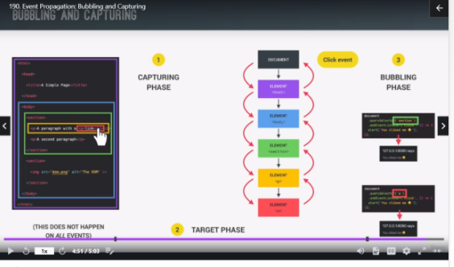

- Event Propagation in Practice

  ```js
  // Event Propagation in Practice

  // rgb(255,255,255)
  const randomInt = (min, max) => Math.floor(Math.random() * (max - min) + 1);
  const randomColor = () =>
    `rgb(${randomInt(0, 255)},${randomInt(0, 255)},${randomInt(0, 255)}) `;
  // console.log(randomColor(0, 255));

  document.querySelector(".nav__link").addEventListener("click", function (e) {
    this.style.backgroundColor = randomColor();
    console.log("LINK", e.target, e.currentTarget);
    console.log(e.currentTarget === this); // True

    // Stop event propagation
    // e.stopPropagation();
  });
  document.querySelector(".nav__links").addEventListener("click", function (e) {
    this.style.backgroundColor = randomColor();
    console.log("CONTAINER", e.target, e.currentTarget);
  });

  //  if we really do want to catch events during the capturing phase, we can define a third parameter in the addEventlistener function. If the third parameter is set to TRUE, the event handler will no longer listen to bubbling events but instead to capturing events
  document.querySelector(".nav").addEventListener(
    "click",
    function (e) {
      this.style.backgroundColor = randomColor();
      console.log("NAV", e.target, e.currentTarget);
    },
    false
  ); // this element is now listening for the event (like target phase) as it travels down from DOM, while the other ones (nav__link & nav__links) are listening for events as it travels back up

  // **e.target --the target is essentially where the event originated. So where the event first(actually) happened. So this is not the element on which the handler is actually attached
  // **e.currentTarget --indeed the element on which the event handler is attached
  // NOTE: noticed that the currentTarget is exactly the same as the this keyword. So, the this keyword is also the one pointing to the element on which the EventListener is attached to.
  ```

- Event Delegation: Implementing Page Navigation

  ```js
  // Page Navigation : Event Delegation
  // event delegation: use in event bubble up by simply putting eventlistener on a common parent of all the elements that we are interested in, then we can basically catch that event in the commen parent element

  // document.querySelectorAll('.nav__link').forEach(function (el) {
  //   el.addEventListener('click', function (e) {
  //     e.preventDefault();
  //     const id = this.getAttribute('href');
  //     console.log(id);
  //     document.querySelector(id).scrollIntoView({ behavior: 'smooth' });
  //   });
  // });

  // 1. Add event listener to common parent element
  // 2. Determine what element originated the event (event created)
  document.querySelector(".nav__links").addEventListener("click", function (e) {
    e.preventDefault();
    // console.log(e.target);

    // Matching strategy
    if (e.target.classList.contains("nav__link")) {
      const id = e.target.getAttribute("href");
      console.log(id);
      document.querySelector(id).scrollIntoView({ behavior: "smooth" });
    }
  });
  ```

- DOM Traversing

  - basically walking through the DOM --means can select an element based on another element

  ```js
  // DOM Traversing
  const h1 = document.querySelector("h1");

  // Going DOWNWARDS : --child element
  console.log(h1.querySelectorAll(".highlight"));
  console.log(h1.childNodes); // nodelist
  console.log(h1.children); // HTML collection --works only on direct children
  h1.firstElementChild.style.color = "white";
  h1.lastElementChild.style.color = "orangered";

  // Going UPWARDS : --parent element
  console.log(h1.parentNode);
  console.log(h1.parentElement);

  h1.closest(".header").style.background = "var(  --gradient-secondary)"; //closest parent element that has this class and simply applied all style to that element

  // if selector actually matches the element on which calling closest, its gonna be the return

  h1.closest("h1").style.background = "var(  --gradient-primary)";

  // closest -- use to find parent element in a multiple same elements. Opposite of querySelector, both receives a query string as an input but querySelector, finds children, no matter how deep in the Dom tree, while the closest method finds parents. And also no matter how far up in the Dom tree.

  // Gong SIDEWAYS -- siblings element
  console.log(h1.previousElementSibling);
  console.log(h1.nextElementSibling);

  console.log(h1.previousSibling);
  console.log(h1.nextSibling);

  console.log(h1.parentElement.children); // all siblings
  [...h1.parentElement.children].forEach(function (el) {
    if (el !== h1) el.style.transform = "scale(0.5)";
  });
  ```

- Building a Tab Component

  ```js
  // Building a Tabbed Component
  const tabs = document.querySelectorAll(".operations__tab");
  const tabsContainer = document.querySelector(".operations__tab-container");
  const tabsContent = document.querySelectorAll(".operations__content");

  // tabs.forEach(t =>
  //   t.addEventListener('click', function () {
  //     console.log('TAB');
  //   })
  // );

  // use event delegation
  tabsContainer.addEventListener("click", function (e) {
    const clicked = e.target.closest(".operations__tab");
    // console.log(clicked);

    // Guard clause --an if statement which will return early if some condition matches
    if (!clicked) return; // ignoring null

    // Active tab
    tabs.forEach((t) => t.classList.remove("operations__tab--active"));
    clicked.classList.add("operations__tab--active");

    // Activate content Area
    tabsContent.forEach((c) =>
      c.classList.remove("operations__content--active")
    );
    document
      .querySelector(`.operations__content--${clicked.dataset.tab}`)
      .classList.add("operations__content--active");
  });

  // Null --is the results of the closest method when there is no matching parent element be found
  // NOTE: the whole idea when we build components like this is to just add and remove classes as necessary to manipulate the content to our needs.
  ```

- Implementing Sticky Navigation

  ```js
  // Implementing Sticky Navigation

    const initialCoords = section1.getBoundingClientRect();

    window.addEventListener('scroll', function (e) {
      console.log(window.scrollY);

      if (window.scrollY > initialCoords.top) nav.classList.add('sticky');
      else nav.classList.remove('sticky');
    });
    // sroll --on window object and not at the event
    */

    // A better way: The intersection observer API
    const navHeight = nav.getBoundingClientRect().height;
    console.log(navHeight);

    const header = document.querySelector('.header');

    const stickyNavCb = function (entries) {
      const [entry] = entries;
      console.log(entry);

      if (!entry.isIntersecting) nav.classList.add('sticky');
      else nav.classList.remove('sticky');
    };

    const observer = new IntersectionObserver(stickyNavCb, {
      root: null,
      threshold: 0,
      rootMargin: `-${navHeight}px`, // rootMargin --is a box of 90px that will be applied outside of our target element
    });
    observer.observe(header);

    /*
    const obsCallback = function (entries, observer) {
      entries.forEach(entry => {
        console.log(entry);
      });
    }; // callback --get called each time the observed element (target) is intersecting the root at the threshold that we defined --called when the threshold is passed when moving into and out of the view
    // entries --an array of the threshold entries

    // intersectingRatio === threshold & isIntersecting === true

    const obsOptions = {
      root: null, // root(viewport) -- is the element that the target is intersecting (null is an alternative) --then will be able to observe the target element intersecting the entire viewport
      threshold: [0, 0.2], // threshold (visible in root VP)-- the percentage of intersection at which the observer callback will be called (obsCallback)
    };

    const observer = new IntersectionObserver(obsCallback, obsOptions);
    observer.observe(section1); // target -- element that will be intersecting

    // what actually is the intersection observer API, and why is it so helpful? Well, this API allows our code to basically observe changes to the way that a certain target element intersects another element, or the way it intersects the viewport.
  ```

- Revealing elements on Scroll

  ```js
  // Revealing Section as scrolling
  const allSection = document.querySelectorAll(".section");

  const revealSection = function (entries, observer) {
    const [entry] = entries;
    console.log(entry);

    if (!entry.isIntersecting) return;

    entry.target.classList.remove("section--hidden");
    observer.unobserve(entry.target);
  };
  const sectionObserver = new IntersectionObserver(revealSection, {
    root: null,
    threshold: 0.15,
  });
  allSection.forEach(function (section) {
    sectionObserver.observe(section);
    section.classList.add("section--hidden");
  });
  ```

- Lazy Loading Image

  ```js
  // Lazy Loading Image -- really great for performance
  const imgTarget = document.querySelectorAll("img[data-src]"); // use to select img data-src attributes

  const loadImg = function (entries, observer) {
    const [entry] = entries;
    console.log(entry);

    if (!entry.isIntersecting) return;

    // Replace src with data-src
    entry.target.src = entry.target.dataset.src;

    entry.target.addEventListener("load", function () {
      entry.target.classList.remove("lazy-img");

      observer.unobserve(entry.target);
    });
  };

  const imgObesver = new IntersectionObserver(loadImg, {
    root: null,
    threshold: 0,
    rootMargin: "200px",
  });

  imgTarget.forEach((img) => imgObesver.observe(img));
  ```

- Building Slider Component

  ```js
  // Building Slider Component
  const slider = function () {
    // Selector
    const slides = document.querySelectorAll(".slide");
    const btnLeft = document.querySelector(".slider__btn--left");
    const btnRight = document.querySelector(".slider__btn--right");
    const dotsContainer = document.querySelector(".dots");

    let curSlide = 0;
    const maxSlide = slides.length;

    // visual sample for translateX
    // const slider = document.querySelector('.slider');
    // slider.style.transform = 'scale(0.4) translateX(-800px)';
    // slider.style.overflow = 'visible';

    // slides.forEach((s, i) => (s.style.transform = `translateX(${100 * i}%`));
    // // 0%, 100%, 200%, 300%

    // Function
    const goToSlide = function (slide) {
      slides.forEach(
        (s, i) => (s.style.transform = `translateX(${100 * (i - slide)}%)`)
      );
      // cur slide = 1 : -100%, 0%, 100%, 200%
      // i(0) - curSlide(1) = -1
      // 1 - 1 = 0
      // 2 - 1 = 1
      // 3 - 1 = 2
    };

    // when page reload slide will be on its initial 0 (translateX)

    const creatDots = function () {
      slides.forEach(function (_, i) {
        dotsContainer.insertAdjacentHTML(
          "beforeend",
          `<button class="dots__dot" data-slide="${i}"></button>`
        );
      });
    };

    const activeDot = function (slide) {
      document
        .querySelectorAll(".dots__dot")
        .forEach((dot) => dot.classList.remove("dots__dot--active"));

      document
        .querySelector(`.dots__dot[data-slide="${slide}"]`) // can create selector using brackets notation for certain attributes
        .classList.add("dots__dot--active");
    };

    // Next slide function
    const nextSlide = function () {
      if (curSlide === maxSlide - 1) {
        curSlide = 0;
      } else {
        curSlide++;
      }

      goToSlide(curSlide);
      activeDot(curSlide);
    };

    const prevSlide = function () {
      if (curSlide === 0) {
        curSlide = maxSlide - 1;
      } else {
        curSlide--;
      }

      goToSlide(curSlide);
      activeDot(curSlide);
    };

    const init = function () {
      goToSlide(0);
      creatDots();
      activeDot(0);
    };
    init();

    // Event Handlers
    btnRight.addEventListener("click", nextSlide);
    btnLeft.addEventListener("click", prevSlide);

    document.addEventListener("keydown", function (e) {
      if (e.key === "ArrowLeft") prevSlide();
      e.key === "ArrowRight" && nextSlide();
    });

    dotsContainer.addEventListener("click", function (e) {
      if (e.target.classList.contains("dots__dot")) {
        const { slide } = e.target.dataset;
        goToSlide(slide);
        activeDot(slide);
      }
    });
  };

  slider();
  ```

- Lifecylec of DOM Events

  ```js
  //Lifecycle DOM Events
  document.addEventListener("DOMContentLoaded", function (e) {
    console.log("HTML parsed and DOM Tree built", e);
  }); // DOMContentLoaded --this event fired as soon as the HTML file loaded

  window.addEventListener("load", function (e) {
    console.log("Page fully loaded", e);
  });
  //  load event is fired by the window. As soon as not only the HTML is parsed, but also all the images and external resources like CSS files are also loaded. --complete page has finishes loading

  // window.addEventListener('beforeunload', function (e) {
  //   e.preventDefault();
  //   console.log(e);
  //   e.returnValue = '';
  // }); // beforeunload --this event is created immediately before a user is about to leave a page
  ```

- Efficient Script Loading: defer and async

  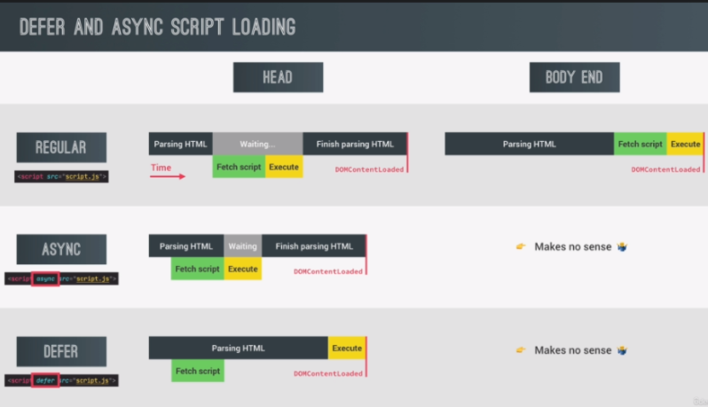
  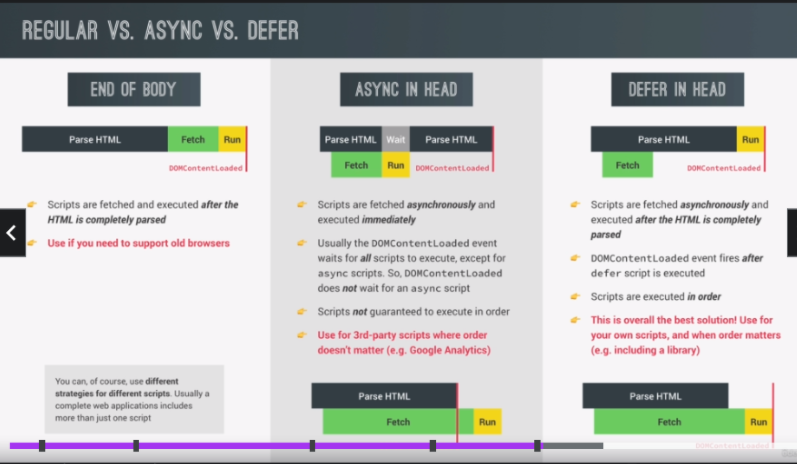

  - Conclusion: using the HTML head is overall the best solution. For example --if your script relies on some third party library that you need to include, you will include that library before your own script, so that your script can then use the library's code. And in this case, you have to use defer and not async. Because defer will guarantee the correct order of execution
  - for third party scripts, where the order does not matter, for example, an analytics software like Google Analytics, or an ad script, or something like that, then in this case, you should totally use async. So for any code that your own code will not need to interact with async is just fine. So it's a good use case for this kind of scripts.
  - NOTE: only modern browsers support async and defer. If you need to support all browsers, then you need to put script tag at the end

## Section 14: OOP with JS

- What is Object Oriented Programming?

  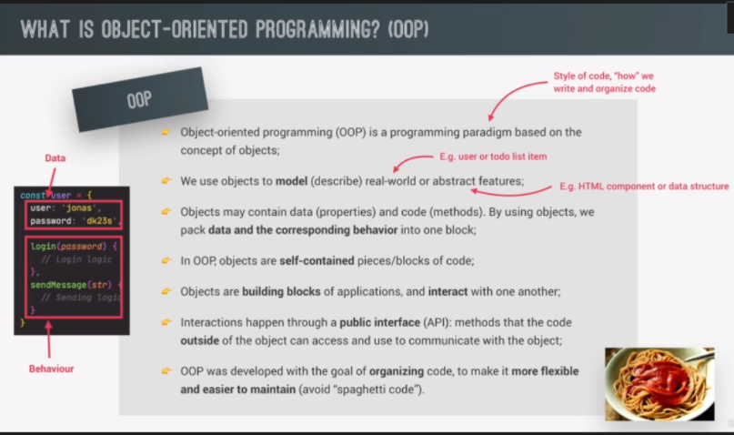

  - Class itself is not an object **CLASS is blueprint analogy while INSTANCE is like a real house**

  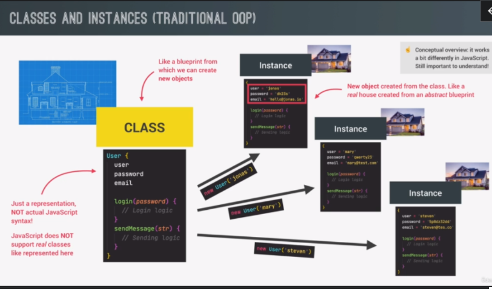

  - Abstraction
    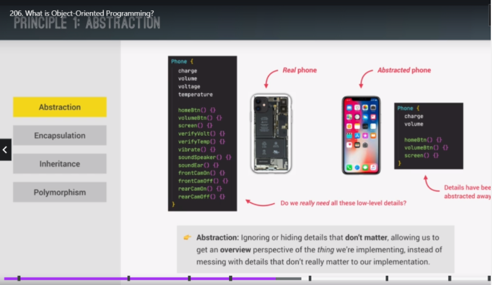

  - Encapsulation
    

    - State\*\* simply refers to an object data
    - \*\*allowing external code to manipulate internal state directly can cause many kinds of bugs esp in large code bases and dev teams
    - **public interface** -- all the methods that are not private, that are not encapsulated
    - making methods private easier to change the code without breaking code from the outside
    - \*\*in summary, we should always have the goal to nicely encapsulate most of our state and methods and only leaving essential methods public

  - Inheritance
    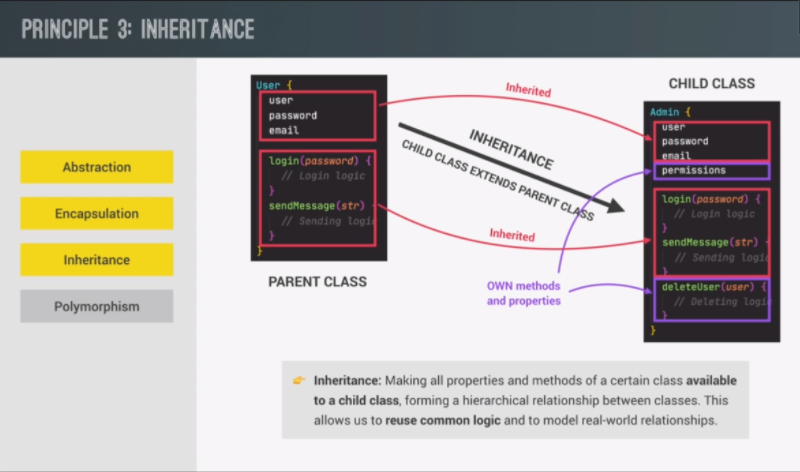

  - Polymorphism
    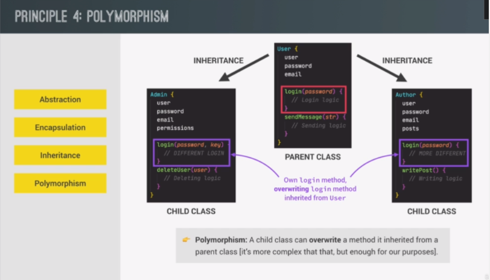

- OOP in JS
  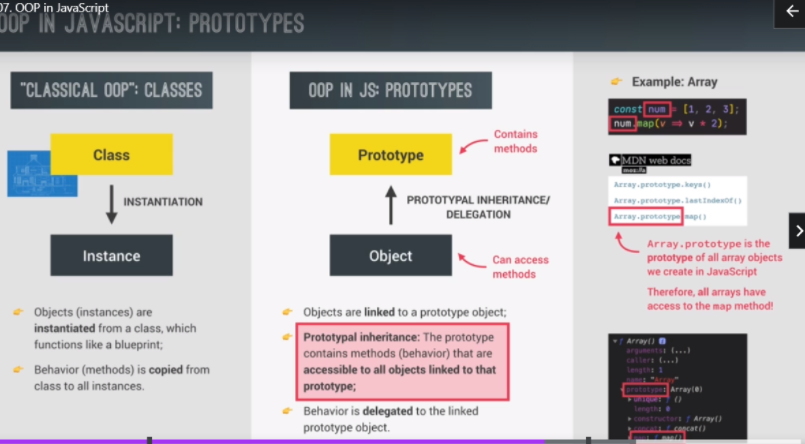

  - "Classical OOP": CLASSES

    - Class --is like a blueprint which is theoretical plan and that we use to build many houses in real world
    - Theoretical class can be used to create actual objects called **instance**, the process in creating an instance is called instantiation.

  - OOP in JS: PROTOTYPES
    - How does OOP actually work in JS?
      - In JS, prototypes and all objects in JS are linked to certain prototype object (each object has prototype)
      - the prototype object contains methods and properties that all the objects that are linked to that prototype can access and use. And this behavior is usually called **prototypal inheritance**--also called delegation --object delegate their behavior to the prototype. While in classical OOP, methods are copied from class to the object
      - **behavior: another term for methods**
      - **object delegate/inherit their behavior to the prototypes**
      - NOTE: difference between prototypal inheritance -- instance(object) inhereting from class. While inheritance in principles of OOP(tradional) -- one class inhereting from another class
      - NOTE: functions are also object

  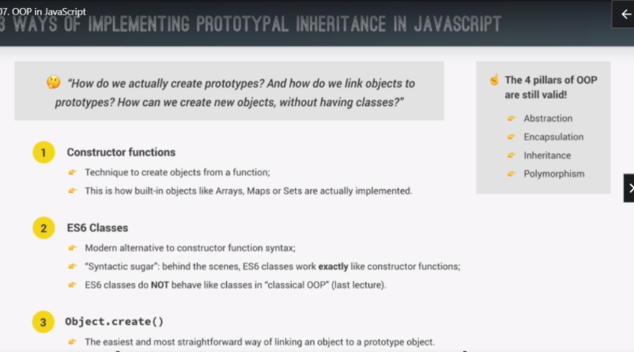

- Constructor Functions and the "new" Operator

  - Constructor functions always start with a capital letter
  - Arrow function will actually not work as a function constructor because it doesnt have its own this keyword. Only function expression and declaration will work
  - The difference between a regular function and constructor function is that we call the constructor using the "new" keyword
  - JS doesnt really have classes in traditional OOP --however constructor functions used to simulates classes

  -- NOTE: constructor functions are not really a feature of the JS language but rather simply a pattern that has been developed by other developers

  ```js
  const Person = function (firstName, birthYear) {
    // instance properties
    this.firstName = firstName;
    this.birthYear = birthYear;

    // never create method inside constructor function --terrible to the performance of code for thousands of Person object --solutiion? use prototypes and prototype inheritance
    //   this.calcAge = function () {
    //     console.log(2037 - this.birthYear);
    //   };
  }; // simulated class --blueprint
  const jonas = new Person("Jonas", 1991); // instance --actual with actual data
  console.log(jonas);
  console.log(jonas instanceof Person); // True -- operator to test instance

  // 1. New {empty} is created
  // 2. function is called, this keyword pointed to the new {}
  // 3. {} linked to prototype
  // 4. function automatically return {} --no longer to be empty

  const matilda = new Person("Matilda", 2017);
  const jack = new Person("Jack", 1975);
  console.log(matilda, jack);
  ```

- Prototypes

  - each and every function in JS automatically has a property called prototype --includes constructor function

  - each object created by constructor function will get access to all the methods and properties that we define on the constructors prototype property

  ```js
  // Prototypes
  console.log(Person.prototype); // any object has access to the method and properties from its prototype

  // set method to prototype
  Person.prototype.calcAge = function () {
    console.log(2037 - this.birthYear);
  }; // this keyword set to the object(created by constructor function) that is calling the method
  jonas.calcAge(); // jonas object is connected to Person,prototype --prototypal inheritance
  matilda.calcAge();
  jack.calcAge();

  console.log(jonas.prototype); // undefined
  console.log(jonas.__proto__); // Step 3 --jonas variable --creates and link this proto property and it sets its value to the prototype property of the function (Person.prototype.calcAge()) that is being called.

  console.log(jonas.__proto__ === Person.prototype); // True --  jonas object is essentially the prototype property of the constructor function
  // jonas prototype is the prototype property of the Person constructor function.

  console.log(Person.prototype.isPrototypeOf(jonas)); // True
  console.log(Person.prototype.isPrototypeOf(Person)); // False
  console.log(jonas.__proto__.isPrototypeOf(jonas)); // True
  console.log(jonas.__proto__.isPrototypeOf(Person)); // False

  // NOTE: Person.prototype here is actually not the prototype of Person(variable--object). But instead, it is what's gonna be used as the prototype of all the objects that are created with the Person constructor function.

  // can also set properties to prototype
  Person.prototype.species = "Homo Sapiens";
  console.log(jonas.species, matilda.species);

  console.log(jonas.hasOwnProperty("firstName")); // true
  console.log(jonas.hasOwnProperty("species")); // false

  // NOTE: this property is not really directly in the object, so it's not its own property own properties are only the ones that are declared directly on the object itself. Not including the inherited properties
  ```

- Prototypal Inheritance and Prototype Chain

  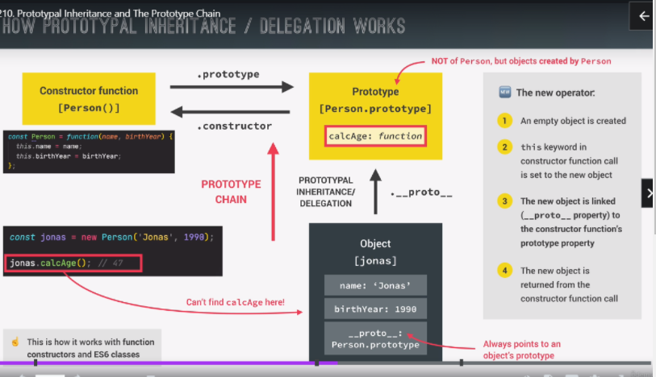

  - this constructor function has a prototype property which is an object and inside that object, we defined the calcAge method and Person.prototype itself actually also has a reference back to person which is the constructor property. So, essentially Person.prototyp.constructor is gonna point back to person itself.

  - if a property or a method cannot be found in a certain object JS will look into its prototype

  - ability of looking up methods and properties is called **Prototype Chain**

  - object constructor function and this is actually the function that is called behind the scenes whenever we create an object literal. So just an object simply with curly braces. So essentially the curly braces are just like a shortcut to writing new object

  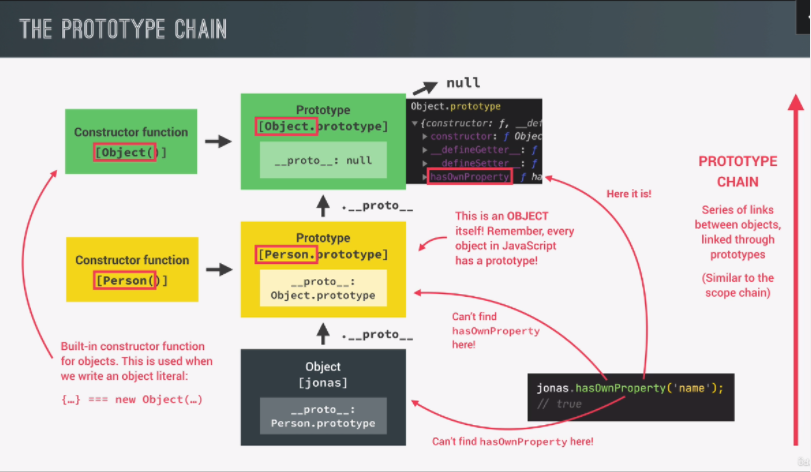

  - prototype chain is similar to scope chain -- certain object gonna look up into the next prototype chain and see if it can find it there --works in properties and method

- Prototypal Inheritance on Built-In Object

  ```js
  // Prototypal Inheritance on Built-In Objects

  console.log(jonas.__proto__); // constructor: Person.prototype
  console.log(jonas.__proto__.__proto__); // constructor: Object.prototype (top of prototype chain)
  console.log(jonas.__proto__.__proto__.__proto__); // constructor: null

  console.dir(Person.prototype.constructor); // constructor property points back at Person()

  const arr = [3, 5, 9, 4, 5, 8, 5]; // Array Prototype
  console.log(arr.__proto__); // all arrays get access to all method as arrays are object. Each array does not contain all of these methods but instead it will inherit those method

  // same as creating new Array === []

  console.log(arr.__proto__ === Array.prototype); // True

  console.log(arr.__proto__.__proto__); // object constructor
  console.log(arr.__proto__.__proto__.__proto__); // null
  // console.dir(arr.__proto__.__proto__.__proto__);

  // NOTE: the prototype property of the constructor (function) is gonna be the prototype of all the objects created by that constructor.

  Array.prototype.unique = function () {
    return [...new Set(this)];
  };
  console.log(arr.unique());

  // TIP: extending the prototype of a built-in object is not a good idea if working in large project

  const h1 = document.querySelector("h1");
  console.dir((x) => x + 1);
  ```

- ES6 Classes

  > Classes on JS do not work like traditional classes in other languages like Java or C++

  > Classes are special type of functions thats why we have classes declaration and class expression

  ```js
  // ES6 Classes

  // class expression
  //const PersonCl = class {};

  // class declaration
  class PersonCl {
    // similar way as constructor function --constructor also called method in ES6 classes
    constructor(firstName, birthYear) {
      this.firstName = firstName;
      this.birthYear = birthYear;
    }

    // Methods will be added to .prototype propert of the classes
    calcAge() {
      console.log(2037 - this.birthYear);
    } // -- will automatically be added to the prototype property of the class

    greet() {
      console.log(`Hi! I am ${this.firstName}`);
    }
  }
  // to create new object, also uses "new" operator and constructor will automatically be called
  const jonas = new PersonCl("Jonas", 1991);
  console.log(jonas);
  console.log(jonas.__proto__);
  jonas.calcAge();

  console.log(jonas.__proto__ === PersonCl.prototype); // True --same with constructor function but the only difference is we can write the method inside the class

  // adding method
  // PersonCl.prototype.greet = function () {
  //   console.log(`Hi! I am ${this.firstName}`);
  // };
  jonas.greet();

  // NOTE:
  // 1. Classes are not hoisted --means we cannot use them before they are declared in the code
  // 2. Classes are first class citizen --means we can pass them into functions and also return them a function
  // 3. Classes are executed in strict mode
  ```

- Setters and Getters

  - call these special properties assessor properties, while the more normal properties are called data properties.

  - getters and setters are basically functions that get and set a value and looks as if it is a property in object

  ```js
  // Setters and Getters
  const account = {
    owner: "Jonas",
    movements: [200, 530, 120, 300],

    get latest() {
      return this.movements.slice(-1).pop();
    },

    set latest(mov) {
      this.movements.push(mov);
    },
  };
  console.log(account.latest);

  account.latest = 50;
  console.log(account.movements);

  //////////////////////////////////////
  class PersonCl {
    // similar way as constructor function --method of class called constructor
    constructor(fullName, birthYear) {
      this.fullName = fullName;
      this.birthYear = birthYear;
    }

    // Methods will be added to .prototype propert of the classes
    calcAge() {
      console.log(2037 - this.birthYear);
    } // -- will automatically be added to the prototype property of the class

    greet() {
      console.log(`Hi! I am ${this._fullName}`);
    }

    get age() {
      return 2037 - this.birthYear;
    }

    // set a property that already exist
    set fullName(name) {
      if (name.includes(" ")) this._fullName = name;
      else alert(`${name} is not a fullname`);
    }

    get fullName() {
      return this._fullName;
    }
  }
  ```

- Static Method

  - The static keyword defines a static method or property for a class, or a class static initialization block. Neither static methods nor static properties can be called on instances of the class. Instead, they're called on the class itself.

  - Array.from()
    - basically just a simple function, but its a function that's attached to the Array constructor.
    - convert any array like structure to a real Array
    - method that is attached to the Array Constructor and not to the prototype property of the constructor
    - all array do not inherit this method --because its not on their prototype. Its simply attached to the constructor itself.
    - sometimes they are still useful to implement some kind of helper function about a class or about a constructor function.

  ```js
  // Static Method

  // Array.from() --this method .from() is a simple function attached to the Array constructor and not to the prototype property of the constructor  --also this method is in the Array name space same as Number.parseFloat()

  const Person = function (firstName, birthYear) {
    this.firstName = firstName;
    this.birthYear = birthYear;
  };
  const jonas1 = new Person("Jonas", 1991);

  // add static method
  Person.hey = function () {
    console.log("Hey there!");
    console.log(this); // Person object --whatever object is calling the method, will be the this key word inside of that function. And so here the this key word, is simply that entire constructor function.
  };
  Person.hey();
  // jonas1.hey(); // Reference Error --not in the prototype of jonas1

  ///////////////////////////////////////////////
  class PersonCl {
    // similar way as constructor function --method of class called constructor
    constructor(fullName, birthYear) {
      this.fullName = fullName;
      this.birthYear = birthYear;
    }

    // INSTANCE METHOD
    // Methods will be added to .prototype propert of the classes
    calcAge() {
      console.log(2037 - this.birthYear);
    } // -- will automatically be added to the prototype property of the class

    greet() {
      console.log(`Hi! I am ${this._fullName}`);
    }

    get age() {
      return 2037 - this.birthYear;
    }

    // set a property that already exist
    set fullName(name) {
      if (name.includes(" ")) this._fullName = name;
      else alert(`${name} is not a fullname`);
    }

    get fullName() {
      return this._fullName;
    }

    // STATIC METHOD
    static hey() {
      console.log("Hey there!");
      console.log(this);
    }
  }
  PersonCl.hey();
  // NOTE: static methods are not available on the instances and sometimes they are still useful to implement some kind of helper function about a class or about a constructor function.
  ```

- Object.create

  - works differently than constructor functions and classes
  - still have prototypal inheritance, however, there are **no prototype properties** involved. And also **no constructor functions**, and **no new operator**.
  - So instead, we can use Object.create() to essentially **manually set the prototype** of an object, to any other object that we want.

  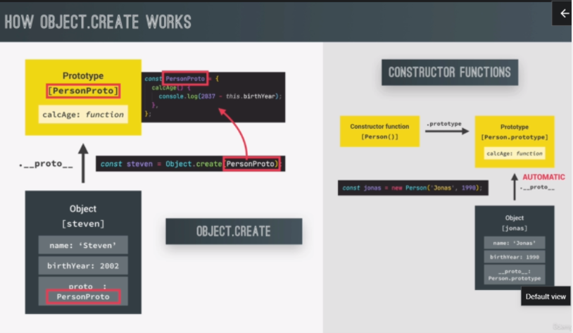

  - NOTE: Object.create -- looking at properties, or methods in a prototype chain, works just like it worked in function constructors, or classes. And so the prototype chain, in fact, looks exactly the same here. The big difference is that we didn't need any constructor function, and also no prototype property at all,

  ```js
  // Object.create

  const PersonProto = {
    calcAge() {
      console.log(2037 - this.birthYear);
    },

    init(firstName, birthYear) {
      this.firstName = firstName;
      this.birthYear = birthYear;
    }, // not a prototype property --just manual way of initializing the object
  };
  console.log(PersonProto.__proto__); // all objects has a prototype

  const steven = Object.create(PersonProto); // manually set the prototype of an object, to any other object (PersonProto)
  console.log(steven);
  steven.name = "Steven";
  steven.birthYear = 2002;
  steven.calcAge();

  console.log(steven.__proto__); // PersonProto
  console.log(steven.__proto__ === PersonProto); // True
  console.log(steven.__proto__ === PersonProto.prototype); // false --no new operator used thats why no prototype property created
  console.log(PersonProto.hasOwnProperty("birthYear")); // false

  const sarah = Object.create(PersonProto);
  sarah.init("Sarah", 1979);
  sarah.calcAge();

  // NOTE:  Object.create creates a new object, and the prototype of that object will be the object that we passed in.
  ```

- Inheritance between Classes: Constructor Functions

  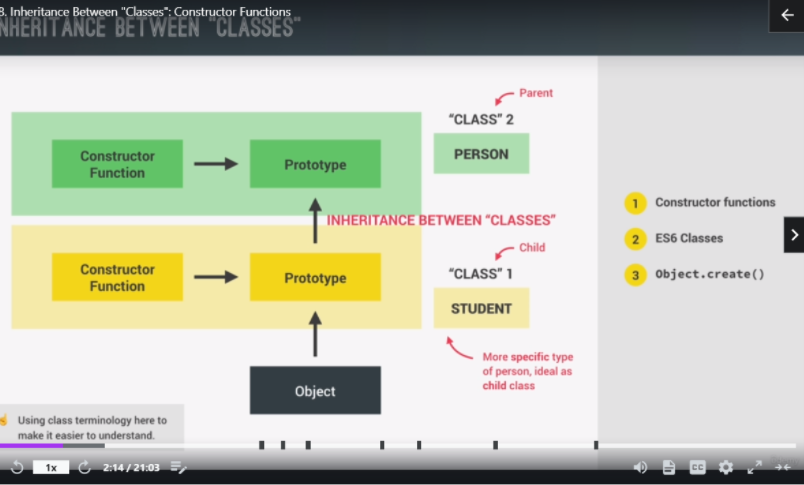

  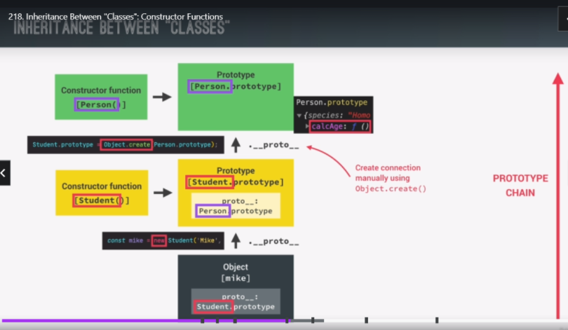

  - what we want to do is to make person dot prototype, the prototype of student dot prototype.
  - we are gonna have to create this connection manually. And to do this, to link two prototype objects, we are gonna use Object.create() because defining prototypes manually is exactly what Object.create does.

  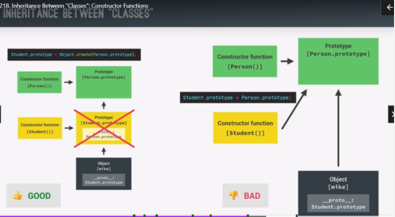

  

  ```js
  // Inheritance between Classes: Constructor Function
  const Person = function (firstName, birthYear) {
    this.firstName = firstName;
    this.birthYear = birthYear;
  };

  Person.prototype.calcAge = function () {
    console.log(2037 - this.birthYear);
  };

  const Student = function (firstName, birthYear, course) {
    // this.firstName = firstName;
    // this.birthYear = birthYear;
    Person.call(this, firstName, birthYear); // we used call method to call person function pointing the this keyword in Student object --regular function calling this keyword is undefined
    this.course = course;
  };

  // Linking prototypes
  Student.prototype = Object.create(Person.prototype);

  Student.prototype.introduce = function () {
    console.log(`Hi! my name is ${this.firstName} and I study ${this.course}`);
  };

  const mike = new Student("Mike", 1997, "Computer Studies");
  mike.introduce();
  mike.calcAge();

  // the link between instance and prototype has been made automatically by creating new object with the **new operator**

  console.log(mike.__proto__); // person.prototype
  console.log(mike.__proto__.__proto__); // object.prototype

  console.log(mike instanceof Object); // True
  console.log(mike instanceof Student); // True
  console.log(mike instanceof Person); // True --both true as we links two prototypes

  Student.prototype.constructor = Student; // pointing back to student.prototype
  console.dir(Student.prototype.constructor); //points to Person prototype as --reason for that is that we set the prototype property of the student using object.create. And so this makes it so that the constructor of student.prototype is still person.

  // child class can overwrite a method that inherited from the parent class

  // NOTE: when there are two methods or properties with the same name in a prototype chain, the first one that appears in the chain is the one that's gonna be used
  ```

- Inheritance Between Class: ES6 Classes

  ```js
  // Inheritance Between Class: ES6 Classes
  class PersonCl {
    constructor(fullName, birthYear) {
      this.fullName = fullName;
      this.birthYear = birthYear;
    }

    // INSTANCE METHOD
    calcAge() {
      console.log(2037 - this.birthYear);
    }

    greet() {
      console.log(`Hi! I am ${this._fullName}`);
    }

    get age() {
      return 2037 - this.birthYear;
    }

    // set a property that already exist
    set fullName(name) {
      if (name.includes(" ")) this._fullName = name;
      else alert(`${name} is not a fullname`);
    }

    get fullName() {
      return this._fullName;
    }

    // STATIC METHOD
    static hey() {
      console.log("Hey there!");
      console.log(this);
    }
  }

  class StudentCl extends PersonCl {
    constructor(fullName, birthYear, course) {
      // Always need to happen first -- super is responsible for creating the this keyword in this subclass
      super(fullName, birthYear); // super() --consructor function of the Parent class --happen automatically no need to use call method
      this.course = course;
    } // if dont need any new properties then no need to write a constructor method in the child class

    introduce() {
      console.log(`Hi! my name is ${this.fullName} and I study ${this.course}`);
    }

    calcAge() {
      console.log(
        `I'm ${
          2037 - this.birthYear
        } years old but as a student I feel more like ${
          2037 - this.birthYear + 10
        }`
      );
    }
  }
  const martha = new StudentCl("Martha Jones", 2012, "Computer Science");
  martha.introduce();
  martha.calcAge();

  // NOTE: class syntax hides a lot of the details that are actually happening behind the scenes, because classes are just a layer of obstruction over construction functions. But not a problem there is inheritance between classes that works behind the scenes
  ```

- Inheritance Between Class: Object.create()

  

  ```js
  // Inheritance Between Class: Object.create()

  const PersonProto = {
    calcAge() {
      console.log(2037 - this.birthYear);
    },

    init(firstName, birthYear) {
      this.firstName = firstName;
      this.birthYear = birthYear;
    }, // not a prototype property --just manual way of initializing the object
  };

  const steven = Object.create(PersonProto);

  const StudentProto = Object.create(PersonProto);
  StudentProto.init = function (firstName, birthYear, course) {
    PersonProto.init.call(this, firstName, birthYear);
    this.course = course;
  };

  StudentProto.introduce = function () {
    console.log(`Hi! my name is ${this.firstName} and I study ${this.course}`);
  };

  const jay = Object.create(StudentProto);
  jay.init("Jay", 2010, "Computer Science");
  jay.introduce();
  jay.calcAge();

  // NOTE: in Object.create() we are doing simply linking object together where some objects then serve as the prototype of the other objects
  ```

- Another Class Example

  ```js
  // Another Class Example
  class Account {
    constructor(owner, currency, pin) {
      this.owner = owner;
      this.currency = currency;
      this.pin = pin;
      this.movements = [];
      this.locale = navigator.language;

      console.log(`Thanks for opening an account ${this.firstName}`);
    }

    // API --public interface of Account object
    deposit(val) {
      this.movements.push(val);
    }

    withdraw(val) {
      this.deposit(-val);
    }

    approveLoan(val) {
      return true;
    } // internal method

    requestLoan(val) {
      if (this.approveLoan) {
        this.deposit(val);
        console.log("Loan is approved");
      }
    }
  }

  const acc1 = new Account("Jonas", "EUR", 1111);
  acc1.deposit(250);
  acc1.withdraw(140);
  acc1.requestLoan(1000);
  acc1.approveLoan(1000); // should not even be allowed to access this kind of method --need to encapsulate and data privacy
  console.log(acc1);
  ```

- Encapsulation: Protected Properties and Method

  > Encapsulation --means to keep some properties and methods private inside the class so that they are not accessible from outside of the class

  > 2 reasons why need encapsulation --1st: it is to prevent code from outside of a class to accidentally manipulate our data inside the class --2nd: small API consisting only a few public methods then we can change all the other internal methods --external code does not rely on these private methods therefore our code will not break when we do internal changes

  - NOTE: 1st: we are not supposed to manually mess with the public interface property --we should encapsulate it
  - JS classes actually do not yet support real data privacy and encapsulation --there is a proposal to add truly private class fields and methods to the language, but it's not completely ready yet.

  ```js
  // Encapsulation: Protected Properties and Method
  class Account {
    constructor(owner, currency, pin) {
      this.owner = owner;
      this.currency = currency;
      // Protected Property
      this._pin = pin;
      this._movements = []; //adding underscore(_) here is not does not make the property private, this is just a convention --we called this protected property
      this.locale = navigator.language;

      console.log(`Thanks for opening an account ${this.firstName}`);
    }

    // API --public interface of Account object

    getMovements() {
      return this._movements; // using public method can still have an access to the movs but cannot override them
    }

    deposit(val) {
      this._movements.push(val);
    }

    withdraw(val) {
      this.deposit(-val);
    }

    _approveLoan(val) {
      return true;
    } // internal method --should not be part of public API

    requestLoan(val) {
      if (this._approveLoan) {
        this.deposit(val);
        console.log("Loan is approved");
      }
    }
  }

  const acc1 = new Account("Jonas", "EUR", 1111);
  acc1.deposit(250);
  acc1.withdraw(140);
  acc1.requestLoan(1000);
  // acc1._approveLoan(1000); // should not even be allowed to access this kind of method --need to encapsulate and data privacy
  console.log(acc1);

  // NOTE: Protected property can still be accessible outside but it is for the developer to know not supposed to be touch outside of the class --other solution: implement a public method
  ```

- Encapsulation: Private Class Fields and Method

  - Private class fields and methods are actually part of a bigger proposal for improving and changing JavaScript classes which is simply called Class fields. Now this Class fields proposal is currently at stage three. And so right now it's actually not yet part of the JavaScript language.
  - In tradional OOP languages like Java and C++, properties are usually called fields --with this new proposal, JavaScript is moving away from the idea that classes are just syntactic sugar over constructor functions. Because with this new class features classes actually start to have abilities that we didn't previously have with constructor functions.
  - In the propasal there are 4 different kinds of fields and method (actually 8) but will focus on 4 in this lecture

    - 1. Public Fields
      - --properties that are gonna be set on all the objects(instance) that we creating through the class (they are not on the prototype) --properties that do not pass as arguments in the constructor
    - 2. Private Fields
      - properties are trully not accessible from the outside
    - 3. Public Methods
      - methods that are been using within the class
    - 4. Private Methods
      - useful to hide the implementation details from the outside of the class
      - #hashtag syntax same with private fields
    - There is also static version --attached on the class itself not on the instance

    ```js
    // Encapsulation: Private Class Fields and Method

    // NOTE: fields --think as property that will be on the instances (instance fields) --have to be outside of any method

    class Account {
      // 1. Public fields (instances)
      locale = navigator.language; // add only on the instances but not on the prototype --looks like a variable that dont have const or let prepend --also referenceable by/via the this keyword

      // 2. Private fields (also available on instances not on prototype)
      #movements = []; // #hashtag is the syntax for private fields --this property also protected
      #pin; // create the field out of the constructor method then dont set to anything as it will be redefine in the constructor method

      constructor(owner, currency, pin) {
        this.owner = owner;
        this.currency = currency;
        // Protected Property
        this.#pin = pin;

        // this._movements = []; //adding underscore(_) here is not does not make the property private, this is just a convention --we called this protected property
        //this.locale = navigator.language;

        console.log(`Thanks for opening an account ${this.owner}`);
      }

      // Public Method --methods that we are using in this class are public method
      // API --public interface of Account object
      getMovements() {
        return this.#movements; // using public method can still have an access to the movs but cannot override them
      }

      deposit(val) {
        this.#movements.push(val);
      }

      withdraw(val) {
        this.deposit(-val);
      }

      requestLoan(val) {
        if (this._approveLoan) {
          this.deposit(val);
          console.log("Loan is approved");
        }
      }

      // Static Version
      static helper() {
        console.log("helper");
      }

      // Private methods
      //#approveLoan(val){} --still not supported in chrome
      _approveLoan(val) {
        return true;
      } // internal method --should not be part of public API
    }

    const acc1 = new Account("Jonas", "EUR", 1111);
    acc1.deposit(250);
    acc1.withdraw(140);
    acc1.requestLoan(1000);
    console.log(acc1);

    // console.log(acc1.#movements); // syntax error: property is private and protected
    // console.log(acc1.#pin);
    // console.log(acc1.#approveLoad(1000)); // chrome read this as private fields not private method

    // static version
    Account.helper();
    ```

- Chaining Method

  ```js
  acc1.deposit(300).deposit(500).withdraw(35).requestLoan(25000).withdraw(4000);
  console.log(acc1.getMovements());

  // NOTE: returning the 'this' keyword will make the method chainable --this will make most sense in methods that actually set some property
  ```

- ES6 Classes Summary

  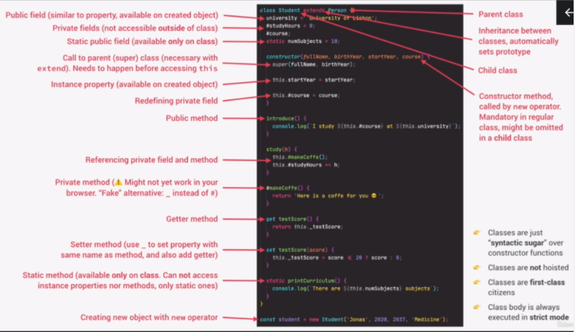

  - NOTE: the difference between instance property and public fields is that we set these instance properties based on input data of the constructor --properties are more personalized and unique for each object while the fields are usually for something that is common to all the objects.

  - getter -- method that we can get a value out of an object by simply writing a property instead of writing a method

  - setter -- **--use \_underscore to set property with same method name** if you have a setter for a property that is already defined in the constructor, then you need to create basically a new property with the underscore in front of it. And then in the getter with the same name, you also need to then return that new property.

## Section 15: Mapty App: OOP, Geolocation, External Libraries

- Project Overview
  

  - The Mapty App is loaded from third party service
  - the position is obtained by the browser using geolocation --JS will fetch the location and load a map on your current position
  - Goal of the app: log my workouts

- How to Plan a Web Project?

  - Planning Step
    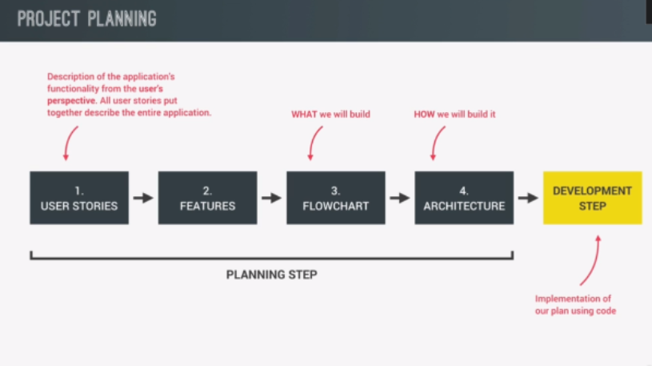

    - 1. User Stories --a high level overview of the whole application that will allow developers to determine the exact features. --all user stories put together provide a clear picture of the application whole functionality
         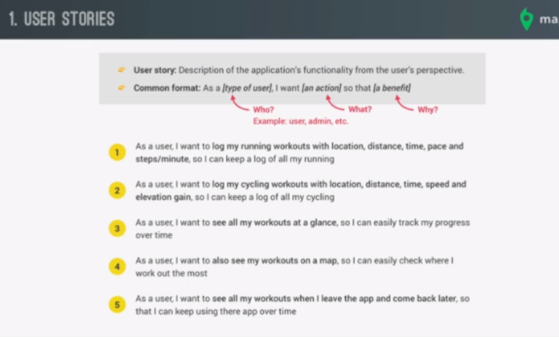

    - 2. Features --determine the exact features that we need to implement in order to make the user stories actually work as intended.
         

    - 3. Flowchart --to visualize the different actions that a user can take, and how the program react to these actions, we usually put all these features into a nice flow chart. --its a good idea to start with events of the page loading(page loads)
         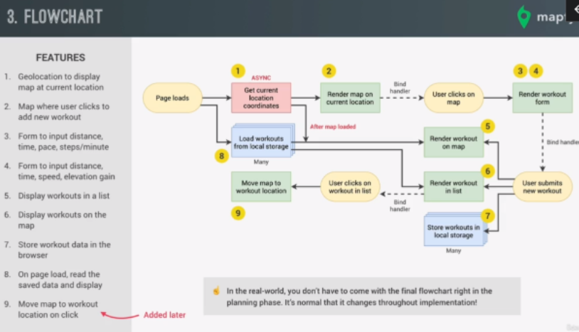

      - Async means--the red box up there means that it is an operation that takes times some time and only after completed then the rest of the operations that depend on it can be executed --take NOTE: this flowchart itself has nothing to do yet with implementation itself

    - 4. Architecture --how we will organize our code, and what JavaScript features we will use. So the project's architecture is essentially what holds all the code together. It gives us a structure in which we can then develop the application's functionality.

    - GOAL: how to implement all the functionality. --all features before actually do it

- Using the Geolocation API

  - Geolocation API means is an API because it is in fact a browser API just like internationalization or timers

  ```js
  // Using the Geolocation API

  if (navigator.geolocation)
    navigator.geolocation.getCurrentPosition(
      function (position) {
        const { latitude } = position.coords; // we simply use destructuring then create a variable called latitude based out of the latitude property of this object
        const { longitude } = position.coords;
        // console.log(latitude, longitude); //

        console.log(`https://www.google.com/maps/@${latitude},${longitude}`); // coords of current location
      },
      function () {
        alert("Could not get your position");
      }
    ); //1st argument: callback function that will be called on success wheneveer the browser successfully got the coordinates of the current position of the user 2nd argument: is the error callback which is the one that is gonna be called when error happened while getting the coordinates

  // use if statement --to make sure we dont get any errors in an old browser, we can test if (navigation.geolocation) actually exists
  ```

- Displaying a Map using Leaflet Library

  - Leaflet --is a third party library --an open source JS library for mobile-friendly interactive maps

  ```js
  if (navigator.geolocation)
    navigator.geolocation.getCurrentPosition(
      function (position) {
        const { latitude } = position.coords; // we simply use destructuring then create a variable called latitude based out of the latitude property of this object
        const { longitude } = position.coords;
        // console.log(latitude, longitude); //

        console.log(`https://www.google.com/maps/@${latitude},${longitude}`); // coords of current location

        const coords = [latitude, longitude];

        // Displaying a Map using Leaflet Library
        const map = L.map("map").setView(coords, 13); // we pass in the map method must be the ID name of an element in HTML -- L here this is basically the main function that Leaflet gives us as an entry point. Its kinda of namespace and L in the browser consle is a global variable inside of the script of leaflet that we then can access from all the other scripts.

        L.tileLayer("https://{s}.tile.openstreetmap.fr/hot/{z}/{x}/{y}.png", {
          attribution:
            '&copy; <a href="https://www.openstreetmap.org/copyright">OpenStreetMap</a> contributors',
        }).addTo(map); // tiles --maps squares that appear one by one in every refresh || tileLayer --define the tiles of our map

        L.marker(coords) // marker --render a map on our page with the coordinates
          .addTo(map)
          .bindPopup("A pretty CSS3 popup.<br> Easily customizable.")
          .openPopup();
      },
      function () {
        alert("Could not get your position");
      }
    );
  ```

- Display a Map Marker

  ```js
  // Displaying Map Marker
      map.on('click', function (mapEvent) {
        console.log(mapEvent);
        const { lat, lng } = mapEvent.latlng;

        L.marker([lat, lng]) // marker --used to display clickable/draggable icons on the map and passes coordinates (render a map on our page with the coordinates)
          .addTo(map) // method that adds to the map
          .bindPopup(
            L.popup({
              maxWidth: 250,
              minWidth: 100,
              autoClose: false,
              closeOnClick: false,
              className: 'running-popup', //can use to assign any CSS className to style
            })
          ) // create a popup and bind it to the marker --simply pass a string
          .setPopupContent('Workout')
          .openPopup();
      }); // here we attached an eventlistener --this method is not coming from JS itself, instead of coming from the leaflet library. -- just like in standard JavaScript, we get access to an event, but this one is an event created by leaflet.So let's just call it mapEvent.

      // NOTE: on method registers a handler, which is callback function with specific signature. Once an event is triggered, a handler is called. It receives necessary data as function parameters (commonly event object). --The on() method attaches one or more event handlers for the selected elements and child elements
    }
  ```

- Rendering Workout Form

  ```js
  // Rendering workout form
  form.addEventListener("submit", function (e) {
    e.preventDefault();

    // clear input fields
    inputDistance.value =
      inputDuration.value =
      inputCadence.value =
      inputElevation.value =
        "";

    // Display marker
    console.log(mapEvent);
    const { lat, lng } = mapEvent.latlng;

    L.marker([lat, lng]) // marker --used to display clickable/draggable icons on the map and passes coordinates (render a map on our page with the coordinates)
      .addTo(map) // method that adds to the map
      .bindPopup(
        L.popup({
          maxWidth: 250,
          minWidth: 100,
          autoClose: false,
          closeOnClick: false,
          className: "running-popup", //can use to assign any CSS className to style
        })
      ) // create a popup and bind it to the marker --simply pass a string
      .setPopupContent("Workout")
      .openPopup();
  });

  inputType.addEventListener("change", function () {
    inputElevation.closest(".form__row").classList.toggle("form__row--hidden");
    inputCadence.closest(".form__row").classList.toggle("form__row--hidden");
  });
  ```

- Project Architecture

  

  

  > the most important aspect of any architecture is to decide where and how to store the data --because data is the most fundamental of any application

  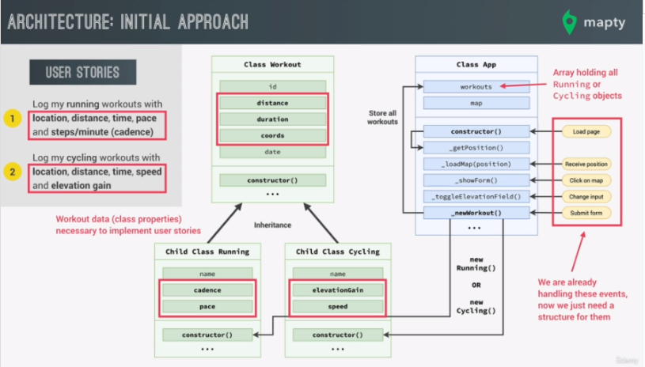

  ```js
  // *****DATA******
  // Managing Workout Data: Creating classes
  // Parent class
  class Workout {
    date = new Date();
    id = (Date.now() + "").slice(-10); // NOTE:  in the real world, we usually always use some kind of library in order to create good and unique ID numbers. So usually we should never create IDs on our own but always let some library take care of that because this is a very important part of any application
    clicks = 0;

    constructor(coords, distance, duration) {
      this.coords = coords; // [lat, lng]
      this.distance = distance; // in km
      this.duration = duration; // im min
    }

    _setDescription() {
      // prettier-ignore
      const months = ['January', 'February', 'March', 'April', 'May', 'June', 'July', 'August', 'September', 'October', 'November', 'December'];

      this.description = `${this.type[0].toUpperCase()}${this.type.slice(
        1
      )} on ${months[this.date.getMonth()]} ${this.date.getDate()}`;
    }

    // using public interface
    click() {
      this.clicks++;
    }
  }

  // Child class
  class Running extends Workout {
    // public fields
    type = "running";

    constructor(coords, distance, duration, cadence) {
      super(coords, distance, duration);
      this.cadence = cadence;
      // this.type = 'running' --is same as above public fields

      this.calcPace();
      this._setDescription(); //calling from the parent class workout --child class contain the type field
    }

    calcPace() {
      // min/km
      this.pace = this.duration / this.distance;
      return this.pace;
    }
  }
  class Cycling extends Workout {
    type = "cycling";
    constructor(coords, distance, duration, elevationGain) {
      super(coords, distance, duration);
      this.elevationGain = elevationGain;

      this.calcSpeed();
      this._setDescription();
    }

    calcSpeed() {
      // min/km
      this.speed = this.distance / (this.duration / 60);
      return this.speed;
    }
  }

  // ********APPLICATION***********
  // Refractorung for Project Architecture
  class App {
    #map;
    #mapZoomLevel = 13;
    #mapEvent;
    #workouts = [];
    clicks = 0;
    constructor() {
      this._getPosition();

      // Rendering workout form
      form.addEventListener(
        "submit",
        this._newWorkout.bind(this) // TIP: always bind the callback function in an event handler --event handler callback function will always have the this keyword in the DOM element (form)
      ); // NOTE: JavaScript events are bound to the document object model (DOM) and aren't bound to any arbitrary object you might make. --attach the eventListener to the DOM elements here in the constructor

      inputType.addEventListener("change", this._toggleElevationField);

      click() {
        this.clicks++;
      }
    } //constructor method is called immediately when new object is created from this class

    // Display current positon(coordinates)
    _getPosition() {
      if (navigator.geolocation)
        navigator.geolocation.getCurrentPosition(
          this._loadMap.bind(this), // this keyword passed on the bind method points to the current object (class App)--_loadMap method called by _getCurrentPosition method here and treated as regular function call not method call --regular function this keyword is undefined
          function () {
            alert("Could not get your position");
          }
        );
    } // navigator.geolocation --1st argument: callback function that will be called on success wheneveer the browser successfully got the coordinates of the current position of the user 2nd argument: is the error callback which is the one that is gonna be called when error happened while getting the coordinates

    // just a blueprint --we need to create an actual object out of the App class
    _loadMap(position) {
      console.log(position);
      const { latitude } = position.coords;
      const { longitude } = position.coords;
      console.log(latitude, longitude); //

      console.log(`https://www.google.com/maps/@${latitude},${longitude}`); // coords of current location

      const coords = [latitude, longitude];

      this.#map = L.map("map").setView(coords, this.#maxZoomLevel);
      console.log(this.#map); // // map()method --The central class of the API — it is used to create a map on a page and manipulate it and we pass in the map method must be the ID name of an element in HTML -- L here this is basically the main function that Leaflet gives us as an entry point. Its kinda of namespace and L in the browser consle is a global variable inside of the script of leaflet that we then can access from all the other scripts. // the map variable here is an object generated by a leaflet (L) --therefore it is a special object with couple of methods and properties
      // set its view to our chosen geographical coordinates and a zoom level

      L.tileLayer("https://{s}.tile.openstreetmap.fr/hot/{z}/{x}/{y}.png", {
        attribution:
          '&copy; <a href="https://www.openstreetmap.org/copyright">OpenStreetMap</a> contributors',
      }).addTo(this.#map); // tiles --squares bitmap graphics -typically 256×256 pixels- images displayed in a grid arrangement to show a map || tileLayer()--used to display tile layers on the map --define the tiles of our map
      //  first select a title layer and then we add that tile layer to the map again, using .addTo()

      // NOTE: Tile layers display image tiles served from a tile server. A tile layer is a set of web-accessible tiles that reside on a server. The tiles are accessed by a direct URL request from the web browser.

      // Displaying Map Marker
      // --handling clicks on map leaflet library
      this.#map.on("click", this._showForm.bind(this)); // same as event hanlders --this keyword is attached to the map library event itself (whom we attached the event handlers)
      // here we attached an eventlistener --this method is not coming from JS itself, instead of coming from the leaflet library. -- just like in standard JavaScript, we get access to an event, but this one is an event created by leaflet.So let's just call it mapEvent.

      // NOTE: on method registers a handler, which is callback function with specific signature. Once an event is triggered, a handler is called. It receives necessary data as function parameters (commonly event object). --The on() method attaches one or more event handlers for the selected elements and child elements
      this.#workouts.forEach((work) => this._renderWorkoutMarker(work));
    }

    _showForm(mapE) {
      this.#mapEvent = mapE;
      // mapEvent --an event created by leaflet library --event object take the lat&lng upon clicking on map and then add a marker

      form.classList.remove("hidden");
      inputDistance.focus();
    }

    _hideForm() {
      // Empty input fields
      inputDistance.value =
        inputDuration.value =
        inputCadence.value =
        inputElevation.value =
          "";

      // Dirty tricks
      form.style.display = "none";
      form.classList.add("hidden");
      setTimeout(() => (form.style.display = "grid"), 1000);
    }

    _toggleElevationField() {
      inputElevation
        .closest(".form__row")
        .classList.toggle("form__row--hidden");
      inputCadence.closest(".form__row").classList.toggle("form__row--hidden");
    }

    // **Creating new Workout --features
    _newWorkout(e) {
      const validInputs = (...inputs) =>
        inputs.every((inp) => Number.isFinite(inp)); // helper function
      const allPositive = (...inputs) => inputs.every((inp) => inp > 0);
      e.preventDefault();

      // Get data from the form
      const type = inputType.value;
      const distance = +inputDistance.value;
      const duration = +inputDuration.value;
      const { lat, lng } = this.#mapEvent.latlng;
      let workout;

      // If workout, create  running object
      if (type === "running") {
        const cadence = +inputCadence.value;
        // Check if data is valid
        if (
          // !Number.isFinite(distance) ||
          // !Number.isFinite(duration) ||
          // !Number.isFinite(cadence)
          !validInputs(distance, duration, cadence) ||
          !allPositive(distance, duration, cadence)
        )
          return alert("Input have to be positive numbers!"); // using guard clause --means check for the opposite of what we are interested in

        workout = new Running([lat, lng], distance, duration, cadence);
      }
      // If workout, create cycling object
      if (type === "cycling") {
        const elevation = +inputElevation.value;
        // Check if data is valid
        if (
          !validInputs(distance, duration, elevation) ||
          !allPositive(distance, duration)
        )
          return alert("Input have to be positive numbers!");

        workout = new Cycling([lat, lng], distance, duration, elevation);
      }

      // Add new object to workout array
      this.#workouts.push(workout);
      console.log(workout);

      // Render workout on map as marker
      this._renderWorkoutMarker(workout);

      // Render workout on list
      this._renderWorkout(workout);

      // Hide form & clear input fields
      this._hideForm();
    }

    // **Display marker
    _renderWorkoutMarker(workout) {
      // console.log(mapEvent);
      // const { lat, lng } = this.#mapEvent.latlng;
      L.marker(workout.coords)
        .addTo(this.#map)
        .bindPopup(
          L.popup({
            maxWidth: 250,
            minWidth: 100,
            autoClose: false,
            closeOnClick: false,
            className: `${workout.type}-popup`,
          })
        )
        .setPopupContent(
          `${workout.type === "running" ? "🏃‍♂️" : "🚴‍♀️"} ${workout.description}`
        )
        .openPopup();
    }

    // **Rendering Workout --list
    _renderWorkout(workout) {
      let html = `
        <li class="workout workout--${workout.type}" data-id="${workout.id}">
        <h2 class="workout__title">${workout.description}</h2>
        <div class="workout__details">
          <span class="workout__icon">${
            workout.type === "running" ? "🏃‍♂️" : "🚴‍♀️"
          }</span>
          <span class="workout__value">${workout.distance}</span>
          <span class="workout__unit">km</span>
        </div>
        <div class="workout__details">
          <span class="workout__icon">⏱</span>
          <span class="workout__value">${workout.duration}</span>
          <span class="workout__unit">min</span>
        </div>`;

      if (workout.type === "running")
        html += `
        <div class="workout__details">
          <span class="workout__icon">⚡️</span>
          <span class="workout__value">${workout.pace.toFixed()}</span>
          <span class="workout__unit">min/km</span>
        </div>
        <div class="workout__details">
          <span class="workout__icon">🦶🏼</span>
          <span class="workout__value">${workout.cadence}</span>
          <span class="workout__unit">spm</span>
        </div>`;

      if (workout.type === "cycling")
        html += ` <div class="workout__details">
          <span class="workout__icon">⚡️</span>
          <span class="workout__value">${workout.speed.toFixed()}</span>
          <span class="workout__unit">km/h</span>
        </div>
        <div class="workout__details">
          <span class="workout__icon">⛰</span>
          <span class="workout__value">${workout.elevationGain}</span>
          <span class="workout__unit">m</span>
        </div>`;

      form.insertAdjacentHTML("afterend", html);
    }

    // **Move map marker on click
    _moveToPopup(e) {
      const workoutEl = e.target.closest(".workout");
      console.log(workoutEl);

      if (!workoutEl) return;

      const workout = this.#workouts.find(
        (work) => work.id === workoutEl.dataset.id
      );
      console.log(workout);

      this.#map.setView(workout.coords, this.#mapZoomLevel, {
        animate: true,
        pan: {
          duration: 1,
        },
      });

      // using the public interface
      // workout.click();
    }

    // **Working with local Storage
    _setLocalStorage() {
      // local storage(very simple API) is simple key value store
      localStorage.setItem("workouts", JSON.stringify(this.#workouts)); // 1st argument: give name(key) and 2nd argument: simple value --needs to be string to store and which is associated with a key
      // TIP: we can convert object to string using JSON.stringify(). Dont use local storage to store large amount of data
    }

    _getLocalStorage() {
      const data = JSON.parse(localStorage.getItem("workouts"));
      console.log(data);

      if (!data) return;

      this.#workouts = data;

      this.#workouts.forEach((work) => this._renderWorkout(work));
    }
    // NOTE: when converted objects to a string and convert it back to object, the prototype chain is lost, so the new object recovered from the local storage are now just regular object (not same object created by OOP) therefore not inherit the method --to solve, 1: restore the object in the local storage and loop over then restore the object by creating a new object using class 2: simple disable the functionality of counting clicks

    // public interface
    reset() {
      localStorage.removeItem("workouts");
      location.reload();
    }
  }

  const app = new App();
  console.log(app);
  // app._getPosition(); // all code in top level scope --outside of any function will get executed immediatelt as the script loads

  // NOTE: when calling function in an event handlers and in callback, the function will simply be called a regular function and regular function this keyword is undefined
  ```

## Section 16: Asynchronous JS: Promises, Async/Awaits and AJAX

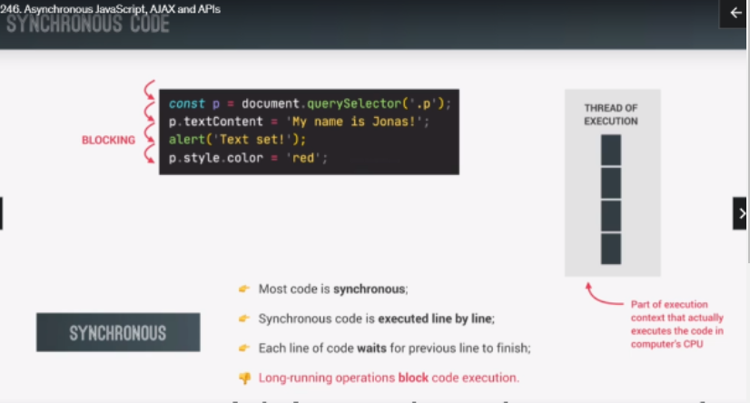

- Asynchronous JS, AJAX and APIs

  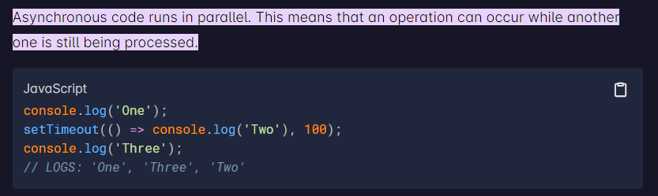

  - In summary, **Asynchronous Progamming** is all about coordinating the behaviour of our program over a certain period of time. In other words, literally means not occuring at the same time.
  - most popular use cases of asynchronuos JS is to make so called AJAX calls to APIs

  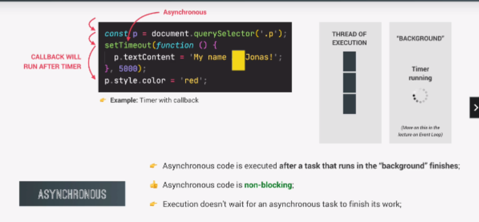

  - we encountered the set timeout function, which will basically start a timer in an asynchronous way. So this means that the timer will essentially run in the background without preventing the main code from executing.
  - the callback function(setTimeout method) is the asynch JS --because its only going to be executed after a task that is running in the background finishes execution

  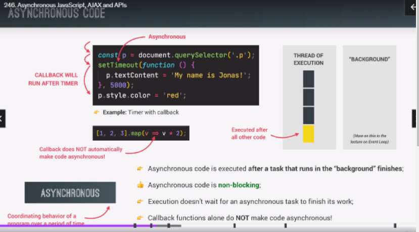

  - when timer finishes after 5seconds, the callback function will finally be executed as well(this callback runs after all the other code even though in code it doesnt appear at the end)
  - in async, an action was deferred(delayed or postpone for a while) into the future in order to make the code non-blocking
  - keep in mind that CB function alone doesnt make the code async, only certain functions such as setTimeout work in an an async way.
  - Other example: Loading img with event and callback
    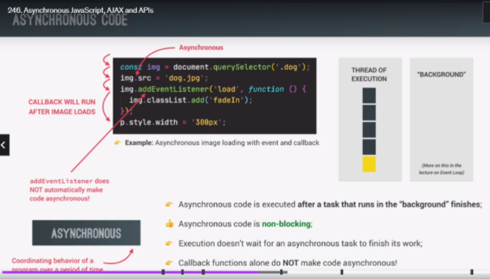

    - the first two lines run in synch way
    - now in 2nd line, by setting an attribute of img --this operation is actually async (setting the src attribute of any img is essentially loading an img in the background while the rest of the code can keep running)
    - Now, once the image has finished loading, a load event will automatically be emitted by JavaScript. And so we can then listen for that event in order to act on it. (image is loading asynchronously in the background but not the fact that we are listening for the load events to happen)
    - Also eventListeners alone do not make code async

  - AJAX
    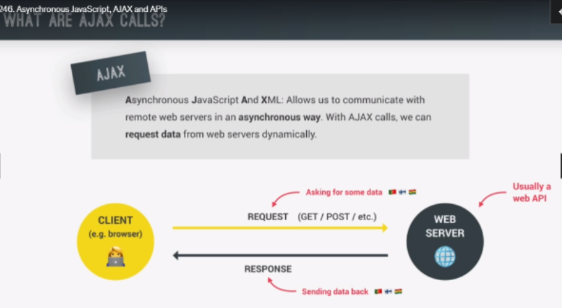
    - Now in practice we make Ajax calls in our code in order to request some data from a web server dynamically without reloading the page so that we can use that data in our application dynamically
    - AJAX's most appealing characteristic is its "asynchronous" nature, which means it can **communicate with the server, exchange data, and update the page without having to refresh the page**.
    - The two major features of AJAX allow you to do the following:
      - a. Make requests to the server without reloading the page
      - b. Receive and work with data from the server
  - APIs
    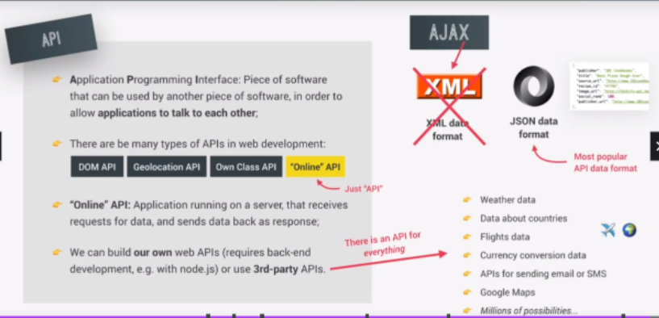

    - DOM API -- APIs for manipulating documents loaded into the browser. The most obvious example is the DOM (Document Object Model) API, which allows you to manipulate HTML and CSS — creating, removing and changing HTML, dynamically applying new styles to your page, etc. Every time you see a popup window appear on a page or some new content displayed, for example, that's the DOM in action.

    - Own Class API -- we can always implement a small and simple API in a class where we make some methods available as a public interface. Objects made from a class can be seen as self-contained encapsulated pieces of software that other pieces of software can interact with

    - Online API --is essentially an application running on a web server, which receives requests for data, then retrieves this data from some database and then sends it back to the client.

      - XML is a data format which used to be widely used to transmit data on the web but in not anymore in use. Instead most API these days use the JSON data format--basically just JS object but converted to a string

- Our First AJAX Calls: XMLHttpRequest()

  - XMLHttpRequest (XHR) objects are used to interact with servers. You can retrieve data from a URL without having to do a full page refresh. This enables a Web page to update just part of a page without disrupting what the user is doing. XMLHttpRequest is used heavily in AJAX programming.
  - NOTE: API URL for the whole section: https://restcountries.com/v2/
  - Requesting: open() method
    - The first parameter of the call to open() is the HTTP request method – GET, POST, HEAD, or another method supported by your server. Keep the method all-capitals as per the HTTP standard
    - The second parameter is the URL you're sending the request to. As a security feature, you cannot call URLs on 3rd-party domains by default.

  ```js
  // First AJAX call: XMLHttpRequest

  const getCountryData = function (country) {
    // old way of AJAX calls
    const request = new XMLHttpRequest(); // allows to make request to the server
    request.open("GET", `https://restcountries.com/v2/name/${country}`); //  open method --basically open the request 1st: request method(GET, POST, HEAD,) to GET data, 2nd: URL --this get method uses to open the request
    request.send(); // send method --sending off request (will send of request in the URL declare at open method)

    //  AJAX call that we just send off here, is being done in the background, while the rest of the code keeps running. And so this is the asynchronous, non-blocking behavior. (same with img src --need to wait for load event, once done it will emit the fetched data in the load event)

    // to get the result being sent --need to register a callback on the new object created (request) for the load event.
    request.addEventListener("load", function () {
      // using this event listener we are waiting for that event. as data arrices, callback functionn will be called

      //console.log(this.responseText); // responseText property --only gonna be set once the data has actually arrived.

      // when data arrived --need to convert the JSON(big string of text) into JS object
      const [data] = JSON.parse(this.responseText);
      console.log(data);

      const html = ` <article class="country">
        
        <div class="country__data">
            <h3 class="country__name">${data.name}</h3>
            <h4 class="country__region">${data.region}</h4>
            <p class="country__row"><span>👫 </span>${(
              +data.population / 1000000
            ).toFixed(1)}</p>
            <p class="country__row"><span>🗣️ </span>${
              data.languages[0].name
            }</p>
            <p class="country__row"><span>💰 </span>${
              data.currencies[0].name
            }</p>
        </div>
        </article>`;

      countriesContainer.insertAdjacentHTML("beforeend", html);
      countriesContainer.style.opacity = 1;
    });
  };
  getCountryData("philippines");
  getCountryData("japan");
  getCountryData("australia");

  // NOTE: basically having 3 AJAX calls as we called function at same time, they might appear in different order because of data arrives slightly different time.
  ```

- [OPTIONAL] How the Web Works: Request and Response

  - High level Overview

    - Web Server

      - harware --computer that stores web server software and a website components files --connects to the internet and support physical data interchaneg with other devices coonected to the web
      - software --includes several parts that control how web users access hosted files. HTTP server-- can be accessed through domain names and delivers the content of hosted website to users --http is a protocol browser uses to view webpages.

    - Request-Response Model / Client-Server Architecture
      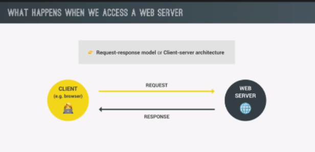
      - Whenever we try to access a Web server, the browser, which is the client, sends a request to the server and the server will then send back a response and that response contains the data or the Web page that we requested.
      - https://restcountries.com/v2/name/portugal -- protocol, domain name and resource
      - domain name --not the real address of the server, need a way to convert to real address of server, happens through so-called DNS(domain name server) --special kind of server like a phone of the internet that convert domain name to the real IP address.
      - **STEP** accessing web server
        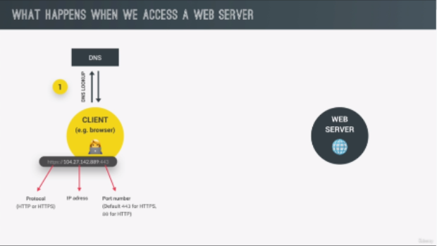
        - 1st: when accessing any web server, the browser makes a reqs to a DNS then simply match the web address of URL to the servers real IP address (actually happens through internet service provider). --after converting to real IP address, DNS generater new address (e.g https://104.271.142.889.443) protocol, IP address and port number --identify specific service that running on a server (like a subaddress)
          
        - 2nd: once we have real IP add, a TCP socket connection is established between the browser and the server. And this connection is typically kept alive for the entire time that it takes to transfer all files of the Website or all data. TCP and IP --communication protocols that defines exactly how data travel accross the Web(Internets Fundamental Control System)
          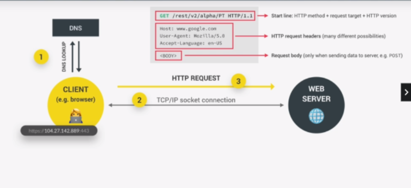
        - 3rd: Make our request --HTTP request **another communication protocol-simply system of rules that allows 2 or more parties to communicate. they are the ones set rules how data moves on the internet** HTTP--protocol that allows clients and web server to communicate (thru) request and response msg from client to server and back [HTTP method: GET -> requesting data, POST -> sending data, PUT & PATCH -> modify data] [request target --where the server is told that we want to access resource --if target reqs is just a slash and empty then we would be accessing the website route (the domain name)] NOTE: main difference between HTTP and HTTPS is that HTTPS is encrypted using TLS or SS
          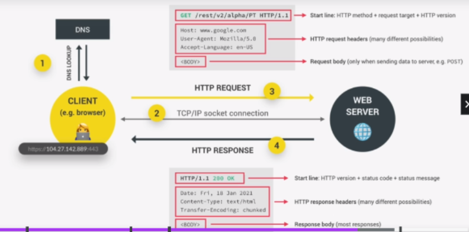
        - 4: HTTP Response --status code and message used to let client know whether the reqs has been failed or not (200 means okay, 404 means page not found)
          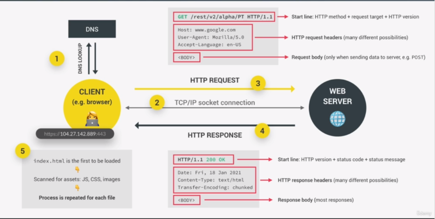
        - 5: HTTP reqs in Web Page --many more reqs and reponse. Each different file there will be new HTTP reqs made to the server basically this entire back and forth between client and server happens for every single file that is included in the Web page.

  - Transmission Control Protocol(TCP)
    
    - first the job of TCP is to break the requests and responses down into thousands of small chunks, called packets before they are sent.
    - once the packet arrive at final destination, TCP will reassemble all the packets into the original reqs or response (for each packets can take different route through internet for data travel faster)
  - Internet Protocol(IP)
    - second part, the job of IP protocol is to actually send and route these packets through the internet.
    - It ensures that they arrive at the correct destination using IP address on each packet

## Section 17: Modern JS Development: Modules, Tooling and Function

## Section 18: Forkify App: Building a Modern Application

## Section 19: Setting Up Git and Deployment

# Note

## Differences Between Functional Programming vs OOP

- Functional programming is the programming technique that accentuates the functional factors required for creating and implementing the programs. OOP or the Object-Oriented Programs are the conceptual programming techniques that uses objects as the key. The programming model used in functional programming is a declarative programming model, while object-oriented programming uses the imperative programming model. In functional programs, variables and functions are the main elements of the code, while in object-oriented programs, objects and methods are the key element
