# The Complete JavaScript Course 2022: From Zero to Expert!

## Section 02: JavaScript Fundamentals - Part 1

### Brief Introduction

- JavaScript - is a high-level object-oriented, multi-paradigm programming language


- Value - is basically a piece of data, the most fundamental unit of information that we have in programming.

```js
    console.log("Jonas");

    Value = Jonas
    **Note: either string or integer
```

- Variable - storing value by declaring a variable

```js
    let firstName = "Jonas";

    Value = Jonas
    Variable = firstName

**Note: way in naming variable
camelCase notation- write the first letter in lowercase and next word uppercase

Variable name cannot start with numbers
Can only be start with letters, underscore or dollar sign
CAPSLOCK - is for constant
```


- Data Type - either objects or primitive


> typeof - is use to determine the data type

```js
let javascriptIsFun = true;
console.log(javascriptIsFun);

console.log(typeof true);
console.log(typeof javascriptIsFun);
console.log(typeof 23);
console.log(typeof "Jonas");
```

> Don't use let in reassigning new value to existing variable

```js
let javascriptIsFun = true;
console.log(javascriptIsFun);

javascriptIsFun = "YES!";
```

- Let, Const & Var (Ways in declaring variables)

  > let and const - introduced in ES6 (modern JS)

  - we use the **let [mutable variable]** keyword to declared variables that can be change later, basically during execution (reasigning a value to a variable)

  - we use the **const [immutable variable]** keyword to declare variables that are not supposed to change. The value is cannot be change.

    ```js
        let age = 30;
        age = 31;

        const birthYear = 1991;

    *when using need an initial value
    *recommend: use const by default and let only when you really sure that the variable need to change
    ```

  > var - is the old way of defining variable

- Basic Operator

  > Operators - allows us to transform values or combine multiple values

  - Arithmetic Operator (+ - \* /)

    ```js
    const now = 2037;
    const ageJonas = now - 1991;
    const ageSarah = now - 2018;
    console.log(ageJonas, ageSarah);

    console.log(ageJonas * 2, ageJonas / 10, 2 ** 3);
    ```

    - we can also use the plus operator to join strings or to concatenate different strings

    ```js
    const firstName = "Jonas";
    const lastName = "Schedtmann";
    console.log(firstName + " " + lastName);
    ```

  - Assignment Operator (=)

    ```js
        // Assignment Operator
        let x = 10 + 5; // 15
        x += 10; // x = x + 10 = 25
        x *= 4; // x = x * 4 = 100
        x++; // x = x +1 = 101
        x--;
        x--;
        console.log(x);

        **NOTE: assignment is right to left execution
    ```

  - Comparison Operator (> , < , >=, <=)

    > use comparison operator to produce boolean values **(true or false)**

    ```js
    // Comparison Operator
    console.log(ageJonas > ageSarah); // > , < , >=, <=
    console.log(ageSarah >= 18);

    const isFullAge = ageSarah >= 18;

    console.log(now - 1991 > now - 2018);
    ```

- Operator Precedence - order of operators to be solve

- Strings and Template Literals

  - Strings

    ```js
    const firstName = "Jonas";
    const job = "teacher";
    const birthYear = 1991;
    const year = 2037;

    const jonas =
      "I'm " +
      firstName +
      ", a " +
      (year - birthYear) +
      " years old" +
      " " +
      job +
      "!";
    console.log(jonas);
    ```

  - Template Literals - can write a string in a more normally, basically inserting the variable directly into the string. Can assemble multiple pieces into one final string.

    ```js
    const jonasNew = `I'm ${firstName}, a ${
      year - birthYear
    } years old ${job}!`;
    console.log(jonasNew);
    ```

  - Backsticks
    ```js
    console.log(`Just a regular string...`);
    ```
  - Multiple Strings (before ES6)

    ```js
      console.log('String with \n\
      multiple \n\
      lines')

      **template strings - simply click enter
      console.log(`String
      multiple
      lines`);

    ```

- Taking Decision: If / Else statement

  - if else control structure - allows us to have more control over the way that our code is executed

    ```js
        // IF ELSE
        const age = 15;
        // const isOldEnough = age >= 18;

        if (age >= 18) {
          console.log("Sarah can start driving license 🚗");
        } else {
          const yearsLeft = 18 - age;
          console.log(`Sarah is too young. Wait for another ${yearsLeft} years`);
        }

        const birthYear = 2021;

        let century;
        if (birthYear <= 2000) {
          century = 20;
        } else {
          century = 21;
        }
        console.log(century);

        **NOTE: condition is essentially any code that returns a true or false value

    ```

- Type Conversion and Coersion

  > Type Conversion is when we manually convert from one type to another

  - We can only convert from **string** to number and number to string or to boolean but not in undefined or null

    ```js
    const inputYear = "1991";
    console.log(Number(inputYear), inputYear);
    console.log(inputYear + 18);

    console.log(Number("Jonas"));
    console.log(typeof NaN);

    console.log(String(23), 23);
    ```

  - We only converted to **numbers** to strings but not to booleans

  > Type Coersion is when JS automatically convert types behind the scenes for us

  - Coersion happens whenever an operator is dealing with two values that have different types

    ```js

      console.log("I am " + 23 + " years old");
      console.log("23" - "10" - 3);
      console.log("23" / "2");

      let n = "1" + 1; // '11'
      n = n - 1; //10
      console.log(n);

      **NOTE:
          - plus will convert into string when that string either first before number(concatenation rule)
          - while minus, multiply and divide will convert into number


    ```

    

- Truthy and Falsy Values

  > In practice, the conversion of boolean is always implicit not explicit

  > When does JS do type coercion?

  - First - when using logical operators
  - Second - when using in a logical context, e.g in a if else condition

  > Falsy - are values that are not exactly false but will become false when we try to convert them into boolean

  - 5 Falsey Values - 0, '', undefined, null and NaN. They are not exactly false initially but they will become when converted to a boolean. Anything that string has a value is not a falsy

    ```js
    console.log(Boolean(0));
    console.log(Boolean(undefined));
    ```

    ```js
    // Truth or False (Boolean Coersion)
    // 5 Falsey Values: 0, '', undefined, null and NaN

    console.log(Boolean(0));
    console.log(Boolean(undefined));
    console.log(Boolean("Jonas"));
    console.log(Boolean({}));

    const money = 0;
    if (money) {
      console.log("Dont spend it all!");
    } else {
      console.log("You should get a job !");
    }

    let height;
    if (height) {
      console.log("YAY! Height is define");
    } else {
      console.log("Height is UNDEFINED");
    }
    ```

  - Truthy Value - Anything that string has a value is true. Same applies to the empty object

- Equality Operators: == vs ===

  > **triple (===) equal** - (strict equality operator - does not perform type coercion) just like the comparison operators, will also return a true or false value (boolean). True will only be the result in case that both sides are exactly the same

  ```js
  const age = 18;
  if (age === 18) console.log("You just became an adult");

  **note: - when comparing values, always use strict equality
          - better to convert the value manually before comparison than relying on double equal operator
  ```

  ```js
    const favorite = Number(prompt("What's your favorite number?"));
    console.log(favorite);
    console.log(typeof favorite);

    if (favorite === 23) {
      console.log("Cool!");
    }

    **note: we convert manually to convert **Number()**
  ```

  > **double (==) equal** - (loose equality operator - does type coercion)

  ```js
    '18' == 18
    >true

  **note: same with type coercion it converted it to a number

  const age = '18';
  if (age === 18) console.log("You just became an adult (strict)");

  if (age === 18) console.log("You just became an adult (loose)");
  >You just became an adult (loose)

  **note as general rule for clean code: avoid the loose equality operator as much as you can.
  ```

  ```js
  const favorite = prompt("What's your favorite number?");
  console.log(favorite);
  console.log(typeof favorite);

  if (favorite == 23) {
    console.log("Cool!");
  }

  **note: still true, automatically do type coercion
  ```

  \*\*note: we dont need two curly braces if we write one line of code for if statement

- Boolean (LOGICAL) Operator **(AND, OR & NOT)**

  > is a branch of computer science, which uses true and false values to solve complex logical problems. Uses several logical operators to combine true and false values.

  - **AND** - if all the variable is true.

  - **OR** - even if one of the variable is false, the outcome will still be true.

  - **NOT** - doesnt combine multiple value. Acts on only one boolean value and basically just inverts it. If A is true, it will become false. And if its false then NOT A will become true. The NOT actually has proceedings over the AND & OR operators and basically the value inverted first when combine using AND & OR.

  
  

  ```js
  const hasDriversLicense = true; // A
  const hasGoodVision = true; // B

  console.log(hasDriversLicense && hasGoodVision);
  console.log(hasDriversLicense || hasGoodVision);
  console.log(!hasDriversLicense);

  if (hasDriversLicense && hasGoodVision) {
    console.log("Sarah is able to drive");
  } else {
    console.log("Someone else should drive..");
  }

  const isTired = true; // C
  console.log(hasDriversLicense && hasGoodVision && isTired);

  if (hasDriversLicense && hasGoodVision && !isTired) {
    console.log("Sarah is able to drive");
  } else {
    console.log("Someone else should drive..");
  }
  ```

  ```js
  const scoreDolphins = (97 + 112 + 81) / 3;
  console.log(scoreDolphins);

  const scoreKoalas = (109 + 95 + 86) / 3;
  console.log(scoreKoalas);

  if (scoreDolphins > scoreKoalas && scoreDolphins >= 100) {
    console.log("Team Dolphins wins the trophy!");
  } else if (scoreKoalas > scoreDolphins && scoreKoalas >= 100) {
    console.log("Team Koalas wins the trophy");
  } else if (
    scoreDolphins === scoreKoalas &&
    scoreDolphins >= 100 &&
    scoreKoalas >= 100
  ) {
    console.log("Both wins!");
  } else {
    console.log("No one wins");
  }
  ```

- Switch Statement

  > alternative way of writing complicated if/else statement in comapring one value to multiple different options

  ```js

  // Switch Statement
  const day = "thursday";
  //day === "thursday";

  switch (day) {
    case "monday":
      console.log("Plan course structure");
      console.log("Go to coding meetup");
      break;
    case "tuesday":
      console.log("Prepare theory videos");
      break;
    case "wednesday":
    case "thursday":
      console.log("Write code examples");
      break;
    case "friday":
      console.log("Record videos");
      break;
    case "saturday":
    case "sunday":
      console.log("Enjoy the weekends");
      break;
    default:
      console.log("Not a valid day!");
  }

   **note: without a break, the code simply continues executing
  ```

- Statements and Expressions

  > Expression - is a piece of code that produces a value.

  - ```js
      e.g 3 + 4 , 1991, true && false && !false
    ```

  > Statement - is like a bigger piece of code that is executed and which does not produce a value on itself. Its a sequence of actions

  - ```js
        e.g if (23 > 10) {
          const str = '23 is bigger';
        }
    ```
    \*\*note: In template literal, we can only insert expressions but not statements.

- The Conditional (TERNARY) Operator

  > is an expression and allows us to write something similar to an if/else statement but all in one line.

  ```js
  // CONDIIONAL OPERATOR (TERNARY)
  const age = 23;
  age >= 18 ? console.log("Can drink wine") : console.log("Only water");

  const drink = age >= 18 ? "wine" : "water";
  console.log(drink);

  let drink2;
  if (age >= 18) {
    drink2 = "wine";
  } else {
    drink2 = "water";
  }
  console.log(drink2);
  ```

  > using the ternary operator, which produces value, we can actually have conditionals inside of a template literal.

  ```js
  console.log(`I like to drink ${age >= 18 ? "wine" : "water"}`);
  ```

  ```js
   challeng 04:
    const bill = 275;
    const tip = bill >= 50 && bill <= 300 ? bill * 0.15 : bill * 0.2;
    console.log(
      `The bill was ${bill}, the tip is ${tip}, and the total value ${bill + tip}`
    );
  ```

- JavaScript Releases: ES5. ES6+ and EXnext

  > compatible table: http://kangax.github.io/compat-table

  
  
  
  

## Section 03: JavaScript Fundamentals - Part 2

- Activating Strict Mode

  > Strict mode - is a special mode that we can activiate in JS, that makes easier to write secure JS code.

  - importance - 1st: forbids us to do certain things | 2nd: creates visible errors in the developers console.

  ```js

    "use strict";

    let hasDriversLicense = false;
    const passTest = true;

    if (passTest) hasDriverslicense = true;
    if (hasDriversLicense) console.log("I can drive!");

    const interface = "Audio"; // reserved word should not used as variable name

    **note: should be the very first statement in the script.
  ```

- Functions

  > functions are actually just values

  > a piece of code that we can reuse over and over again

  > can also receive data and return data back

  > can hold one or more complete lines of codes

  - Parameters - are like variables that are specific only to this function and get defines once call the function | represent the input data of the function
  - Notes : not all functions need to return something and not all functions need to accept parameters

  ```js
    function logger() {
      console.log("May name is Jonas");
    }

    // calling / running / invoking a function
    logger();
    logger();
    logger();

    //generic function
    function fruitProcessor(apples, oranges) {
      console.log(apples, oranges);
      const juice = `Juice with ${apples} apples and ${oranges} orange.`;
      return juice;
    }

   // fruitProcessor(17, 17);  the result(output) of running this function here is the juice that we just returned then we need to save that value by creating a new variable : if we want to use the (juice) value that was returned we need to store it in a variable
    const fruitJuices = fruitProcessor(17, 17);
    console.log(fruitJuices);

    console.log(fruitProcessor(17, 17)); //directly logged it to the console


    **note:
        **(apples, oranges) - is called paramater and represents the input data of the function
        **(17, 17) - specific or the actual values of parameters | input of the fruitProcessor function | get assigned to the parameters (ARGUMENT)
        **return keyword - can return any value from the function and result of executing a function
  ```

  

- Function Declarations vs Expressions

  > Function Declarations - can call function declaration before they are defined in the code.

  ```js
  // Function Declarations
  const age1 = calcAge1(1991);

  function calcAge1(birthYear) {
    return 2037 - birthYear;
  }
  ```

  > Function Expression - another type of function. A function without a name (anonymous function).

  ```js
  // Function Declarations

  function calcAge1(birthYear) {
    return 2037 - birthYear;
  }
  const age1 = calcAge1(1991);

  // Function Expressions
  const calcAge2 = function (birthYear) {
    return 2037 - birthYear;
  };
  const age2 = calcAge2(1991);
  console.log(age1, age2);

  **note: function expression: x = 5 (x is the function and 5 is the value)
  ```

- Arrow Functions

  > third type of function that was added to JS in ES6

  > a special form of function expression that is shorter and therfore faster to write.

  ```js
  // Arrow Function
  const calcAge3 = (birthYear) => 2037 - birthYear;
  const age3 = calcAge3(1991);
  console.log(age3);

  // one parameter & multiple return value
  const yearsUntilRetirement = (birthYear) => {
    const age = 2037 - birthYear;
    const retirement = 65 - age;
    return retirement;
  };

  console.log(yearsUntilRetirement(1991));

  // multiple parameter & multiple return value
  const yearsUntilRetirement = (birthYear, firstName) => {
    const age = 2037 - birthYear;
    const retirement = 65 - age;
    return `${firstName} retire in ${retirement} years`;
  };

  console.log(yearsUntilRetirement(1991, "Jonas"));
  console.log(yearsUntilRetirement(1980, "Bob"));
  ```

- Functions calling other functions

  ```js
  // Function calling other function
  function cutFruitPieces(fruit) {
    return fruit * 4;
  }

  function fruitProcessor(apples, oranges) {
    const applesPieces = cutFruitPieces(apples);
    const orangePieces = cutFruitPieces(oranges);

    const juice = `Juice with ${applesPieces} pieces of apples and ${orangePieces} pieces of orange.`;
    return juice;
  }

  console.log(fruitProcessor(2, 3));
  ```

  

- Recap for function

  ```js
  const age = function (birthYear) {
    return 2037 - birthYear;
  };

  const yearsUntilRetirement = function (birthYear, firstName) {
    const calcAge = age(birthYear);
    const retirement = 65 - calcAge;

    if (retirement > 0) {
      console.log(`${firstName} retire in ${retirement} years`);
      return retirement;
    } else {
      console.log(`${firstName} is already retired!`);
      return -1;
    }
  };

  console.log(yearsUntilRetirement(1991, "Jonas"));
  console.log(yearsUntilRetirement(1970, "Mike"));
  ```

  
  

- Introduction to Arrays

  > is a data structure. Also can hold as many values as we want and also values of any type. Also a zero-based

  > length - is a property, it gives the exact amount of elements in the array(not a zero-based)

  > only primitive values are immutable but an array is not a primitive value.

  > we cannot do is to actually replace the entire Array.

  > can hold values with different types all at the same time. also input array inside an array

  ```js
  // Arrays
  const friend1 = "Michael";
  const friend2 = "Steven";
  const friend3 = "Peter";

  const years = new Array(1991, 1992, 1993, 1994);

  const friends = ["Michael", "Steven", "Peter"];
  console.log(friends);
  console.log(friends[0]);
  console.log(friends[2]);

  console.log(friends.length);
  console.log(friends[friends.length - 1]);

  friends[2] = "Jay;";
  console.log(friends);

  const firstName = "Jonas";
  const jonas = [firstName, "Schedtmann", 2037 - 1991, "teacher", friends];
  console.log(jonas);
  console.log(jonas.length);

  // Exercise
  const calcAge2 = function (birthYear) {
    return 2037 - birthYear;
  };
  const y = [1991, 1992, 1993, 1994];

  const age1 = calcAge2(y[0]);
  const age2 = calcAge2(y[1]);
  const age4 = calcAge2(y[y.length - 1]);
  console.log(age1, age2, age4);

  //new array technique
  const ages = [calcAge2(y[0]), calcAge2(y[1]), calcAge2(y[y.length - 1])];
  console.log(ages);
  ```

- Basic Array Operations (METHODS)

  > push - is a methods which is technically is a function that adds elements to the end of an array

  > unshift - is a methods which is technically is a function that adds elements to the beginning of an array

  ```js
  // Add elements
  const newLength = friends.push("Jay");
  console.log(friends);
  console.log(newLength);

  friends.unshift("John");
  console.log(friends);
  ```

  > pop - the opposite of the push method. To remove that last array.

  ```js
  /// Remove elements
  friends.pop(); //last
  const popped = friends.pop();
  console.log(popped);
  console.log(friends);

  // **note: Pop method also return the removed element but doesnt return the length of new array

  friends.shift(); //first
  console.log(friends);
  ```

  > includes - one of the ES6 method. Instead of returning the index of element will simply return true if the element is in the array and false otherwise.

  ```js
  console.log(friends.indexOf("Steven"));
  console.log(friends.indexOf("Bob"));

  friends.push(23);
  console.log(friends.includes("Steven"));
  console.log(friends.includes("Bob"));
  // console.log(friends.includes("23"));
  console.log(friends.includes(23));

  if (friends.includes("Steven")) {
    console.log("You have a friend called Steven");
  }
  ```

- Introduction to Object

  > another data structure in JS

  > a standalone entity, with properties and type

  ```js
    const jonas = {
      firstName: "Jonas",
      lastName: "Schedmtmann",
      age: 2037 - 1991,
      job: "teacher",
      friends: ["Michael", "Peter", "Steven"],
    };

    **note: contains a key I(property) value pairs (5 keys here)
  ```

- Dot vs. Bracket Notation

  > ways of getting a property from an object

  - Dot - uses when need actual property
  - Bracket - uses when need to first compute the property name

  ```js
  // Dot vs. Bracket Notation
  const jonas = {
    firstName: "Jonas",
    lastName: "Schedmtmann",
    age: 2037 - 1991,
    job: "teacher",
    friends: ["Michael", "Peter", "Steven"],
  };

  console.log(jonas);

  console.log(jonas.lastName);
  console.log(jonas["firstName"]); //in bracket, can put any expression

  const nameKey = "Name";
  console.log(jonas["first" + nameKey]);
  console.log(jonas["last" + nameKey]);

  const interestedIn = prompt(
    "What do you want to know about Jonas? Choose between firstName, lastName, age, job and friends"
  );

  if (jonas[interestedIn]) {
    console.log(jonas[interestedIn]);
  } else {
    console.log(
      "Wrong request! Choose between firstName, lastName, age, job and friends"
    );
  }

  // add new properties object
  jonas.location = "Portugal";
  jonas["twitter"] = "@jonasschedtman";
  console.log(jonas);

  // Challenge
  console.log(
    `${jonas.firstName} has ${jonas.friends.length} friends, and his bestfriend is called ${jonas.friends[0]}`
  );
  ```

- Object Method

  > any function attached to the object is called method

  > function expression only works in object as a method

  > method is also a property, a property that holds function value

  > "this" variable - basically equal to the object calling the method (ex. jonas as a variable object) | can also use to store new property

  > arrays (methods) are actually also objects, they are just special kind of objects, they have methods that we can use to manipulate them like pop, push, shift and unshift.

  ```js
  // Object Method
  const jonas = {
    firstName: "Jonas",
    lastName: "Schedmtmann",
    birthYear: 1991,
    job: "teacher",
    friends: ["Michael", "Peter", "Steven"],
    hasDriverLicense: true,

    // calcAge: function (birthYear) {
    //   return 2037 - birthYear;
    // }, function expression that needed an argument

    // calcAge: function () {
    //   return 2037 - this.birthYear;
    // }, uses to avoid repeated argument

    calcAge: function () {
      this.age = 2037 - this.birthYear;
      return this.age;
    },

    // Challenge
    getSummary: function () {
      return `${this.firstName} is a ${this.calcAge()}-year old ${
        this.job
      } and he has ${
        this.hasDriverLicense ? "a" : "no"
      } drivers license. He also has ${this.friends.length} friends namely ${
        this.friends
      }`;
    },
  };
  console.log(jonas.calcAge());
  console.log(jonas.age);
  console.log(jonas.age);
  console.log(jonas.age);
  console.log(jonas.getSummary());

  // console.log(jonas.calcAge()); // jonas.calcAge is computed first and become the function value, then with the parenthesis inputted argument and passed in 1991

  // console.log(jonas["calcAge"](1991)); //we access the property using the brackets (jonas["calcAge"]) and then basically replaces with function, then we call the function (1991).
  ```

- Iteration: The for loop

  > Loop - one of the control structures. Also fundamental aspect of every programming langugae that allows us to automate repetitive tasks.

  > Loop does is to verify before each repetition if all condition still hold true it will keep running the loop

  > for loop - a loop which has a counter

  > Loop statement has 3 parts: 1st **(initialization)** is the initial value of a counter | 2nd **(condition)** is the logical condition | 3rd **(increment)** update counter after each iteration

  ```js
  // For Loop
  // for loop keeps running while condition is TRUE
  //  rep = rep + 1
  for (let rep = 1; rep <= 10; rep++) {
    console.log(`Lifting weights repetition ${rep}!`);
  }
  ```

- Looping Arrays, Breaking and Continuing

  - Looping Arrays

  ```js
  // show all arrays in console: for loop
  const jonas = [
    "Jonas",
    "Schedtmann",
    2037 - 1991,
    "teacher",
    ["Michael", "Peter", "Steven"],
    true,
  ];
  // create new arrays based on above original array
  const types = [];

  for (let i = 0; i < jonas.length; i++) {
    // reading from jonas array
    console.log(jonas[i], typeof jonas[i]);

    // filling types array
    // types[i] = typeof jonas[i];
    types.push(typeof jonas[i]); //its important that we add the new element to the end of array and not in beginning
  }

  console.log(types);

  // computing ages in array: for loop
  const years = [1990, 1991, 1992, 1993];
  const ages = [];

  for (let i = 0; i < years.length; i++) {
    ages.push(2037 - years[i]);
  }
  console.log(ages);
  ```

  - Continue Statement - is to exit the current iteration of the loop and continue to the next one

    ```js
    // Continue Statement

    const jonas = [
      "Jonas",
      "Schedtmann",
      2037 - 1991,
      "teacher",
      ["Michael", "Peter", "Steven"],
      true,
    ];

    console.log("--- ONLY STRING ---");
    for (let i = 0; i < jonas.length; i++) {
      if (typeof jonas[i] !== "string") continue;
      console.log(jonas[i], typeof jonas[i]);
    }
    ```

  - Break Statement - is used to completely terminate the whole loop.

    ```js
    // Break Statement

    const jonas = [
      "Jonas",
      "Schedtmann",
      2037 - 1991,
      "teacher",
      ["Michael", "Peter", "Steven"],
      true,
    ];

    console.log("--- BREAK WITH NUMBERS ---");
    for (let i = 0; i < jonas.length; i++) {
      if (typeof jonas[i] === "number") break;
      console.log(jonas[i], typeof jonas[i]);
    }
    ```

- Looping Backwards and Loops in Loops

  ```js
  // Looping Backwards
  const jonas = [
    "Jonas",
    "Schedtmann",
    2037 - 1991,
    "teacher",
    ["Michael", "Peter", "Steven"],
    true,
  ];

  // Loops in loops
  for (let i = jonas.length - 1; i >= 0; i--) {
    console.log(i, jonas[i]);
  }

  for (let exercise = 1; exercise <= 4; exercise++) {
    console.log(`--------Starting Exercise ${exercise}`);

    for (let rep = 1; rep < 6; rep++) {
      console.log(`Exercise ${exercise}: Lifting weight repetition ${rep}`);
    }
  }
  ```

- While Loop

  > in a while loop, we can only specify a condition

  > more versatile than for loop that can be used in a larger variety of situations

  > called while because it will run while condition is true

  > more explicitly we need to define the other two components of the for loop . Counter - **outside ! ! !** | Inrement \*\*inside code block after the iteration

  ```js
  // while loop
  let rep = 1;
  while (rep <= 10) {
    console.log(`WHILE: Lifting weights repetition ${rep}!`);
    rep++;
  }

  // Math.random() - create number between zero and one
  // Math.trunc() - gives us a number between zero and five
  let dice = Math.trunc(Math.random() * 6) + 1;

  while (dice !== 6) {
    console.log(`You rolled a ${dice}`);
    dice = Math.trunc(Math.random() * 6) + 1;
    if (dice === 6) console.log("Loop is about to end....");
  }
  ```

## Section 04: How to Navigate This Course


## Section 05: Developer Skills & Editor Setup

- Setting up Prettier in VsCode
  ```js
    {
  "singleQuote": true
    }
  ```
- Installing Node.js and Setting Up a Dev Environment

  > Node.js - is a way of running JS outside of the browser but also a way of running development tools

  - 1st: Download Node.js
  - 2nd: Install
  - 3rd: Run in terminal

    

- Learn how to Code

  

  

  

  

  

  

- How to think like a Developer: Become a Problem Solver!

  
  
  
  
  

- Using Google, Stack Overflow and MDN

  ```js
  // PROBLEM 01:
  // We work for a company building a smart home thermometer.Our most recent task is this: "Given an array of temperatures of one day, calculate the temperature amplitude. Keep in mind that sometimes there might be a sensor error"

  // Solving Problems
  const temperatures = [3, -2, -6, -1, "error", 9, 13, 17, 15, 14, 9, 5];

  // 1) Understand the Problem
  // - What is temp amplitude? Answer: difference between highest and lowest temp
  // - How to compute max and min temp?
  // - Whats a sensor error? And what to do?

  // 2) Breaking up into sub-problems
  //  - How to ignore errors?
  //  - Find max value in temp array
  //  - Find min value in temp array
  //  - Subtract min from max (amp) and return it

  const calcTempAmp = function (temps) {
    let max = temps[0];
    let min = temps[0];
    for (let i = 0; i < temps.length; i++) {
      const curTemp = temps[i];

      if (typeof curTemp !== "number") continue;
      if (curTemp > max) {
        max = curTemp;
      } else if (curTemp < min) {
        min = curTemp;
      }
    }
    console.log(max, min);
    return max - min;
  };

  const amplitude = calcTempAmp(temperatures);
  console.log(amplitude);
  ```

- Debugging (Fixing Errors)

  

  

- Debugging with the Console and Breakpoints

  > Breakpoint - an intentional stopping or pausing place in a program, put in place for debugging purposes. It is also sometimes simply referred to as a pause

  > Step button - basically will then go to the next line of code

  ```js
  // Debugging (Fixing Errors) Console and Breakpoints

  const measureKelvin = function () {
    const measurement = {
      type: "temp",
      unit: "celsius",

      // C) FIX
      value: Number(prompt("Degree celsius:")),
    };

    //   B) FIND BUG
    //   console.table(measurement);

    //   console.log(measurement.value);
    //   console.warn(measurement.value);
    //   console.error(measurement.value);

    const kelvin = measurement.value + 273;
    return kelvin;
  };
  // A) IDENTIFY
  // console.log(measureKelvin());

  //  Note: Prompt function always return a string value

  // Using a debugger
  const temperatures1 = [3, -2, -6, -1, "error", 9, 13, 17, 15, 14, 9, 5];

  const temperatures2 = [-1, "error", 9, 9, 5];

  const calcTempAmpBug = function (t1, t2) {
    const temps = t1.concat(t2);
    console.log(temps);

    let max = 0;
    let min = 0;
    for (let i = 0; i < temps.length; i++) {
      const curTemp = temps[i];

      debugger; //same as breakpoint in source debugger
      if (typeof curTemp !== "number") continue;
      if (curTemp > max) {
        max = curTemp;
      } else if (curTemp < min) {
        min = curTemp;
      }
    }
    console.log(max, min);
    return max - min;
  };

  // A) IDENTIFY
  const amplitudeBug = calcTempAmpBug(temperatures1, temperatures2);
  console.log(amplitudeBug);
  ```

## Section 06: [OPTIONAL] HTML & CSS Crash Course

- Basic HTML Structure and Elements
- Attributes, Classes and IDs
- Basic Styling with CSS
- CSS Box Model

  > Reference: https://github.com/Racketship01/BuildResponsiceWebsiteHTML-CSS1/tree/master/Notes

## Section 07: JS in the Browser: DOM and Events

- PROJECT 01: Guess my number!

  ```js
  // document.querySelector(); //method thats available on the document object

  console.log(document.querySelector(".message").textContent);

  // mutiple dot operator are executed from left to right

  //query selector method is available on the document object
  ```

- What is DOM and DOM Manipulation

  - **DOM** (Document Object Model)
    - basically a connection point between HTML document and JavaScript code (The DOM represents the document as nodes and objects; that way, programming languages can interact with the page.)
    - automatically created by the browser as soon as the HTML page loads
    - always starts with the document object (right at the very top). And document is a special object that have access to in JS. Document serves as entry point into the DOM
    - Node - Every object located within a document is a node of some kind. In an HTML document, an object can be an element node but also a text node or attribute node.
      
      
      
      

```
  **NOTE:
    - the DOM and DOM methods are actually part of something called web APIs (Application Programming Interface) ---basically libraries that are also written in JS
    - web API APIs are like libraries that browser implement and that can access from JS code
```

- Selecting and Manipulating Elements

  ```js
  console.log(document.querySelector(".message").textContent);

  document.querySelector(".message").textContent = "🎉 Correct Number!";

  document.querySelector(".number").textContent = 13;
  document.querySelector(".score").textContent = 10;

  document.querySelector(".guess").value = 23;
  console.log(document.querySelector(".guess").value);
  ```

- Handling Click Events

  > Events - is something happen on the page. With an event listener, can wait for a certain event to happen and then react to it

  > Event handler function are also called callback function

  ```js
  //  1st: Need to select the element where the event should happen
  // 2nd: On that element, can call a method e.g addEventListener() so we need to call it once more using parenthesis. Then need to pass in the type of event, just a simple click (1st arg)
  // 3rd: Need to specify the REACTION  (code that executed when click happens called EVENT HANDLER) to the Click event by defining a function

  //   Note:
  //     - addEventListener() is a special kind of function --in second argument is the event handler, need a function value as 2nd argument.
  //     - only define function (2nd arg) then pass it into event handler, then JS engine will call this function as events happens

  document.querySelector(".check").addEventListener("click", function () {
    const guess = Number(document.querySelector(".guess").value);
    console.log(guess, typeof guess);

    if (!guess) {
      document.querySelector(".message").textContent = "⛔ No number!";
    }
  });
  ```

- Implementing Game Logic

  ```js
  let numberSecret = Math.trunc(Math.random() * 20) + 1;
  //console.log(number);

  let score = 20;
  let highScore = 0;

  document.querySelector(".check").addEventListener("click", function () {
    const guess = Number(document.querySelector(".guess").value);
    console.log(guess, typeof guess);

    //  when no input
    if (!guess) {
      document.querySelector(".message").textContent = "⛔ No number!";

      // when player wins
    } else if (guess === numberSecret) {
      document.querySelector(".message").textContent = "🎉 Correct Number!";
      document.querySelector(".number").textContent = numberSecret;

      document.querySelector("body").style.backgroundColor = "#60b347";

      document.querySelector(".number").style.width = "30rem";

      //Implementing Highscore
      if (score > highScore) {
        highScore = score;
        document.querySelector(".highscore").textContent = highScore;
      }

      //  when guess too high
    } else if (guess > numberSecret) {
      if (score > 1) {
        document.querySelector(".message").textContent = "📈 Number too high!";
        score--;
        document.querySelector(".score").textContent = score;
      } else {
        document.querySelector(".message").textContent =
          "🤯 You lost the game!";
        document.querySelector(".score").textContent = 0;
      }

      // when guess too low
    } else if (guess < numberSecret) {
      if (score > 1) {
        document.querySelector(".message").textContent = "📉 Number too low!";
        score--;
        document.querySelector(".score").textContent = score;
      } else {
        document.querySelector(".message").textContent =
          "🤯 You lost the game!";
        document.querySelector(".score").textContent = 0;
      }
    }
  });

  // Coding Challenge 01
  document.querySelector(".again").addEventListener("click", function () {
    score = 20;
    numberSecret = Math.trunc(Math.random() * 20) + 1;

    document.querySelector(".message").textContent = "Start guessing...";

    document.querySelector(".score").textContent = score;

    document.querySelector(".number").textContent = "?";

    document.querySelector(".guess").value = "";

    document.querySelector("body").style.backgroundColor = "#222";

    document.querySelector(".number").style.width = "15rem";
  });

  // Note: All data should always be available in our code not just in the DOM.
  ```

- Manipulating CSS Styles

  - DOM also includes CSS Styles by DOM manipulation

    ```js
    document.querySelector("body").style.backgroundColor = "#60b347";

    document.querySelector(".number").style.width = "30rem";
    ```

- Refractoring Code: DRY Principle

  > Why is it actually so bad to have duplicate code? to minimize bugs and change functionality quickly all at one time.

  > Refractoring - restructure the code without changing how it works to improve the code and eliminate duplicate code

  - Identify duplicate or almost duplicate code
  - Sometimes good technique is also to create functions

  ```js
  // Refractoring : DRY Principle
  let numberSecret = Math.trunc(Math.random() * 20) + 1;
  let score = 20;
  let highScore = 0;

  const displayMsg = function (msg) {
    document.querySelector(".message").textContent = msg;
  };

  document.querySelector(".check").addEventListener("click", function () {
    const guess = Number(document.querySelector(".guess").value);
    console.log(guess, typeof guess);

    //  when no input
    if (!guess) {
      //document.querySelector('.message').textContent = '⛔ No number!';
      displayMsg("⛔ No number!");

      // when player wins
    } else if (guess === numberSecret) {
      //document.querySelector('.message').textContent = '🎉 Correct Number!';
      displayMsg("🎉 Correct Number!");

      document.querySelector(".number").textContent = numberSecret;

      document.querySelector("body").style.backgroundColor = "#60b347";

      document.querySelector(".number").style.width = "30rem";

      //Implementing Highscore
      if (score > highScore) {
        highScore = score;
        document.querySelector(".highscore").textContent = highScore;
      }

      //when guess is wrong
      else if (guess !== numberSecret) {
        if (score > 1) {
          // document.querySelector('.message').textContent =
          //   guess > numberSecret ? '📈 Number too high!' : '📉 Number too low!';
          displayMsg(
            guess > numberSecret ? "📈 Number too high!" : "📉 Number too low!"
          );
          score--;
          document.querySelector(".score").textContent = score;
        } else {
          // document.querySelector('.message').textContent =
          //   '🤯 You lost the game!';
          displayMsg("🤯 You lost the game!");
          document.querySelector(".score").textContent = 0;
        }
      }
    }
  });

  // Coding Challenge 01
  document.querySelector(".again").addEventListener("click", function () {
    score = 20;
    numberSecret = Math.trunc(Math.random() * 20) + 1;

    // document.querySelector('.message').textContent = 'Start guessing...';
    displayMsg("Start guessing...");

    document.querySelector(".score").textContent = score;

    document.querySelector(".number").textContent = "?";

    document.querySelector(".guess").value = "";

    document.querySelector("body").style.backgroundColor = "#222";

    document.querySelector(".number").style.width = "15rem";
  });
  ```

- PROJECT 2: Modal Window

  ```js
  const modal = document.querySelector(".modal");
  const overlay = document.querySelector(".overlay");
  const btnCloseModal = document.querySelector(".close-modal");
  const btnsOpenModal = document.querySelectorAll(".show-modal");

  //Note: when need to manipulate styles on page, always export the styles into a class.

  const openModal = function () {
    console.log("Button clicked");
    modal.classList.remove("hidden");
    //Note: dot is only for the selector when selecting classes
    overlay.classList.remove("hidden");
  };

  const closeModal = function () {
    modal.classList.add("hidden");
    overlay.classList.add("hidden");
  };

  for (let i = 0; i < btnsOpenModal.length; i++)
    btnsOpenModal[i].addEventListener("click", openModal);

  btnCloseModal.addEventListener("click", closeModal);

  overlay.addEventListener("click", closeModal);

  //Note: if want to use same function in multiple event listener, need to specify that function as a separate function(function expression) then can pass as an argument to multiple "add eventlistener"
  ```

- Handling an "Esc" Keypress Event

  > keyboard events are so-called global events because they do not happen on one specific element

  > global events like keyboard events usually listen on the whole document

  > using addEventListener on document, basically listening for events everywhere

  > there 3 types of events for the keyboard: key down, key press and key up

  > key up - only happens when we lift our finger off the keyboard

  > key press - fired continously as we keep our finger on a certain key

  > key down - fired as soon as we press down key, event will happen as soon as we hit any key on the keyboard

  ```js
  document.addEventListener("keydown", function (e) {
    console.log(e.key);

    if (e.key === "Escape" && !modal.classList.contains("hidden")) {
      closeModal();
    }
  });

  //Note: to look at the event object in order to figure out which key was pressed is by giving function a parameter.
  // JS will call this function when a key down events happens and pass in the event object as an argument
  ```

- PROJECT 3: Pig Game

  - Flow of the game
    

- Game's Logic

  ```js
  // Rolling the dice
  // Selecting elements
  "use strict";

  // Selecting elements

  const player0El = document.querySelector(".player--0");
  const player1El = document.querySelector(".player--1");
  const score0El = document.querySelector("#score--0");
  const score1El = document.getElementById("score--1");
  const current0El = document.getElementById("current--0");
  const current1El = document.getElementById("current--1");

  const diceEl = document.querySelector(".dice");
  const btnNew = document.querySelector(".btn--new");
  const btnRoll = document.querySelector(".btn--roll");
  const btnHold = document.querySelector(".btn--hold");

  //Starting conditions
  let scores, currentScore, activePlayer, playing;
  //declaring a value is not the same as assigning them a value

  const init = function () {
    scores = [0, 0];
    currentScore = 0; //should be outside the event listener/handler not inside
    // Note: should not only display current score on UI, instead need to define a variable in our code.
    activePlayer = 0;
    playing = true;

    diceEl.classList.add("hidden");
    player0El.classList.remove("player--winner");
    player1El.classList.remove("player--winner");
    player0El.classList.add("player--active");
    player1El.classList.remove("player--active");

    score0El.textContent = 0;
    score1El.textContent = 0;
    current0El.textContent = 0;
    current1El.textContent = 0;
  };
  init(); //calling init function

  const switchPlayer = function () {
    document.getElementById(`current--${activePlayer}`).textContent = 0;
    currentScore = 0;
    activePlayer = activePlayer === 0 ? 1 : 0;
    // if (activePlayer === 0) {1} else {0}
    player0El.classList.toggle("player--active");
    player1El.classList.toggle("player--active");
  };

  // Rolling dice
  btnRoll.addEventListener("click", function () {
    if (playing) {
      // 1. Generating a random dice roll
      const dice = Math.trunc(Math.random() * 6) + 1;

      // 2. Display dice
      diceEl.classList.remove("hidden");
      diceEl.src = `dice-${dice}.png`;

      // 3. Check for rolled 1: if true, switch to next player
      if (dice !== 1) {
        // Add dice to current score
        currentScore += dice;
        document.getElementById(`current--${activePlayer}`).textContent =
          currentScore; // select the element dynamically for the current player and display currentScore

        //current0El.textContent = currentScore; // selecting only for player 1 - change later
      } else {
        // Switch to next player
        switchPlayer();
      }
    }
  });

  // HOLD Feature
  btnHold.addEventListener("click", function () {
    if (playing) {
      // 1. Add current score to active player's score
      scores[activePlayer] += currentScore;
      // scores[1] = scores[1] + currentScore;
      document.getElementById(`score--${activePlayer}`).textContent =
        scores[activePlayer];

      // 2. Check if player's score is >= 100
      if (scores[activePlayer] >= 100) {
        // If yes, finish the game
        playing = false;
        diceEl.classList.add("hidden");
        document
          .querySelector(`.player--${activePlayer}`)
          .classList.add("player--winner", "name");
        document
          .querySelector(`.player--${activePlayer}`)
          .classList.remove("player--active");
      } else {
        // if not, switch to the next player
        switchPlayer();
      }
    }
  });

  // RESET Game
  btnNew.addEventListener("click", init);
  // we dont declare anonymous function for event handler instead we pass n the init function --okay to pass as other function
  ```

## Section 08: How JS Works Behind the Scenes

- A high-level overview of JS

  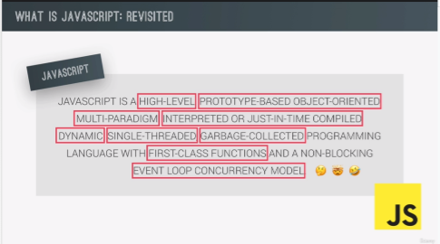
  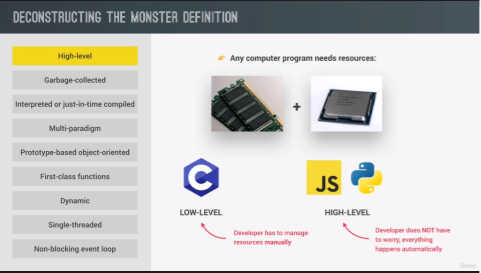
  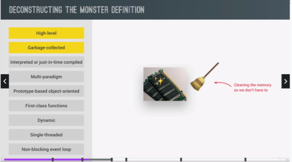

  > one of powerful toolls that takes memory management - garbage collection --is basically an algorithm inside JS engine

  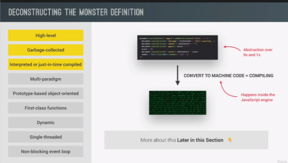
  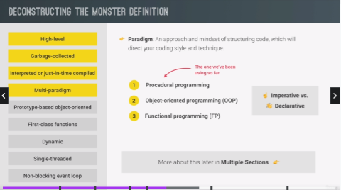
  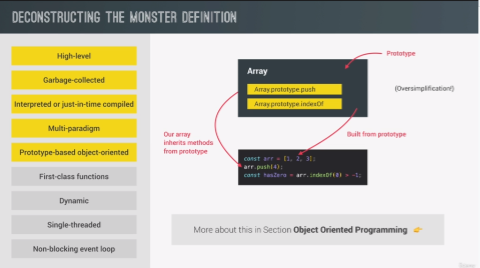
  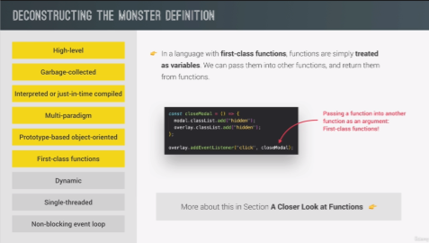
  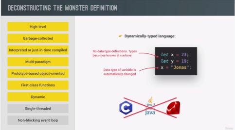
  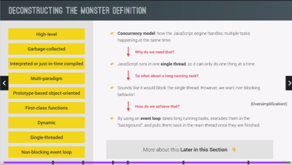

- JS Engine and Runtime

  > V8 engine - powers Google Chrome and also Node.js -- so we can build server side applications with JS outside any browser

  > Call Stack - where code is actually executed using something called execution contexts

  > Heap - is an unstructured memory pool which stores all the objects our application needed

  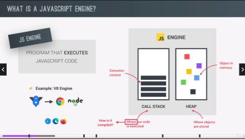

  > Compilation - machine code is built and then it is executed in the CPU in the processor --execution happen after compilation ex. application that we using on our computer, it has been compiled before and executing way after compilation

  > Interpretation - runs through source code and executes line by line (executed all at the same time) --still needs to be converted into MC but simply happens right before its executed and not ahead of time

  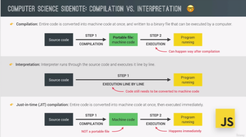

  - Modern Just-In-Time Compilation of JS

    - First step is to parse the code - means read the code, during parsing process, the code is parsed into a data structure called AST(abstract syntax tree) -- this tree has nothing to do with DOM
    - 2nd step is the compilation - takes the generated AST and compiles it into machine code
    - 3rd step - executed right away --(modern JS engine)
    - \*\*Note: modern JS engines actually have some pretty clever optimazation strategies -- create a very unoptimized versin on MC in the beginning just so that it can start executing as fast as possible -- then in the background, this code is optimized and recompiled during the already running program execution.

      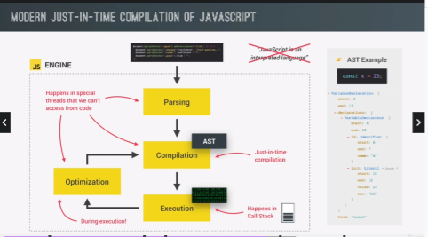

    - without engine, there is no runtime therefore no JS at all
    - Runtime - container including all the things that we need to use JS (in this case in the browser)
    - the heart of any JS runtime is always JS engine
    - engine alone is not enough, in order to work properly, we also need access to the web API's --related to the DOM or timers or even console.log
    - Web API's - are functionalities provided to the engine, accessible on global window object

  - Typical JS runtime also includes **callback queue** --is a data structured that contains all the callback functions that are ready to be executed ex. we attach event handler function to DOM elements like button to reacts to certain events **--event handler function are also called callback function**

    - for ex. a click, the callback function will be called --first thing that actually happpens after the event is that the callback function is put into callback queue --then when the stack is empty the callback function is passed to the stack so that it can be executed. --basically happens in **event loop - essential for non-blocking concurrency model** that takes callback functions from callback queue and puts them in the call stack to be executed.

    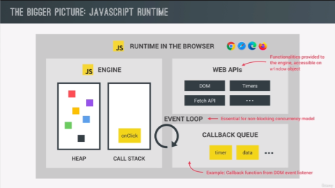
    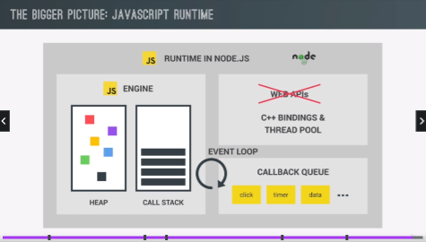

- Execution contexts and the Call Stack

  - What is an execution context?

    - code is now ready to be executed
    - global execution context is created for the top-level code --basically code that is not inside any functions will be executed (function should only be executed when called)
    - JS code always runs inside an execution context
      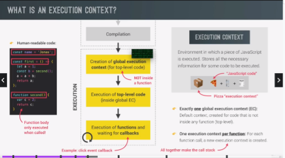

    - Note: Scope chain - basically consists of references to variables that are located outside of the current function. And to keep track of the scope chain, it is stored in each execution context

      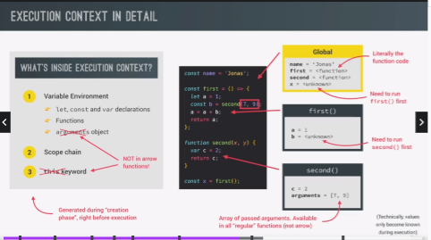
      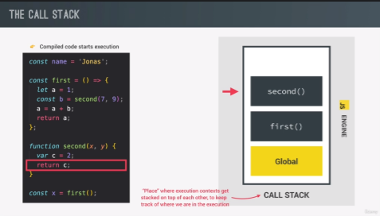

    - Note: execution context belonging to arrow functions, do not get their own arguments keyword nor do they get the this keyword --arrow dont have the arguments object and this keyword, instead they can use the arguments object and this keyword from their closest regular function parent
    - Technically speaking --code runs inside of execution context that are in the call stack.

- Scope and Scope Chain

  - Lexical scoping e.g -- a function that is written inside another function has access to the variables of the parent function
  - Variable scoping is influenced by where exactly we write our functions and code blocks
  - Scope -- in case of functions, essentially the variable environment which is stored in the functions execution context (difference between scope and variable environment are basically the same)
  - Scope of a variable --entire region
    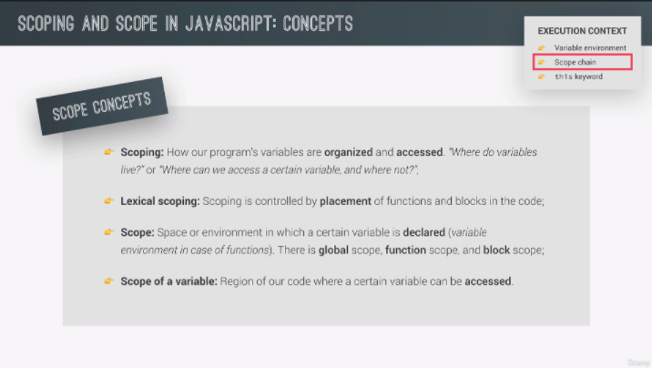
    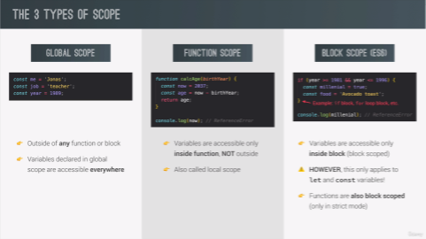
    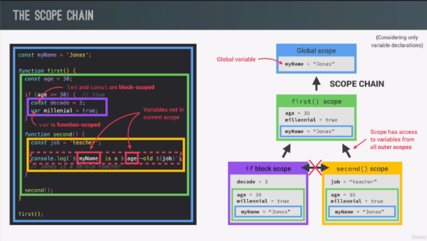

  - Note: variable lookup -- if one scope needs to use a certain variable but cant find in current scope, it will look up in the scope chain and find in one of the parent scopes.

    > on scope can only look up in scope chain but it cant look down.

  - Note: var -- function scoped, let & const -- block scoped

    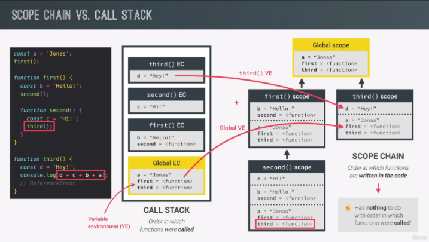

  - Note: the order in which functions are called does not affect the scope chain e.g the third function dont have access in 2nd function even though called the third

    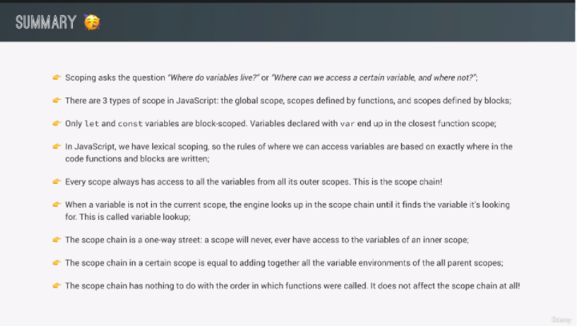

- Scoping in Practice

  ```js
  function calcAge(birthYear) {
    const age = 2037 - birthYear;

    function printAge() {
      let output = `${firstName} you are ${age}, born in ${birthYear}`;
      console.log(output);

      if (birthYear >= 1981 && birthYear <= 1996) {
        var millenial = true;
        // Creating NEW variable with same name as outer's scope
        const firstName = "Steven";

        const str = `Your'e a millenial, ${firstName} `;
        console.log(str);

        //reassigning variable from outer's scope
        output = "NEEEEW!";

        function add(a, b) {
          return a + b;
        }
        console.log(add(2, 3));
      }
      console.log(millenial); //var is a function scope
      // add(2, 3); //reference error -- functions are block scope -- only true for strict mode
      console.log(output);
    }
    printAge();

    return age;
  }

  const firstName = "Jonas";
  calcAge(1991);
  ```

- Variable Environment: Hoisting and the TDZ

  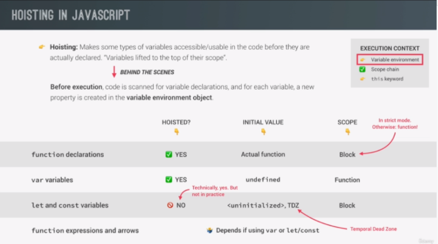

  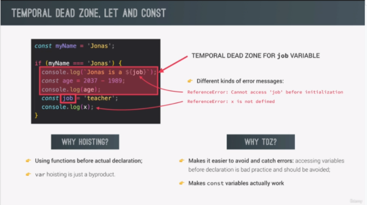

  - Note: each and every let and const variable get their own TDZ (temporal dead zone) that starts at the beginning of the scope until the line where it is defined. And variable is safe to use after the TDZ.

  ```js
  // HOISTING

  // VAR HOISTING
  var num;
  num = 6;
  console.log(num);

  // FUNCTION DECLARATION HOISTING
  defineHoisted();
  function defineHoisted() {
    console.log("hoisted");
  }

  // LET & CONST HOISTING
  let num; //declaration
  num = 6; //initialization
  console.log(num);

  const num = 6;
  console.log(num);

  // TDZ
  const myName = "Jane";

  if (myName === "Jane") {
    const age = 2037 - 1991;
    console.log(`${myName} is a ${job}`); //TDZ
    console.log(age);
    const job = "teacher";
    console.log(x);
  }

  console.log(myName);
  ```

- Hoisting and TDZ in Practice

  - Note: Window is the global object of JS in the browser -- variables declared in let & const do not create properties on the window object

  ```js
  // Practice Hoisting

  // Variables
  console.log(me);
  //console.log(job);
  //console.log(yr);

  var me = "Jonas";
  let job = "teacher";
  const yr = 1991;

  // Functions

  console.log(addDec(2, 3));
  //console.log(addExp(2, 3));
  console.log(addArrow);
  //console.log(addArrow(2, 3));

  function addDec(a, b) {
    return a + b;
  }

  const addExp = function (a, b) {
    return a + b;
  };

  var addArrow = (a, b) => a + b;

  // Example
  console.log(deleteShoppingCart());
  if (!numProducts) deleteShoppingCart();

  var numProducts = 10;

  function deleteShoppingCart() {
    console.log("All products deleted!");
  }

  var x = 1;
  let y = 2;
  const z = 3;

  console.log(x === window.x);
  console.log(y === window.y);
  console.log(z === window.z);
  ```

- The 'this' keyword

  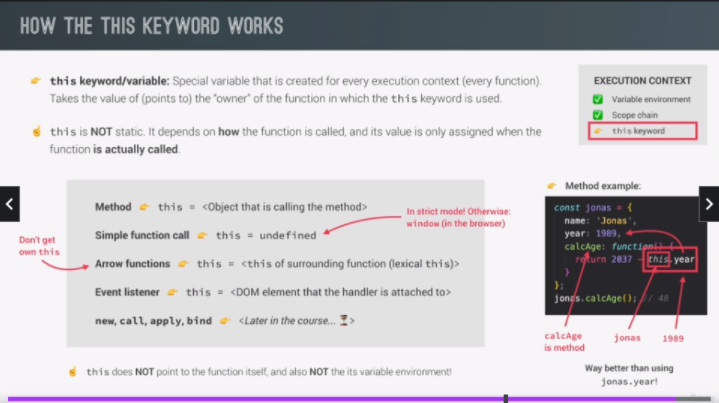

  - Note: not as a method attached to any object will simply be undefined -- only valid for strict mode
  - \*\*if use 'this' variable in arrow function, it will bw simply be the this keyword of the parent function (lexical this keyword)
  - \*\* 'this' kewyword in the global scope is simply window object e.g console.log(this);

  - 'this' Practice

    - Method borrowing - borrowing method from one object to the other (dry code)
    - 'this' keyword always points to the object that is calling the method.

    ```js
    // 'this' keyword practice

    console.log(this); //parent/globe scope

    const calcAge = function (birthYear) {
      console.log(2037 - birthYear);
      console.log(this); // undefined w/o attached to any object --in strict mode
    };
    calcAge(1991);

    const calcAgeArrow = (birthYear) => {
      console.log(2037 - birthYear);
      console.log(this); // window -- because of this in the lexical scoping (parent/globe scope)
    };
    calcAgeArrow(1991);

    const jonas = {
      year: 1991,
      calcAge: function () {
        console.log(this); // attached to object jonas
        console.log(2037 - this.year);
      },
    };
    jonas.calcAge();

    // Method borrowing
    const matilda = {
      year: 2017,
    };

    matilda.calcAge = jonas.calcAge; //method borrow
    matilda.calcAge(); // calling the method on matilda --this keyword will point to matilda, object which called the method

    const f = jonas.calcAge;
    f(); // this keyword attached to jonas is now undefine because function f calling jonas is just a regular function
    ```

- Regular Functions vs Arrow Functions

  ```js
  // Regular vs Arrow

  // var firstName = 'Matilda';

  const jonas = {
    firstName: "Jonas",
    year: 1991,
    calcAge: function () {
      // console.log(this);
      console.log(2037 - this.year);

      // Solution 1
      // const self = this; // self or that
      // const isMillenial = function () {
      //   console.log(self);
      //   console.log(self.year >= 1981 && self.year <= 1996);
      // };

      // Solution 2
      // arrow function inside parent scope --jonas object
      const isMillenial = () => {
        console.log(this);
        console.log(this.year >= 1981 && this.year <= 1996);
      };
      isMillenial();
      // inside regular function call, this keyword is undefined
    },

    // arrow functon in a method
    greet: () => {
      console.log(this);
      console.log(`Hey ${this.firstName}`);
    },
    // Note: for best practice, never use arrow funtion as method in object

    // greet: function () {
    //   console.log(this);
    //   console.log(`Hey ${this.firstName}`);
    // },
  };
  jonas.greet();
  jonas.calcAge();

  // arguments keywords is only available in regular function not in arrow function
  const addExp = function (a, b) {
    console.log(arguments);
    return a + b;
  };
  addExp(2, 3);
  addExp(2, 5, 3, 8);

  var addArrow = (a, b) => {
    console.log(arguments);
    return a + b;
  };
  addArrow(2, 5, 3, 8); // Reference Error
  ```

- Primitive vs Objects(Primitive vs Reference Types)

  > In memory and memory management - usual to call primitives and reference type(objects)

  > reference type(objects) stored in the memory heap (JS engine)

  > primitive types are store in call stack

  

  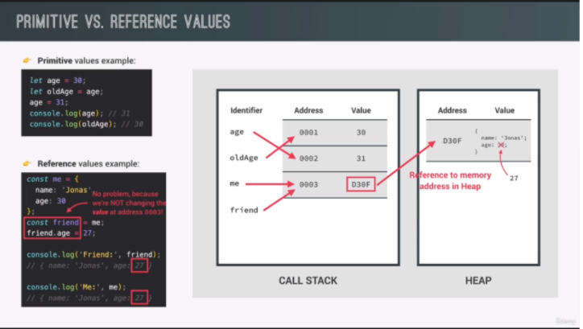

  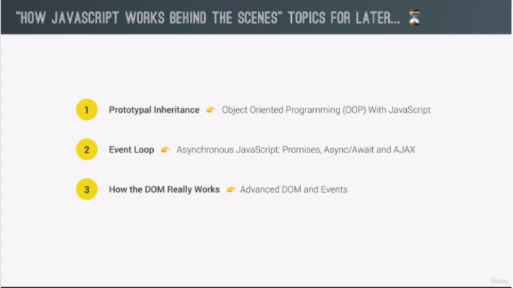

  **Note**: the piece of memory in the call stack has a reference to the piece of memory in the heap

  **Note**: const are only immutable in primitive types not on reference

  ```js
  // Primitive vs Objects(Primitive vs Reference Types)

  let age = 30;
  let oldAge = age;
  age = 31;
  console.log(age);
  console.log(oldAge);

  const me = {
    name: "Jonas",
    age: 30,
  };
  const friend = me;
  friend.age = 27;
  console.log("Friend: ", friend);
  console.log("Me: ", me);
  ```

- Primitives vs Object Practice

  ```js
  // Primitives vs Object Practice

  // Primitive types
  let lastName = "Williams";
  let oldLastName = lastName;
  lastName = "Davis";

  // reference type
  const jessica = {
    firstName: "Jessica",
    lastName: "Williams",
    age: 27,
  };
  const marriedJessica = jessica;
  marriedJessica.lastName = "Davis";
  console.log("Before marriage:", jessica);
  console.log("After marriage:", marriedJessica);

  // copying object --
  const jessica2 = {
    firstName: "Jessica",
    lastName: "Williams",
    age: 27,
    family: ["Alice", "Bob"], // array is an object -- deeply nested object
  };

  const jessicaCopy = Object.assign({}, jessica2); // only property copy not array object -- only creates shallow copy not deep clone
  jessicaCopy.lastName = "Davis";

  // Note: shallow copy only copy the properties while deep clone copy everything

  jessicaCopy.family.push("Mary");
  jessicaCopy.family.push("John");

  console.log("Before marriage:", jessica2);
  console.log("After marriage:", jessicaCopy);
  ```

## Section 09: Data Structures, Modern Operators and Strings

- What is and why might you Destructure an object or array?

  > Destructuring is a JavaScript expression that makes it possible to unpack values from arrays, or properties from objects, into distinct variables. That is, we can extract data from arrays and objects and assign them to variables. ... The ES6 destucturing assignment makes it easier to extract this data.

- Destructing Array

  > destructing is an ES6 feature and a way of **unpacking values** from an array or an object **into separate/new variables**

  > destructing is to break a complex data structure down into smaller data structure like a variable

  > for arrays, we use destructuring to **retrieve elements from the array and store them into variables** in very easy way. Not destroying the array just destructuring

  ```js
  // destructing array

  const arr = [2, 3, 4];
  const a = [0];
  const b = [1];
  const c = [2];

  const [x, y, z] = arr; // destructuring assignment
  console.log(x, y, z);

  let [main, , secondary] = restaurant.categories; // use , to skip element in arr
  console.log(main, secondary);

  // switch variable using destructuring
  // const temp = main;
  // main = secondary;
  // secondary = temp;
  // console.log(main, secondary);

  [main, secondary] = [secondary, main];
  console.log(main, secondary);

  // receive 2 return values from a function
  const restaurant = {
    name: "Classico Italiano",
    location: "Via Angelo Tavanti 23, Firenze, Italy",
    categories: ["Italian", "Pizzeria", "Vegetarian", "Organic"],
    starterMenu: ["Focaccia", "Bruschetta", "Garlic Bread", "Caprese Salad"],
    mainMenu: ["Pizza", "Pasta", "Risotto"],

    order: function (starterIndex, mainIndex) {
      return [this.starterMenu[starterIndex], this.mainMenu[mainIndex]];
    },
  };

  const [starter, mainCourse] = restaurant.order(2, 0);
  console.log(starter, mainCourse);

  // nested array -- one array inside another
  const nested = [2, 4, [5, 6]];
  // const [i, , j] = nested;
  // console.log(i, j);

  // destructuring insice destructuring
  const [i, , [j, k]] = nested;
  console.log(i, j, k);

  // default values
  const [p = 1, q = 1, r = 1] = [8, 9];
  console.log(p, q, r);
  ```

- Destructuring Object

  > destructuring object -- uses curly braces

  > provide variable names that exactly match the property name

  > extremely useful technique when dealing with the result of an API call --basically means to get data from another web application

  ```js
  const restaurant = {
    name: "Classico Italiano",
    location: "Via Angelo Tavanti 23, Firenze, Italy",
    categories: ["Italian", "Pizzeria", "Vegetarian", "Organic"],
    starterMenu: ["Focaccia", "Bruschetta", "Garlic Bread", "Caprese Salad"],
    mainMenu: ["Pizza", "Pasta", "Risotto"],

    openingHours: {
      thu: {
        open: 12,
        close: 22,
      },
      fri: {
        open: 11,
        close: 23,
      },
      sat: {
        open: 0, // Open 24 hours
        close: 24,
      },
    },

    // calling a method with an object --function destructure the object arguments --can also set default values as arguments
    orderDelivery: function ({
      time = "20:00",
      address,
      mainIndex = 0,
      starterIndex = 1,
    }) {
      console.log(
        `Order received! ${this.starterMenu[starterIndex]} and ${this.mainMenu[mainIndex]} at ${time} in ${address}`
      );
    },
  };
  // practical application --we can pass an object into the function as argument then function destructure that object
  restaurant.orderDelivery({
    time: "22:30",
    address: "Manila,Ph",
    mainIndex: 2,
    starterIndex: 2,
  });

  restaurant.orderDelivery({
    address: "Manila,Ph",
    starterIndex: 1,
  });

  // Destructuring Object
  const { name, openingHours, categories } = restaurant;
  console.log(name, openingHours, categories);

  // variable names differ from property name(still need to reference property names)
  const {
    name: restaurantName,
    openingHours: hours,
    categories: tags,
  } = restaurant;
  console.log(restaurantName, hours, tags); // helpful when dealing with third part data

  // default values feature --helpful when we do not have hard-coded data in application --third party app
  const { menu = [], starterMenu: starters = [] } = restaurant;
  console.log(menu, starters);

  // mutating variables while destructuring objects
  let a = 111;
  let b = 999;
  const obj = { a: 23, b: 7, c: 14 };
  ({ a, b } = obj); //uses parenthesis()
  console.log(a, b);

  // nested object
  const { fri } = openingHours;
  console.log(fri);

  const {
    fri: { open, close },
  } = openingHours;
  console.log(open, close);

  const {
    fri: { open: o, close: c },
  } = openingHours;
  console.log(o, c);
  ```

- The Spread Operator (...)

  > uses to expand an array into all its elements

  > basically unpacking all the array elements at one

  > whenever we need the elements of an array individually we use spread operator

  > the difference of spread operator to destructuring array, takes all the elements from the array and it doesnt create new variables

  > we can only use it in places where we would otherwise write values separated by commas

  > iterables - things like all arrays, strings, maps or sets but not object

  ```js
  // Spread Operator

  // array
  const arr = [7, 8, 9];
  const badNewArr = [1, 2, arr[0], arr[1], arr[2]];
  console.log(badNewArr);

  const newArr = [1, 2, ...arr]; // using spread operator write them individually as wrote as manually
  console.log(newArr);
  console.log(...newArr); // write individually array element

  const restaurant = {
    name: "Classico Italiano",
    location: "Via Angelo Tavanti 23, Firenze, Italy",
    categories: ["Italian", "Pizzeria", "Vegetarian", "Organic"],
    starterMenu: ["Focaccia", "Bruschetta", "Garlic Bread", "Caprese Salad"],
    mainMenu: ["Pizza", "Pasta", "Risotto"],

    openingHours: {
      thu: {
        open: 12,
        close: 22,
      },
      fri: {
        open: 11,
        close: 23,
      },
      sat: {
        open: 0, // Open 24 hours
        close: 24,
      },
    },

    orderPasta: function (ing1, ing2, ing3) {
      console.log(`You order pasta with ${ing1}, ${ing2} and ${ing3}`);
    },
  };

  const newMenu = [...restaurant.mainMenu, "Gnocci"]; // creating complete new array
  console.log(newMenu);

  // copy array
  const mainMenuCopy = [...restaurant.mainMenu];

  // join 2 array
  const joinArray = [...restaurant.mainMenu, ...restaurant.starterMenu];
  console.log(joinArray);

  // iterables: arrays, strings, maps, sets. NOT object
  const str = "Jonas";
  const letters = [...str, "", "S"];
  console.log(letters);
  console.log(...str);
  //console.log(`${...str} Schedtmann`); //cannot use spread using template literal

  // Note: multiple values separated by a comma are usually only expected when we pass arguments into function or building new array

  // multiple arguments in function -- real work example
  const ingredients = [
    prompt("Lets make pasta! Ingredient 1?"),
    prompt("Ingredient 2?"),
    prompt("Ingredient 3?"),
  ];
  console.log(ingredients);
  restaurant.orderPasta(...ingredients);

  // objects - ES 2018, spread operator actually works on objects even obj are not iterables
  const newRestaurant = { foundedIn: 1998, ...restaurant, founder: "Guiseppe" };
  console.log(newRestaurant);

  // copy object --aside from using object.assign
  const restaurantCopy = { ...restaurant };
  restaurantCopy.name = "Ristorante Roma";
  console.log(restaurantCopy.name);
  console.log(restaurant.name);
  ```

- Rest Pattern and Parameters

  > has the same syntax with spread operator but actually does the opposite.

  > rest pattern --uses the exact same syntax to collect multiple elements and **condense them into an array.** Basically collects the elements that are unused in the destructuring assignment.

  > spread operator is to unpack an array, while rest is to pack

  > spread operator we expand, while in rest we compress

  ```js
  // Rest Pattern and Parameters

  // SPREAD -- because on the RIGHT side of the assignment operator
  const arr = [1, 2, ...[3, 4]];

  // 1) Destructuring

  // REST -- on the LEFT side of assign operator
  const [a, b, c, ...others] = [1, 2, 3, 4, 5];
  console.log(a, b, c, others); //called rest because it will take the rest of the elements

  // BOTH spread and rest
  const [pizza, , risotto, ...otherFoods] = [
    ...restaurant.mainMenu,
    ...restaurant.starterMenu,
  ];
  console.log(pizza, risotto, otherFoods);
  // rest pattern always must be the last in destructuring assignment
  // only one rest in any destructuring assignment

  // Object
  const { sat, ...weekdays } = restaurant.openingHours;
  console.log(weekdays);

  // 2)  Functions
  const add = function (...numbers) {
    let sum = 0;
    for (let i = 0; i < numbers.length; i++) sum += numbers[i];
    console.log(sum);
  };
  add(2, 3);
  add(5, 3, 7, 2);
  add(5, 3, 7, 2, 5, 8, 9);

  const x = [23, 4, 7];
  add(...x); // x values being spread will enter add function then be pass into number array by the rest parameters

  const restaurant = {
    name: "Classico Italiano",
    location: "Via Angelo Tavanti 23, Firenze, Italy",
    categories: ["Italian", "Pizzeria", "Vegetarian", "Organic"],
    starterMenu: ["Focaccia", "Bruschetta", "Garlic Bread", "Caprese Salad"],
    mainMenu: ["Pizza", "Pasta", "Risotto"],

    openingHours: {
      thu: {
        open: 12,
        close: 22,
      },
      fri: {
        open: 11,
        close: 23,
      },
      sat: {
        open: 0, // Open 24 hours
        close: 24,
      },
    },

    orderPizza: function (mainIngredients, ...otherIngredients) {
      console.log(mainIngredients);
      console.log(otherIngredients);
    },
  };

  // rest parameters --real application at restaurant object

  restaurant.orderPizza("mushrooms", "onion", "olives", "spinash");
  restaurant.orderPizza("mushrooms");
  ```

- Short Circuit (&& and ||)

  - Logical Operators

    - 1 -- can use any data type then can return any data type and do something called --**SHORT CIRCUITING** aka short circuit evaluation
      - OR Operator - short circuiting means that if the first value is a truthy value, it will immediately return the 1st value --can USE to set default values
      - AND Operator - only true if all operands are true. opposite of OR operator, if the 1st value is falsy then immediately return falsy value w/o evaluating 2nd value --if both truthy, the last value return -- can USE to execute code in the second operand if 1st is true

    ```js
    // Short Circuit (&& and ||)

    console.log("------- OR --------");
    // OR operator -- return truthy values even if first operand is truthy other operand will not even be evaluated
    console.log(3 || "Joe"); // 3
    console.log("" || "Joe"); // Joe
    console.log(true || 0); // true
    console.log(undefined || null); //null --no short circuit last operand will return even falsy

    console.log(undefined || 0 || "" || "Hello" || 23 || null); // Hello

    // checking if has property in restaurant obj
    restaurant.numGuests = 23;
    const guests1 = restaurant.numGuests ? restaurant.numGuests : 10;
    console.log(guests1);

    const guest2 = restaurant.numGuests || 10;
    console.log(guest2); // 10 --restaurant.numGuest was undefined --falsy

    console.log("------- AND --------");

    // AND operator--opposite of OR operator, if the 1st value is falsy then immediately return falsy value w/o evaluating 2nd value --if both truthy, the last value return
    console.log(0 && "Jonas");
    console.log(7 && "Jonas");
    console.log("Hello" && 23 && null && "jonas"); // result will always be the falsy value even in multiple values

    // practical practice
    if (restaurant.orderPizza) {
      console.log("mushrooms", "spinach");
    }

    restaurant.orderPizza && restaurant.orderPizza("mushrooms", "spinach");
    ```

- The Nullish Coalesing Operator (??)

  > operator that as introduced in ES2020

  > Nullish: zero and empty string ('') is not a nullish value --it is as if the zero and the empty string were not falsy values and were instead truthy values as well.

  > Nullish value: null or undefined --If values are not defined and null, second operand will be returned

  ```js
  // Nullish Coalesing Operator (??)
  restaurant.numGuests = 0;
  const guest = restaurant.numGuests || 10;
  console.log(guest);

  // Nullish: null and undefined (NOT 0 or '')
  const guestCorrect = restaurant.numGuests ?? 10;
  console.log(guestCorrect);
  ```

- Logical Assignment Operators

  > Introduced in ES2021

  ```js
  // Logical Assignment Operator
  const rest1 = {
    name: "Mama Sita",
    //numGuest: 20,
    numGuest: 0,
  };

  const rest2 = {
    name: "Mang Kanor",
    owner: "Nicanor Knorr",
  };

  // OR assignment operator --will assign a value to variable if that exact variable is currently falsy
  // rest1.numGuest = rest1.numGuest || 10;
  // rest2.numGuest = rest2.numGuest || 10;

  // rest1.numGuest ||= 10;
  // rest2.numGuest ||= 10; //--assigns a value to a variable if that variable is currently falsy

  // Nullish assignment operator --assign a value to a variable if that exact variable is currently nullish(null or undefined)
  rest1.numGuest ??= 10;
  rest2.numGuest ??= 10;

  // AND assignment operator
  //rest1.owner = rest1.owner && 'Anonymous'; // undefined
  rest1.owner &&= "Anonymous";
  rest2.owner &&= "Anonymous";

  console.log(rest1);
  console.log(rest2);
  ```

- Looping Arrays: The FOR-OF LOOP

  ```js
  // Looping Arrays: The FOR-OF LOOP
  const menu = [...restaurant.starterMenu, ...restaurant.mainMenu];

  // regular for loop
  for (let i = 0; i < menu.length; i++) {
    console.log(menu[i]);
  }

  console.log(menu);

  // for of --will automatically loop over the entire array and in each iteration gives acces to current array
  for (const item of menu) console.log(item);
  // variable item is always the current element

  // current index
  for (const [i, el] of menu.entries()) {
    console.log(`${i + 1}: ${el}`);
  }

  //console.log([...menu.entries()]);
  // menu.entries() --basically an array which in each position contain a new array that has both element and index number of that element in the original array
  ```

- Enhanced Object Literals

  > Introduced in ES6

  ```js
  // Enhanced Object Literals

  const weekdays = ["mon", "tue", "wed", "thu", "fri", "sat", "sun"];

  const openingHours = {
    [weekdays[3]]: {
      open: 12,
      close: 22,
    },
    [weekdays[4]]: {
      open: 11,
      close: 23,
    },
    [weekdays[5]]: {
      open: 0, // Open 24 hours
      close: 12 + 12,
    },
  };

  const restaurant2 = {
    name: "Classico Italiano",
    location: "Via Angelo Tavanti 23, Firenze, Italy",
    categories: ["Italian", "Pizzeria", "Vegetarian", "Organic"],
    starterMenu: ["Focaccia", "Bruschetta", "Garlic Bread", "Caprese Salad"],
    mainMenu: ["Pizza", "Pasta", "Risotto"],

    // ES6 enhance object literal
    openingHours,
    order(starterIndex, mainIndex) {
      return [this.starterMenu[starterIndex], this.mainMenu[mainIndex]];
    },
  };
  ```

- Optional Chaining (?.)

  ```js
  // Optional Chaining (?.)

  if (restaurant.openingHours && restaurant.openingHours.mon) {
    console.log(restaurant.openingHours.mon.open);
  }

  // with OC
  console.log(restaurant.openingHours.mon?.open); // undefined --property before ? (mon) the one being read if exist, if not undefined is the result
  console.log(restaurant.openingHours?.mon?.open); //  if restaurant.openingHours does not even exist,well, then the Monday property will not even be read

  // example
  const days = ["mon", "tue", "wed", "thu", "fri", "sat", "sun"];

  for (const day of days) {
    //console.log(day);
    const open = restaurant.openingHours[day]?.open ?? "closed";
    console.log(`On ${day} , we are open at ${open}`);
  }
  // remember if we want to use a variable name as the property name, basically, we need to use the brackets notation.

  // Methods
  console.log(restaurant.order?.(0, 1) ?? "Method not exist");
  console.log(restaurant.orderSalad?.(0, 1) ?? "Method not exist");

  // Array
  const user = [{ name: "jonas", email: "helloa@jonas,io" }];

  // const user = [];
  console.log(user[0]?.name ?? "User array empty");

  // if else
  if (user.length > 0) console.log(user[0].name);
  else {
    console.log("User array empty");
  }
  ```

- Looping Objects: Object Keys, Values and Entries

  - Unlike for of loop array, loop over object are not iterable in indirect way

  ```js
  // Looping Objects: Object Keys, Values and Entries

  // Propperty NAMES
  const properties = Object.keys(openingHours);
  console.log(properties);

  let openStr = `We are open in ${properties.length} days: `;

  for (const day of properties) {
    openStr += `${day}, `;
  }
  console.log(openStr);

  // Property VALUES

  const values = Object.values(openingHours);
  console.log(values);

  // Entries --names plus the values together --Entire object --distinction between array and object is important as we loop over the entire object

  const entries = Object.entries(openingHours);
  console.log(entries);

  // [key, value]
  for (const [key, { open, close }] of entries) {
    console.log(`On ${key} we open at ${open} to ${close}`);
  }
  ```

- Sets

  > Set is a collection of unique values --means that a set can never have any duplicates --all duplicates will be gone

  > Set is always iterables --elements are unique and the order of elements are relevant

  > there is no indexes in sets

  > using set cant retirieve data, if needed getting values out of a set use an array

  > sets is not intended to replace arrays at all

  ```js
  // Sets
  const ordersSet = new Set([
    "Pasta",
    "Pizza",
    "Pizza",
    "Pasta",
    "Pasta",
    "Risotto",
  ]);
  console.log(ordersSet);

  console.log(new Set("Jonnaas")); // J o n a s

  console.log(ordersSet.size); //3
  console.log(ordersSet.has("Pizza")); // true
  console.log(ordersSet.has("Bread")); // false

  ordersSet.add("Garlic Bread");
  ordersSet.add("Garlic Bread");
  ordersSet.delete("Risotto");
  // ordersSet.clear();
  console.log(ordersSet);

  for (const order of ordersSet) console.log(order);

  // example
  const staff = ["Waiter", "Chef", "Waiter", "Manager", "Chef", "Waiter"];
  const staffUnique = [...new Set(staff)];
  console.log(staffUnique);

  console.log(
    new Set(["Waiter", "Chef", "Waiter", "Manager", "Chef", "Waiter"]).size
  );

  console.log(new Set("jonasschedtmann").size);
  ```

- Maps: Fundamentals

  > Map is a data structure that can use to map values to keys --like an object data is stored in key value pairs in maps

  > difference between map, keys can have any type(object, arrays or other maps) and can be huge, while object, keys are basically always strings

  ```js
  // MAPS
  const rest = new Map();
  rest.set("name", "Classico Italiano"); //set method is similar to add -- allows to add new element

  rest.set(1, "Firenze, Italy");
  console.log(rest.set(2, "Lisbon, Portugal"));

  rest
    .set("categories", ["Italian", "Pizzeria", "Vegetarian", "Organic"])
    .set("open", 11)
    .set("close", 23)
    .set(true, "We are open")
    .set(false, "We are closed");
  // calling set method returns the updated map

  console.log(rest.get("name"));
  console.log(rest.get(true));
  // to read data from the map, use get method

  const time = 12;
  console.log(rest.get(time > rest.get("open") && time < rest.get("close")));

  console.log(rest.has("categories")); // check method
  rest.delete(2);
  //rest.clear();

  // Solution --define a variable to return an identifier from call stack
  // array
  const arr = [1, 2]; // refer to the same place in memory

  rest.set(arr, "Test");
  rest.set(document.querySelector("h1"), "Heading");
  console.log(rest);
  console.log(rest.size);

  console.log(rest.get(arr)); // Refernce error --array are store in heap, therefore the key[1,2] will be a value in call stack. Address will be undefined as key will be a value at call stack

  // object
  const me = { name: "Jonas", age: 30 };
  rest.set(me, "Name");

  console.log(rest.get(me)); //use the same object/array to read the value out of the map
  ```

- Maps: Iteration

  ```js
  // Maps: Iteration
  const question = new Map([
    ["question", "What is the best programming language in the world?"],
    [1, "C"],
    [2, "Java"],
    [3, "JavaScript"],
    ["correct", 3],
    [true, "Correct!"],
    [false, "Try again!"],
  ]);
  // question.set(['best teacher', 'Jonas']); // Refernce error
  console.log(question);

  // convert object to maps
  console.log(Object.entries(openingHours));

  const hoursMap = new Map(Object.entries(openingHours));
  console.log(hoursMap);

  // iteration - quiz app
  console.log(question.get("question"));
  for (const [key, value] of question) {
    if (typeof key === "number") console.log(`Answer ${key}: ${value}`);
  }

  //const answer = Number(prompt('Your answer'));
  //console.log(question.get(question.get('correct') === answer));

  // console.log(
  //   question.get(
  //     answer === question.get('correct') ?? answer !== question.get('correct')
  //   )
  // );

  // convert map back to array
  console.log([...question]); // unpack value by using spread operator

  // methods in arrays
  console.log([...question.entries()]);
  console.log([...question.keys()]);
  console.log([...question.values()]);
  ```

- Summary: Which Data Structure to Use

  > 1st: Do we need a simple list values ? Use ARRAYS or a SET --values w/o any description

  > 2nd: If need key values pairs ? Use Object or Maps --with a key value pair we have a way of describing the values using a keys

  > In modern JS - common source of data come from Web APIs --comes in a special data format called JSON

  > sets are not meant to replace arrays but rather to compliment them

  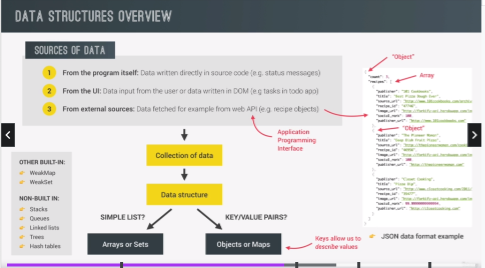
  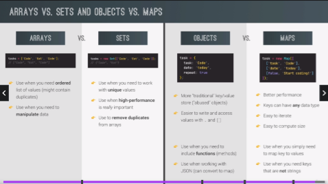

- Working with Strings - Part 1

  > impossible to mutate strings as they are primitives --slice method and other method always return a new string

  > Whenever we call a method on a string, JS will automatically behind the scene convert that string primitive to a string object with same content. Then its on that object where method are called --basically takes string and put in into a box which is the object (boxing)

  ```js
  // Working with Strings - Part 1

  const airline = "TAP Air Portugal";
  const plane = "A320";

  console.log(plane[0]);
  console.log(plane[1]);
  console.log(plane[2]);
  console.log("B737"[0]);

  // lenght
  console.log(airline.length);
  console.log("B737".length);

  // methods
  console.log(airline.indexOf("r"));
  console.log(airline.lastIndexOf("r"));
  console.log(airline.indexOf("portugal")); // case-sensitive

  // SLICE METHOD

  // Note: one good use case is to extract part of a string using slice method
  console.log(airline.slice(4)); // Air Portugal (sub-string) --zero-based and spacing is counted

  console.log(airline.slice(4, 7));
  // KIM: basically stops extracting before reaching index bumber 7 (declared in parameter) --also the length of extracted string is always going to be last parameter minus first

  // extract string w/o knowing its index --using slice method
  console.log(airline.slice(0, airline.indexOf(" ")));
  console.log(airline.slice(airline.lastIndexOf(" ") + 1));

  console.log(airline.slice(-2)); // al --negative index ill start extracting from the end

  console.log(airline.slice(1, -1)); // cutoff the first letter at positon one and last letter at position -1

  const checkMiddleSeat = function (seat) {
    // const s = seat.slice(seat.lastIndexOf(' '));
    const s =
      seat.slice(-1) === "B" || seat.slice(-1) === "E"
        ? `You're in middle seat`
        : `You're not on middle seat`;
    console.log(s);
  };
  checkMiddleSeat("11B");
  checkMiddleSeat("23C");
  checkMiddleSeat("3E");

  console.log(new String("jonas")); // conversion string to object
  console.log(typeof new String("jonas")); //object

  console.log(typeof new String("jonas").slice(1));
  // Note: When the operation is done --the object is converted back to primitive string --all string methods return primitives even if called on a string object
  ```

- Working with Strings - Part 2

  ```js
  // Working with Strings - Part 2
  const airline = "TAP Air Portugal";

  console.log(airline.toLowerCase());
  console.log(airline.toUpperCase());

  // Fix capitalization Name
  const pax = "jOnAs";
  const paxLower = pax.toLowerCase();
  const paxUpper = paxLower[0].toUpperCase() + paxLower.slice(1);

  console.log(paxUpper);

  // Comparing emails
  const email = "hello@jonas.io";
  const loginEmail = "  Hello@Jonas.Io \n";

  // const lowerEmail = loginEmail.toLowerCase();
  // const trimmedEmail = lowerEmail.trim();
  const normalizedEmail = loginEmail.toLowerCase().trim(); //start in ES2019 --can trim white space from start and at end
  console.log(normalizedEmail);
  console.log(email === normalizedEmail);

  // replace method  --relace method also return a brand new string(doesnt mutate original) --case sensitive
  const price = "₱100,000";
  const priceUS = price.replace("₱", "$").replace(",", ".");
  console.log(priceUS);

  const announcement =
    "All passengers come to boarding door 23. Boarding door 23!";

  console.log(announcement.replace("door", "gate"));
  console.log(announcement.replaceAll("door", "gate"));

  // using regular expression
  console.log(announcement.replace(/door/g, "gate")); // g stands for global

  // Booleans
  const plane = "Airbus A320neo";
  console.log(plane.includes("A320"));
  console.log(plane.includes("Boeing"));
  console.log(plane.startsWith("Airb"));

  if (plane.startsWith("Airbus") && plane.endsWith("neo")) {
    console.log("Part of NEW Airbus family");
  }

  // Practice exercise
  const checkBaggage = function (items) {
    const baggage = items.toLowerCase();
    if (baggage.includes("knife") || baggage.includes("gun")) {
      console.log("You are NOT allowed on board");
    } else {
      console.log("WELCOME aboard!");
    }
  };
  checkBaggage("I have a laptop, some Food and a pocket Knife");
  checkBaggage("Socks and camera");
  checkBaggage("Got some snacks and a gun for protection");
  ```

- Working with Strings - Part 3

  > Split method - allows us to split a string into multiple parts based on a divider string --it will then store the results into elements of a **new array**

  > Join method - is the opposite of split. method creates and returns a new string by concatenating all of the elements in an array

  ```js
  // Working with Strings - Part 3

  // Split and join
  console.log("a+very+nice+string".split("+"));
  console.log("Jonas Schmedtmann".split(" "));

  const [firstName, lastName] = "Jonas Schmedtmann".split(" ");

  const newName = ["Mr.", firstName, lastName.toUpperCase()].join(" ");
  console.log(newName);

  const capitalizeName = function (name) {
    const names = name.split(" ");
    console.log(names);

    const namesUpper = [];

    for (const n of names) {
      //namesUpper.push(n[0].toUpperCase() + n.slice(1));

      namesUpper.push(n.replace(n[0], n[0].toUpperCase()));
    }
    console.log(namesUpper.join(" "));
  };
  capitalizeName("jessica ann smith davis");
  capitalizeName("jonas schmedtmann");

  // Padding
  const message = "Go to gate 23";
  console.log(message.padStart(25, "+").padEnd(35, "+"));
  console.log("Jonas".padStart(25, "+").padEnd(35, "+"));

  const maskCreditCard = function (number) {
    const str = String(number);
    const last = str.slice(-4);

    return last.padStart(str.length, "*");
    //console.log(last.padStart(str.length, '*'));
  };
  console.log(maskCreditCard(12345678));
  console.log(maskCreditCard(12345678912345));
  console.log(maskCreditCard("12345678912345678912345"));

  // Repeat
  const message2 = "Bad weather... All Departures delayed";

  console.log(message2.repeat(5));

  const planesInLine = function (n) {
    console.log(`There are ${n} planes in line ${"🛩".repeat(n)}`);
  };
  planesInLine(5);
  planesInLine(3);
  planesInLine(12);
  ```

- String Method in Practice

  ```js
  // String Method Practice

  // Data needed for a later exercise
  const flights =
    "_Delayed_Departure;fao93766109;txl2133758440;11:25+_Arrival;bru0943384722;fao93766109;11:45+_Delayed_Arrival;hel7439299980;fao93766109;12:05+_Departure;fao93766109;lis2323639855;12:30";

  const getCode = (str) => str.slice(0, 3).toUpperCase();

  for (const flight of flights.split("+")) {
    const [type, from, to, time] = flight.split(";");
    const output = `${
      type.startsWith("_Delayed") ? "🔴" : ""
    } ${type.replaceAll("_", " ")} from ${getCode(from)} to ${getCode(
      to
    )} (${time.replace(":", "h")})`;
    console.log(output.padStart(50));
  }
  ```

## Section 10: A Closer Look at Functions

- Default Parameters

  > sometimes its useful to have functions where some parameters are set by default

  ```js
  // Default Parameters

  const bookings = [];

  const createBooking = function (
    flightNum,
    numPassenger = 1,
    price = 199 * numPassenger
  ) {
    // ES5
    //   numPassenger = numPassenger || 1;
    //   price = price || 199;

    const booking = {
      flightNum,
      numPassenger,
      price,
    };
    console.log(booking);
    bookings.push(booking);
  };

  createBooking("LG123");
  createBooking("LG123", 2, 800);
  createBooking("LG123", 2);
  createBooking("LG123", 5);
  createBooking("LG123", undefined, 1000);
  // Note : skipping in argument is not allowed --tricks set to undefined (same as not even setting it)
  ```

- How Passing Arguments Works: Value vs Reference

  > there are two terms that are used all the time when dealing with functions --which is passing by value and passing by reference

  > JS does not have passing by reference, only passing by value even though it looks like its passing by reference

  ```js
  // How Passing Arguments Works: Value vs Reference

  const flight = "LH234";
  const jonas = {
    name: "Jonas Schedtmann",
    passport: 234567890,
  };

  const checkedIn = function (flightNum, pax) {
    flightNum = "KH999";
    pax.name = "Mr. " + pax.name;

    if (pax.passport === 234567890) {
      alert("Check in");
    } else {
      alert("Wrong passport");
    }
  };
  checkedIn(flight, jonas);
  console.log(flight);
  console.log(jonas); // when pass a ref type to a function, what is copied is really just a reference to the object in the memory heap -->

  // flightNum here is a completely different variable. And therefore, as we changed it here,it did not get reflected in the outside flight variable.

  // Is the same as doing...
  const flightnum = flight;
  const pax = jonas;

  // KIM: Passing a primitive type to a function is really just the same as creating a copy outside of a function. On the other hand, when we pass object to a function, it is really just like copying an object -- whatever we change in a copy will also happen in the original

  // two function manipulating one object -- it will create a bug
  const newPassport = function (person) {
    person.passport = Math.trunc(Math.random() * 10000000);
  };

  // newPassport(jonas);
  console.log(newPassport(jonas));
  // checkedIn(flight, jonas);

  console.log(jonas); // output: new passport number defined in newPassport function
  ```

- First-Class and High-Order Functions

  > a fundamental property of the JS language --it has a first class function -- that enable to write higher order

  > **higher order function** --is either a function that **receives another function as an argument** or a function that returns a new function

  - callback function will be called later by the higher order function

  > **first class function** -- is just a feature that a programming language has or does not have. All it means is that all functions are values

  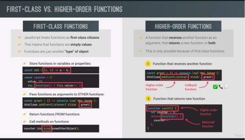

- Functions Accepting Callback Function

  > A callback function is a function passed into another function as an argument, which is then invoked inside the outer function to complete some kind of routine or action.

  - Why callback functions so much used in JS? and why helpful?
    - 1st: it makes it easily split up code into more reusable and interconnected parts
    - 2nd: allows to create abstraction --hide the detail of some code implementation --allows us to think about problems at a higher more abstract level

  ```js
  // Functions Acceptipting Callback Function

  const oneWord = function (string) {
    return string.replace(/ /g, "").toLowerCase();
  };

  const upperFirstWord = function (string) {
    const [first, ...others] = string.split(" ");
    return [first.toUpperCase(), ...others].join(" ");
  };

  // console.log(oneWord('Say the name'));
  // console.log(upperFirstWord('Say the name'));

  // higher order function
  const transformer = function (str, fn) {
    console.log(`Original str: ${str}`);
    console.log(`transformed str: ${fn(str)}}`);

    console.log(`transformed by: ${fn.name}`);
  };
  transformer("JavaScript is the best!", upperFirstWord);
  transformer("JavaScript is the best!", oneWord);

  // We abstracted this code away into other functions --we created a new level of abstraction by doinf the transformer function (delegating the string transformation to other lower level of function(oneWord and upperFirstWord))

  // JS uses callbacks all the time
  const high5 = function () {
    console.log("Hi!");
  };

  document.body.addEventListener("click", high5);
  ["Jonas", "Jose", "Adam"].forEach(high5);
  ```

- Functions Returning Functions

  > Closures -- are a very complex and difficult to understand mechanism thats part of JS

  ```js
  // Functions Returning Functions

  const greet = function (greeting) {
    return function (name) {
      // <--- return function of greet
      console.log(`${greeting} ${name}`);
    };
  };
  const greeterHey = greet("Hey!"); // greteerHey is a function (variable) that will produce a value of the greet function
  greeterHey("Jonas"); // <---return function of name
  greeterHey("Steven");

  // easy way
  greet("Hello")("Jonas");
  // argument hello is for greet function parameter while Jonas is for return name function

  // Challenge
  const greetArr = (greeting) => (name) => console.log(`${greeting} ${name}`);
  greetArr("Helloooo")("Jonass");
  ```

- The Call and Apply Methods

  ```js
  // The Call and Apply Method

  const lufthansa = {
    airline: "Lufthansa",
    iataCode: "LH",
    bookings: [],
    book(flightNum, name) {
      console.log(
        `${name} book a seat on ${this.airline} flight ${this.iataCode}${flightNum}`
      );
      this.bookings.push({ flight: `${this.iataCode}${flightNum}`, name });
    },
  };
  lufthansa.book(239, "Jonas Schedtmann");
  lufthansa.book(896, "Mike Smith");
  console.log(lufthansa);

  const euroWings = {
    airline: "Eurowings",
    iataCode: "EW",
    bookings: [],
  };

  const swiss = {
    airline: "Swiss Airlines",
    iataCode: "LX",
    bookings: [],
  };

  const book = lufthansa.book;

  // Does NOT work
  // book(23, 'Sarah Williams')

  // Call method -- the first argument is exactly what we want the this keyword point to (in this case the eurowings object) And allows us to manually and explicitly set the this keyword of any function that we want to call

  book.call(euroWings, 23, "Sarah William"); // call the book function with the this keyword set to eurowings
  console.log(euroWings);

  book.call(lufthansa, 239, "Mary Cooper");
  console.log(lufthansa);

  // Apply method -- same as call methods, the only difference is that apply does NOT receive a list of arguments after the this keyword --instead gonna take an array of the arguments

  const flightData = [234, "George Cooper"];
  book.apply(swiss, flightData);
  console.log(swiss);
  // first argument is the this keyword (object that needs to pass in)and the second argument is list of arrays --the data need to pass in

  // modern JS not use apply --instead can still use a call method
  book.call(swiss, ...flightData);
  console.log(swiss);
  ```

- The Bind Method

  > The difference between call() and bind() is that the call() sets the this keyword and executes the function immediately and it does not create a new copy of the function, while the bind() creates a copy of that function and sets the this keyword.

  > bind method also allows us to manually set this keyword for any function call

  > the difference is that bind does not immediately call the function, instead it returns a new function where the this keyword is bound

  > partial application --a common pattern specifying parts of the argument beforehand --means that a part of the arguments of the original function are already applied

  ```js
  // Bind Method
  const bookEW = book.bind(euroWings);
  const bookLH = book.bind(lufthansa);
  const bookLX = book.bind(swiss);
  bookEW(23, "Steven Williams");

  const bookEW23 = book.bind(euroWings, 23);
  bookEW23("Jonas Schedtmann");
  bookEW23("Martha Cooper");

  // with Event Listeners
  lufthansa.planes = 300;
  lufthansa.buyPlane = function () {
    console.log(this);
    this.planes++;
    console.log(this.planes);
  };

  document
    .querySelector(".buy")
    .addEventListener("click", lufthansa.buyPlane.bind(lufthansa)); // the this keyword is not pointing at the object lufthansa.buyPlane but in the element selected (buy) --but using bind will creates a copy of buyPlane() and sets the this keyword.

  // Partial Application
  const addTax = (rate, value) => value + value * rate;
  console.log(addTax(0.1, 200));

  const addVAT = addTax.bind(null, 0.23); // preset arguments
  // addVAT = value => value + value * 0.23;
  console.log(addVAT(100));
  // the first argument of the bind method is the this keyword --use null instead if this keyword not in the function
  // if want want to preset the argument, it should always be the first argument

  // Challenge
  const taxAdd = function (rate) {
    return function (value) {
      console.log(value + value * rate);
    };
  };

  const taxAddReg = taxAdd(0.1);
  taxAddReg(200);
  const taxVAT = taxAdd.bind(null)(0.23);
  taxVAT(100);

  // Other Solution --w/o using bind
  const addTaxRate = function (rate) {
    return function (value) {
      return value + value * rate;
    };
  };

  const taxAddReg2 = addTaxRate(0.23);
  console.log(taxAddReg2(100));
  console.log(taxAddReg2(23));
  ```

- Immediate Invoked Function Expressions (IIFE)

  > An IIFE (Immediately Invoked Function Expression) is a JavaScript function that runs as soon as it is defined.

  - 1: An IIFE (Immediately Invoked Function Expression) is a JavaScript function that runs as soon as it is defined.
  - 2: The second part creates the immediately invoked function expression () through which the JavaScript engine will directly interpret the function.

  ```js
  const runOnce = function () {
    console.log("This");
  };
  runOnce();

  // IIFE
  (function () {
    console.log("This will never run again");
    console.log(runOnce());
  })();

  (() => console.log("This will ALSO never run again"))();

  // Variable declared with let or const create their own scope inside a block
  ```

- Closures

  > Closure is not a feature that we explicitly use. We dont create closure manually, it simply happen automatically

  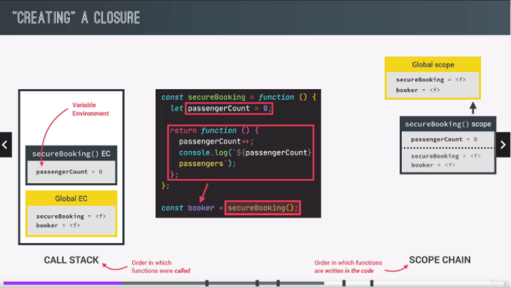

  > Closure makes a function remember all the variables that existed at the function's birthplace essentially

  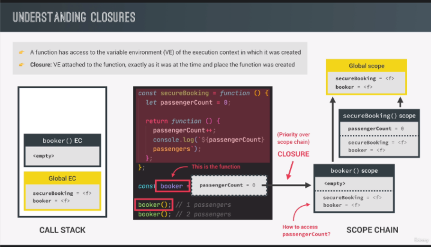
  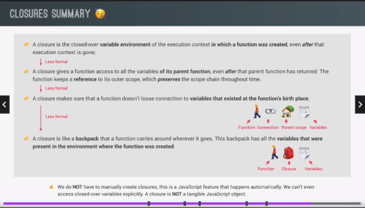

  ```js
  // Closure
  const secureBooking = function () {
    let passengerCount = 0;

    return function () {
      passengerCount++;
      console.log(`${passengerCount} passenger`);
    };
  };
  const booker = secureBooking();
  booker();
  booker();
  booker();

  // secureBooking as being the birthplace of booker function

  // NOTE: Any function always has access to the variable environment of the execution context in which the function was created

  // the Booker function has access to the passengerCount variable(secureBooking function) because it's basically defined in the scope in which the Booker function was actually created. So in a sense, the scope chain is actually preserved through the closure, even when a scope has already been destroyed because its execution context is gone. This means that even though the execution context has actually been destroyed, the variable environment somehow keeps living somewhere in the engine.

  console.dir(booker);
  ```

  ```js
  // More examples

  // Example 1
  let f;

  const g = function () {
    const a = 23;
    f = function () {
      console.log(a * 2);
    };
  };

  const h = function () {
    const b = 777;
    f = function () {
      console.log(b * 2);
    };
  };

  g(); // Execution context
  f(); // Closure
  console.dir(f);

  // re-assigning f function
  h();
  f();
  console.dir(f);
  //Note: whenever re-assinged functions even without returning them this will create a CLOSURE

  // Example 2
  const boardPassengers = function (n, wait) {
    const perGroup = n / 3;

    setTimeout(function () {
      console.log(`We are now boarding all ${n} passengers`);
      console.log(`There are 3 groups, each with ${perGroup} passengers`);
    }, wait * 1000);

    console.log(`Will start boarding in ${wait} seconds`);
  };

  const perGroup = 1000;
  boardPassengers(180, 3);
  // Closure --also includes the arguments because they are really just a local variables in the function

  // Closure will execute variable element inside a function first , when no local variable declared in function, closure will execute variable in the global scope
  ```

## Section 11: Working with Arrays

- Simple Array Method

  > methods are simply functions that we can call on objects. So basically, they are functions attached to objects.

  > So if we have array methods, that means that arrays themselves are also objects. And so these array methods are simply functions that are attached to all arrays that we create in JavaScript.

  > **Slice method** --extract part of any array but without changing the original array, instead it returns a new array. Also use to simplt create a shallow copy of any array

  ```js
  // SLICE
  let arr = ["a", "b", "c", "d", "e"];
  console.log(arr.slice(2));
  console.log(arr.slice(2, 4)); // end parameter is not included in the output just like strings --length of the array will be end minus begin paramter (2)

  console.log(arr.slice(-2)); // --we can define a negative begin parameter then will start to copy from the end of array

  console.log(arr.slice(1, 2)); // starts extracting at position 1 and extracts everything except the last two (-2)

  console.log(arr.slice()); // shallow copy of exact array

  console.log([...arr]); // shallow copy using spread operator
  ```

  > The only time you really need to use the slice method here is when we want to chain multipme methods together, calling one after the other

  > **Splice method** -- works almost same as slice but the core differnce is that it actually change the original array (mutates array) --splice deleted element from the original array --delete one or more elements from an array using splice

  ```js
  // SPLICE
  // console.log(arr.splice(2)); //--output: c, d, e
  // console.log(arr); // original array will be the first two element as we extracted from the postion 2 --output: a, b

  arr.splice(-1); // minus one here is the last element
  console.log(arr);

  arr.splice(1, 2); // delete count (position) as declared in arguments --1st parameter here is the start but the 2nd is really the number of elements that we want to delete
  console.log(arr);
  ```

  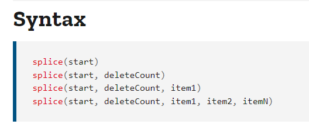

  > **Reverse method** --simply reverse the order from end to begin --also does mutate the original array

  ```js
  // REVERSE
  arr = ["a", "b", "c", "d", "e"];
  const arr2 = ["j", "i", "h", "g", "f"];

  arr2.reverse(); // simply reverse the order from end to begin --also does mutate the original array
  console.log(arr2);
  ```

  > **Concat Method** --use to concatenate two arrays. --also does not mutate original array

  ```js
  // CONCAT
  const letters = arr.concat(arr2);
  console.log(letters);
  console.log([...arr, ...arr2]); // using spread operator
  ```

  > **Join Method**

  ```js
  // JOIN
  console.log(letters.join(" - ")); // result is a string with a separtor specified
  ```

- The NEW at Method

  > **At Method** --use as a modern way to get element on the array --also works at strings

  ```js
  // The NEW at Method
  const arr = [23, 11, 64];
  console.log(arr[0]); // old way
  console.log(arr.at(0)); // ES2020

  // old way getting the last element
  console.log(arr[arr.length - 1]); // old way --know the array length
  console.log(arr.slice(-1)[0]); // using slice --take out values using bracket

  // modern ES2020
  console.log(arr.at(-1)); // negative makes the counting from the right side (end)

  // Note: if want to get the last element of the array, use AT method and to do something called method chaining (combining multiple methods)

  //if you just want to quickly get a value from an array, so just like the first element, then of course you can keep using the brackets notation.

  // String
  console.log("jonas".at(0));
  console.log("jonas".at(-1));
  ```

- Looping Arrays: forEach

  > is a higher order function

  > a lot easier to access at the current index than for of loop

  > forEach passes in the current element, the index and the entire array that we are looping. And so therefore we can specify them here in our parameter list.

  > Fundamental difference : for of vs forEach

  - forEach --will always loop over the entire array --cannot break out of a forEach loop (continue and break statements do not work in a forEach loop at all)

  ```js
  // Looping Arrays: forEach

  const movements = [200, 450, -400, 3000, -650, -130, 70, 1300];

  // for (const movement of movements) {
  for (const [i, movement] of movements.entries()) {
    if (movement > 0) {
      console.log(`Movement ${i + 1}: You deposite ${movement}`);
    } else {
      console.log(`Movement ${i + 1}: You withdrew ${Math.abs(movement)}`);
    }
  }

  console.log("-----------FOREACH-----------");
  movements.forEach(function (mov, i, arr) {
    if (mov > 0) {
      console.log(`Movement ${i + 1}: You deposite ${mov}`);
    } else {
      console.log(`Movement ${i + 1}: You withdrew ${Math.abs(mov)}`);
    }
  });
  // 0: function(200)
  // 1: function(450)
  // ...

  // forEach does is to loop over the array and in each iteration it will pass in the current element as an argument and execute the callback function

  // 1st parameter: current element
  // 2nd parameter: current index
  // 3rd parameter: entire array that we loop
  ```

- forEach with Maps and Sets

  ```js
  // forEach with Maps and Sets

  // Map
  const currencies = new Map([
    ["USD", "United States dollar"],
    ["EUR", "Euro"],
    ["GBP", "Pound sterling"],
  ]);

  currencies.forEach(function (value, key, map) {
    console.log(`${key}: ${value}`);
  });
  // 1st parameter: current value
  // 2nd parameter: key
  // 3rd parameter: entire map that we loop over

  // Sets
  const currenciesUnique = new Set(["USD", "GBP", "USD", "EUR", "EUR"]);
  console.log(currenciesUnique);

  currenciesUnique.forEach(function (value, _, map) {
    console.log(`${value}: ${value}`);
  });

  // key is exactly same as value because SET don't have key and indexes
  // (_) --means a throwaway variable --variable taht completely unnecessary
  ```

- Project: BANKIST APP

  

  - Creating DOM elements

    - The **insertAdjacentHTML() method** of the Element interface parses the specified text as HTML or XML and inserts the resulting nodes into the DOM tree at a specified position.

    ```
    position
    A string representing the position relative to the element. Must be one of the following strings:
    "beforebegin"
    Before the element. Only valid if the element is in the DOM tree and has a parent element.

    **"afterbegin"**
    Just inside the element, before its first child.

    **"beforeend":**
    Just inside the element, after its last child.

    **"afterend"**
    After the element. Only valid if the element is in the DOM tree and has a parent element.

    **text**
    The string to be parsed as HTML or XML and inserted into the tree.

    ```

    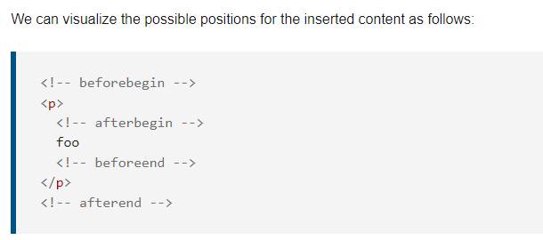

    ```js
    // Creating DOM elements
    const displayMovements = function (movements) {
      containerMovements.innerHTML = ""; // use to clear/empty entire container then start adding new elements

      movements.forEach(function (mov, i) {
        const type = mov > 0 ? "deposit" : "withdrawal";

        const html = `<div class="movements__row">
        <div class="movements__type movements__type--${type}">${
          i + 1
        } ${type}</div>
        
        <div class="movements__value">${Math.abs(mov)}</div>
      </div>`;

        containerMovements.insertAdjacentHTML("afterbegin", html); // method used to display/attach in webpage(DOM tree) --accepts two string 1st: position of new element we want to attach HTML (function) 2nd: text (string containing the HTML that we want to insert)

        // afterbegin position --order of the element in the array would be inverted (*end to begin) --new child element will appear before all the other child elements

        // beforeend position -- (*begin to end) simply be added after the previous one
      });
    };
    displayMovements(account1.movements);
    // Good practice: a lot better to pass data directly into the function than global variables --each function should actually receive the data that it should work with, instead of using a global variable.

    // console.log(containerMovements.innerHTML); // text content: simply returns text itself while HTML: returns everything, including the html (all HTML tags will be included)
    ```

  - Computing Usernames

    ```js
    // Computing Username

    const createUsernames = function (accs) {
      accs.forEach(function (acc) {
        acc.username = acc.owner
          .toLowerCase()
          .split(" ")
          .map((name) => name[0])
          .join("");
      }); // forEach is a great case to produce some so called side effects --simply do dome work without returning anything
    };
    createUsernames(accounts);
    console.log(accounts);

    // const createUsernames = function (user) {
    //   const username = user
    //     .toLowerCase()
    //     .split(' ')
    //     .map(name => name[0])
    //     .join('');
    //   return username;
    // };
    // createUsernames('Steven Thomas Williams');
    ```

  - Computing Balance

    ```js
    // Computing balance --reduce method

    const calcPrintBalance = function (movements) {
      const balance = movements.reduce(function (acc, mov) {
        const money = (acc += mov);
        return money;
      }, 0);

      // const html = `
      //   <p class="balance__value">${balance}€</p>
      // </div>`;

      // labelBalance.insertAdjacentHTML('afterend', html);

      labelBalance.textContent = `${balance}€`;
    };
    calcPrintBalance(account1.movements);
    ```

  - Statistics --using Chain Method

    ```js
    // Statistics -- using chain method

    const calcDisplaySummary = function (movements) {
      const income = movements
        .filter((mov) => mov > 0)
        .reduce((acc, mov) => acc + mov, 0);
      //console.log(income);
      labelSumIn.textContent = `${income}€`;

      const outcome = movements
        .filter((mov) => mov < 0)
        .reduce((acc, mov) => acc + mov, 0);
      labelSumOut.textContent = `${Math.abs(outcome)}€`;

      const interestDeposit = 1.2 / 100;
      const summary = movements
        .filter((mov) => mov > 0)
        .map((deposit) => deposit * interestDeposit)
        .filter((int, i, arr) => {
          console.log(arr);
          return int >= 1;
        })
        .reduce((acc, int) => acc + int, 0);
      labelSumInterest.textContent = `${Math.abs(summary)}€`;
    };
    calcDisplaySummary(account1.movements);
    ```

- Data Transformations: Map, Filter, Reduce

  > these methods use to create new arrays based on transforming data from other arrays

  > **MAP** -- creates a brand new array based on the original array. So essentially the map method takes an array, loops over that array and in each alteration, it applies a callback function that we specify on our code to the current array element.

  > **FILTER** -- used to filter for elements in the original array which satisfy a certain condition.

  > **REDUCE** -- use to boil down all the elements of the original array into one single value

  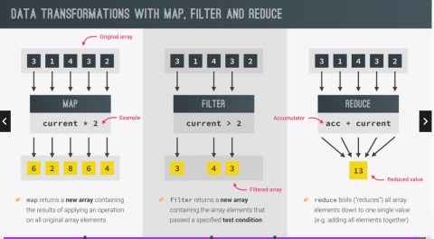

- The Map Method

  > this method will give a brand new array and will contain in each position the results of applying a callback function to the original array elements

  > also has access to the 3 parameters --1st: current array element 2nd: current index 3rd: whole array

  ```js
  const movements = [200, 450, -400, 3000, -650, -130, 70, 1300];

  const euroToUsd = 1.1;

  const moveToUsd = movements.map(function (mov) {
    return mov * euroToUsd;
  });

  console.log(movements);
  console.log(moveToUsd);

  // for of
  const movementsUSDfor = [];
  for (const mov of movements) movementsUSDfor.push(mov * euroToUsd);
  console.log(movementsUSDfor);

  // arrow
  const movementToUsd = movements.map((mov) => mov * euroToUsd);
  console.log(movements);
  console.log(movementToUsd);

  // map with 3 parameters
  const movementDescription = movements.map(
    (mov, i) =>
      `Movement ${i + 1}: You ${mov > 0 ? "deposited" : "withdrew"} ${Math.abs(
        mov
      )}`

    // if (mov > 0) {
    //   return `Movement ${i + 1}: You deposite ${mov}`;
    // } else {
    //   return `Movement ${i + 1}: You withdrew ${Math.abs(mov)}`;
    // }
  );
  console.log(movementDescription);

  // KIM: completely acceptable to have even more return statement as long as only one of them is executed
  ```

- The Filter Method

  ```js
  // Filter Method

  const movements = [200, 450, -400, 3000, -650, -130, 70, 1300];

  const deposit = movements.filter(function (mov, i, arr) {
    return mov > 0;
  });
  console.log(movements);
  console.log(deposit);

  // for of
  const depositFor = [];
  for (const mov of movements) if (mov > 0) depositFor.push(mov);
  console.log(depositFor);

  const withdrawals = movements.filter((mov) => mov < 0);
  console.log(withdrawals);
  ```

- The Reduce Method

  ```js
  // The Reduce Method
  const movements = [200, 450, -400, 3000, -650, -130, 70, 1300];
  console.log(movements);
  const balance = movements.reduce(function (acc, cur, i, arr) {
    console.log(`Iteration ${i}: ${acc}`);
    return acc + cur;
  }, 0);

  const balance3 = movements.reduce((acc, cur) => acc + cur, 0);
  console.log(balance3);
  // 1st parameter: function (accumulator --(current sum of all the previous values) is the value that keep adding to the current value --acc + curr)
  // 2nd: initial value of the accumulator --(0)

  // for of
  let balance2 = 0;
  for (const mov of movements) balance2 += mov;
  console.log(balance2);

  // in for of loop --we always need an external variable

  // Maximum value --  it doesn't have to be a sum. It could be a multiplication or even something completely different, like a string or an object,
  const max = movements.reduce((acc, mov) => {
    if (acc > mov) return acc;
    else return mov;
  }, movements[0]);
  console.log(max);
  ```

  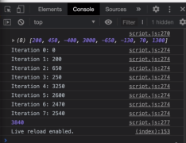

  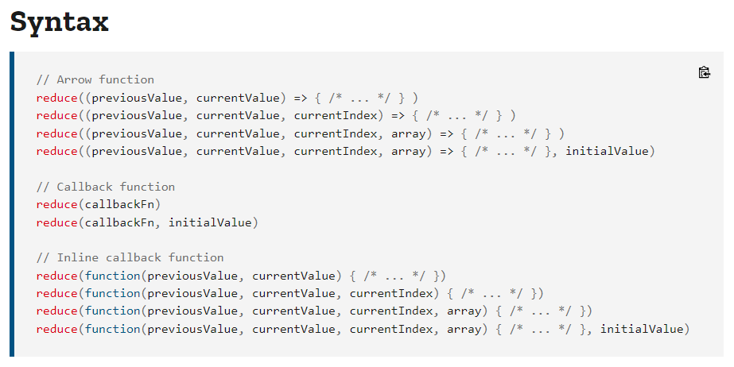

  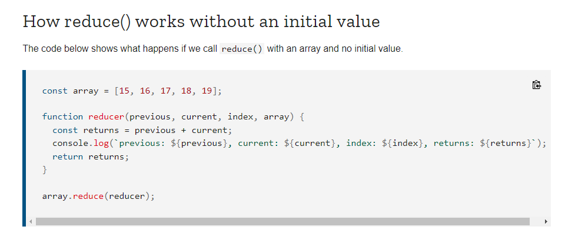

  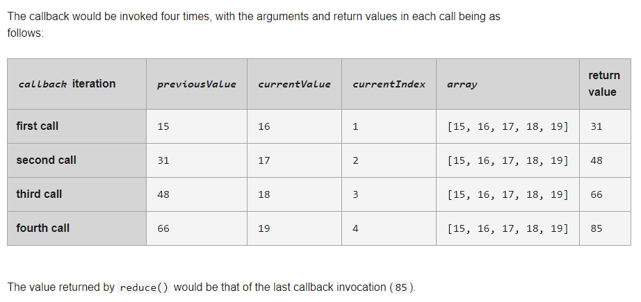

- The Magic of Chaining Methods

  ```js
  // The Chaining Method

  const euroToUsd = 1.1;
  const movements = [200, 450, -400, 3000, -650, -130, 70, 1300];
  console.log(movements);
  // PIPELINE
  const totalDeposits = movements
    .filter((mov) => mov > 0)
    .map((mov, i, arr) => {
      // console.log(arr);
      return mov * euroToUsd;
    })
    //.map(mov => mov * euroToUsd)
    .reduce((acc, mov) => acc + mov, 0);
  console.log(totalDeposits);

  // we can only chain a method after another if the first one returns an array

  // reminders: 1st --not overuse chaining 2nd --try to optimize it 3rd --it is bad practice to chain methods that mutate the underlying original array
  // if we have a huge chain of methods, chained one after the other, we should try to compress all the functionality that they do into as little methods as possible.
  ```

- The Find Method

  > use to retrieve one element of an array based on a condition

  > Find method accepts a condition also accepts a callback function which will then be called as the method loops over the array

  > just like the Filter method, the Find method also needs a callback function that returns a Boolean.

  > unlike the Filter method, the Find method will actually not return a new array but it will only return the first element in the array that satisfies this condition.

  > the Find method is a bit similar to the Filter method, but there are two fundamental differences .First Filter returns all the elements that match the condition while the Find method only returns the first one and second and even more important, the Filter method returns a new array while Find only returns the element itself and not an array,

  > using Find, we can basically find an object in the array based on some property of that object,

  ```js
  // The Find Method
  const movements = [200, 450, -400, 3000, -650, -130, 70, 1300];

  const firstWithdrawal = movements.find(mov => mov < 0);
  console.log(movements);
  console.log(firstWithdrawal);

  const account = accounts.find(acc => acc.owner === 'Jessica Davis');
  console.log(account);

  // using the Find method, we can then search this array basically to find an object that matches a certain property that we already know.

  // for of
  const unique = [];
  for (const acc of accounts) {
    if (acc.owner === 'Jessica Davis') {
      unique.push(acc);
    }
  }
  console.log(unique);
  ```

## Section 12: Numbers, Dates, Intl and Timers

## Section 13: Advanced DOM and Events

## Section 14: OOP with JS

## Section 15: Mapty App: OOP, Geolocation, External Libraries

## Section 16: Asynchronous JS: Promises, Async/Awaits and AJAX

## Section 17: Modern JS Development: Modules, Tooling and Function

## Section 18: Forkify App: Building a Modern Application

## Section 19: Setting Up Git and Deployment
